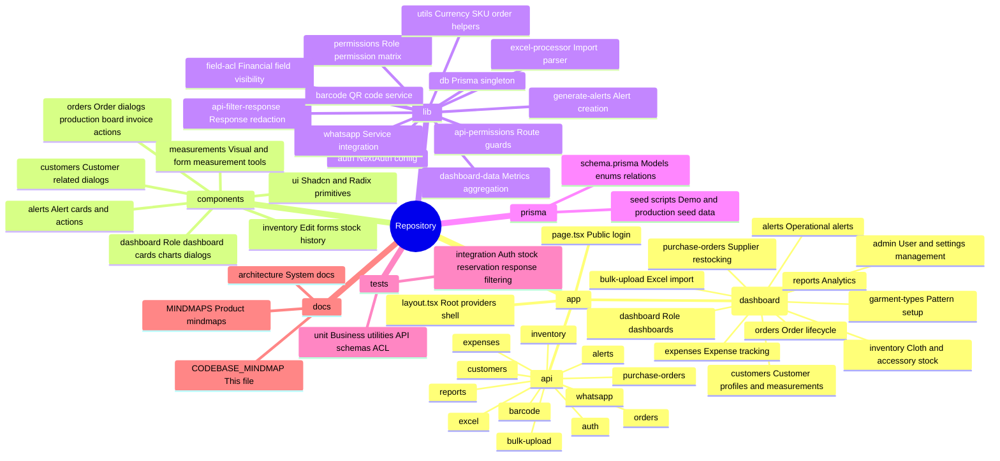
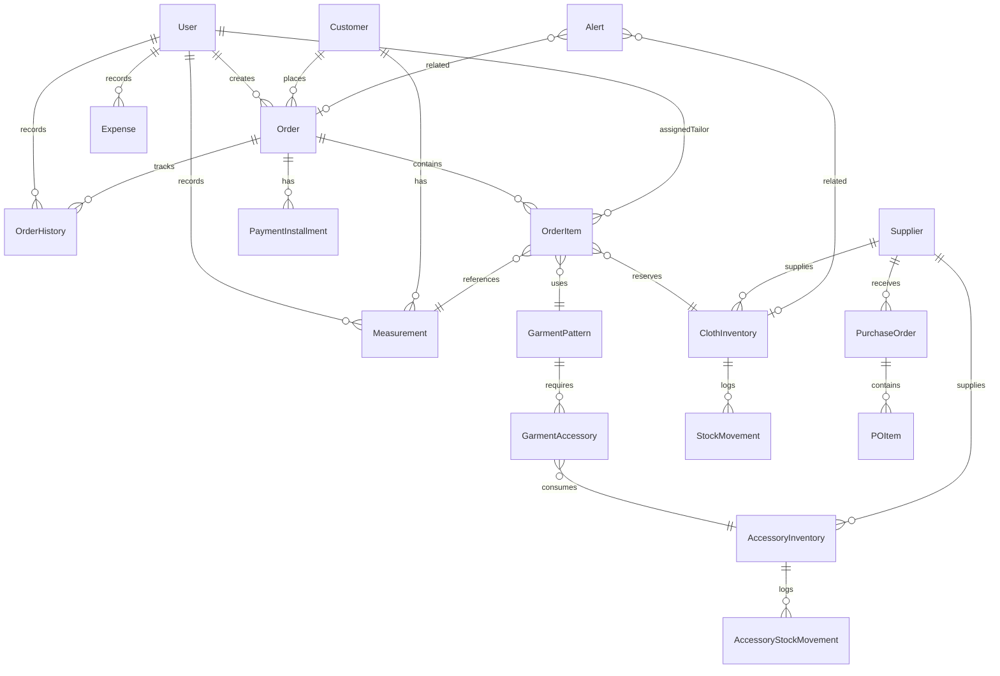
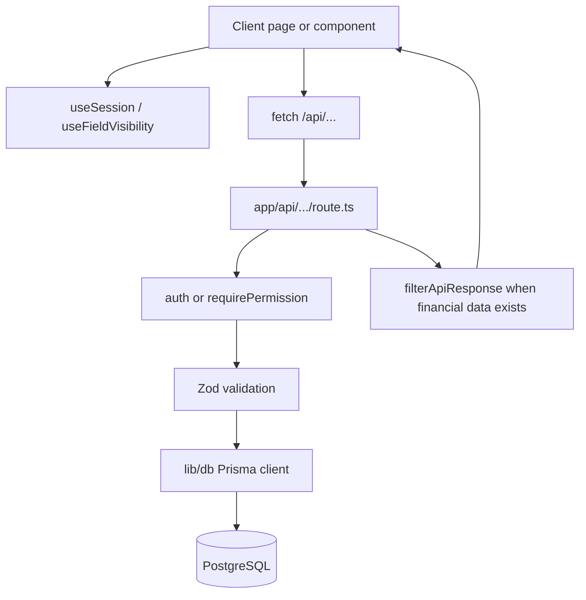
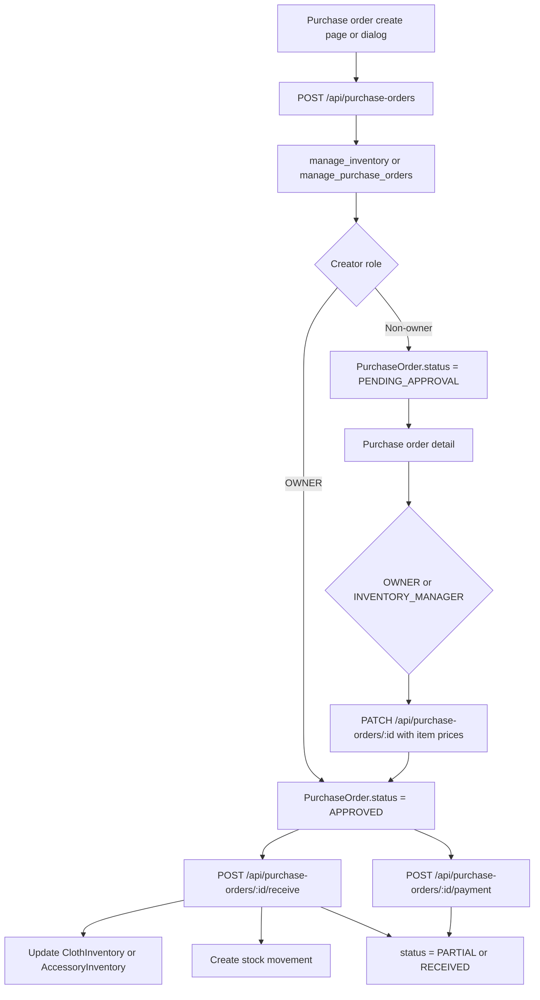
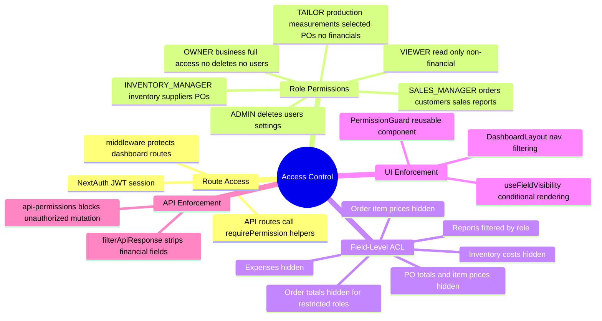

# Hamees Codebase Mindmap

This map explains the repository by code ownership, not only by product feature. Use it when onboarding, planning refactors, reviewing pull requests, or deciding which files must be inspected together for a change.

## 1. System Shape

```mermaid
mindmap
  root((Hamees Inventory))
    Runtime
      Next.js 16 App Router
      React 19 Client Components
      API Route Handlers
      Prisma 7 adapter-pg
      PostgreSQL 16
      NextAuth v5 JWT
    Entry Points
      app/page.tsx Login
      app/(dashboard) Protected UI
      app/api REST endpoints
      prisma/schema.prisma Data model
      components Shared UI and feature widgets
      lib Shared business and infra logic
    Infrastructure
      Port 3009
      PM2 fork mode
      Cloudflare Tunnel
      PostgreSQL local database
```

## 2. Folder Ownership



## 3. Feature Domains

```mermaid
mindmap
  root((Business Domains))
    Auth and RBAC
      lib/auth.ts
      lib/permissions.ts
      lib/api-permissions.ts
      components/auth/permission-guard.tsx
      DashboardLayout permission-filtered nav
      UserRole enum
    Field Privacy
      lib/field-acl.ts
      hooks/use-field-visibility.tsx
      lib/api-filter-response.ts
      Financial values hidden by role
    Orders
      app/(dashboard)/orders
      app/api/orders
      components/orders
      Order OrderItem PaymentInstallment OrderHistory
      Stock reservation on create
      Status updates and tailor notes
      Split order
      Print invoice
      WhatsApp notification
    Customers and Measurements
      app/(dashboard)/customers
      app/api/customers
      app/api/measurements
      components/measurements
      Customer Measurement
      Measurement history and visual tool
    Inventory
      app/(dashboard)/inventory
      app/api/inventory
      components/inventory
      ClothInventory AccessoryInventory
      StockMovement AccessoryStockMovement
      Reserved stock and available stock
      Barcode lookup
    Purchase Orders
      app/(dashboard)/purchase-orders
      app/api/purchase-orders
      components/dashboard/create-po-dialog.tsx
      PurchaseOrder POItem Supplier
      Receive stock into inventory
      Payment tracking
    Alerts
      app/(dashboard)/alerts
      app/api/alerts
      lib/generate-alerts.ts
      Alert model
      Low stock critical stock overdue orders
    Reports and Dashboards
      app/(dashboard)/dashboard
      app/(dashboard)/reports
      app/api/dashboard
      app/api/reports
      lib/dashboard-data.ts
      Recharts components
    Imports Integrations
      app/api/bulk-upload
      app/api/excel/submit-order
      lib/excel-processor.ts
      lib/excel-upload.ts
      app/api/whatsapp
      lib/whatsapp/whatsapp-service.ts
      app/api/barcode
      lib/barcode/qrcode-service.ts
```

## 4. Core Data Model



## 5. Request Flow Pattern



## 6. Order Creation Flow

```mermaid
flowchart TD
    Page[app/(dashboard)/orders/new/page.tsx] --> API[POST /api/orders]
    API --> Permission[create_order permission]
    Permission --> Validate[Zod payload validation]
    Validate --> Pattern[Read GarmentPattern]
    Validate --> Fabric[Read ClothInventory]
    Pattern --> Price[Calculate fabric stitching premiums GST]
    Fabric --> Reserve[Check available = currentStock - reserved]
    Price --> Tx[Prisma transaction]
    Reserve --> Tx
    Tx --> CreateOrder[Order]
    Tx --> CreateItems[OrderItem]
    Tx --> ReserveFabric[ClothInventory.reserved += estimatedMeters]
    Tx --> StockMove[StockMovement ORDER_RESERVED]
    Tx --> ReserveAccessories[AccessoryInventory.reserved]
    Tx --> History[OrderHistory ORDER_CREATED]
    API --> Response[Created order JSON]
    API --> WhatsApp[after() non-blocking confirmation]
```

## 7. Purchase Order Flow



## 8. Security and Privacy Map



## 9. Mindmap and FeatureTrace Maintenance Rules

Before modifying code, build an impact map: inspect the target file, search references with `rg`, identify upstream callers, downstream dependencies, runtime entry points, related tests, database tables, config/env, and external services. Summarise that map before editing.

1. When adding a new route under `app/(dashboard)`, add it to the Folder Ownership and Feature Domains sections.
2. When adding a new API domain under `app/api`, add it to Request Flow Pattern or a domain flow if it has business side effects.
3. When changing Prisma models, update Core Data Model.
4. When a workflow crosses 3 or more files, add or update `@featuretrace` / `FEATURETRACE` markers near the top of primary files.
5. Update `docs/code-map/featuretrace.md` whenever a code change alters callers, callees, entry points, tests, database tables, config, or known risks.
6. Financial fields must be checked in both `lib/field-acl.ts` and `lib/api-filter-response.ts` when adding new amount, cost, price, paid, balance, GST, tax, or expense fields.
7. Any stock-changing workflow should show its transaction path and stock movement table in this document.
8. Do not add runtime logging/tracing of sensitive data. Hot-path tracing should be gated behind config/debug flags.

## 10. Best Entry Points for Future Readers

| Question | Start Here |
|---|---|
| How does auth work? | `lib/auth.ts`, `lib/permissions.ts`, `lib/api-permissions.ts` |
| Why can a role not see a field? | `lib/field-acl.ts`, `hooks/use-field-visibility.tsx`, `lib/api-filter-response.ts` |
| How are orders created? | `app/(dashboard)/orders/new/page.tsx`, `app/api/orders/route.ts` |
| How is stock reserved? | `app/api/orders/route.ts`, `app/api/orders/[id]/status/route.ts`, `prisma/schema.prisma` |
| How are POs created and received? | `app/(dashboard)/purchase-orders`, `app/api/purchase-orders` |
| How are dashboards calculated? | `app/api/dashboard/enhanced-stats/route.ts`, `lib/dashboard-data.ts`, `components/dashboard` |
| How do reports work? | `app/(dashboard)/reports`, `app/api/reports` |
| How do imports work? | `app/api/bulk-upload`, `lib/excel-processor.ts`, `lib/excel-upload.ts` |
| How does Excel submit orders? | `app/api/excel/submit-order/route.ts`, `docs/excel-vba-module.bas` |
