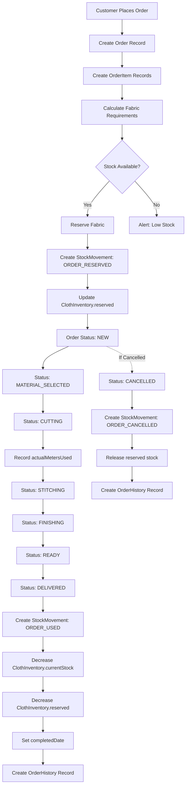
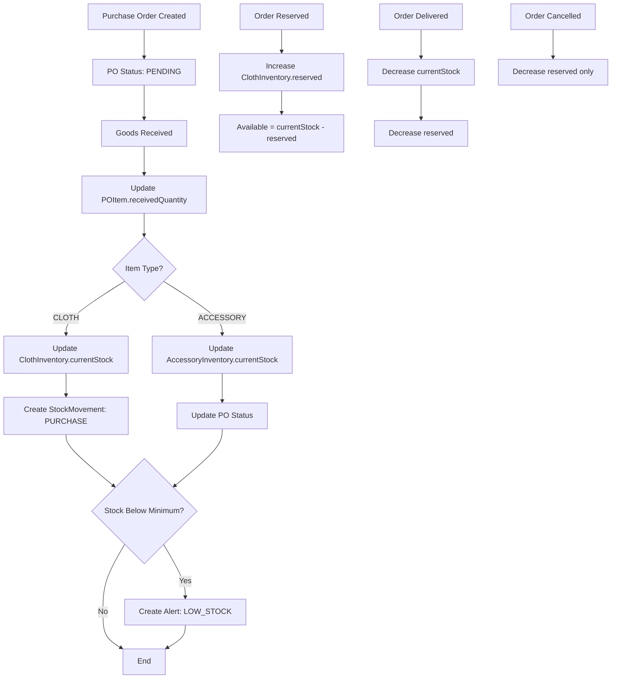
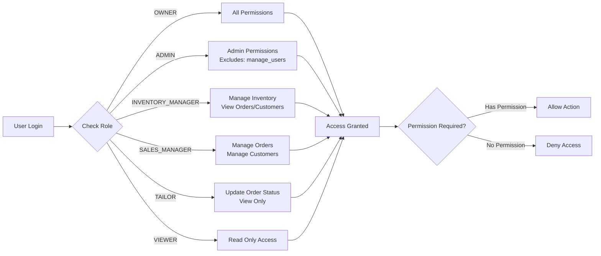
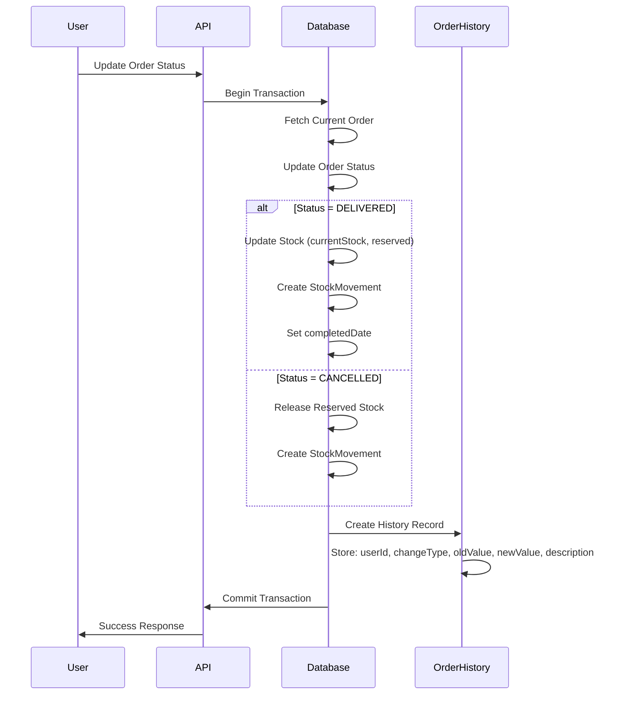

# Database Architecture - Hamees Inventory System

## Entity Relationship Diagram

```mermaid
erDiagram
    User ||--o{ Order : creates
    User ||--o{ StockMovement : records
    User ||--o{ OrderHistory : makes_changes

    Customer ||--o{ Order : places
    Customer ||--o{ Measurement : has

    Order ||--o{ OrderItem : contains
    Order ||--o{ StockMovement : generates
    Order ||--o{ OrderHistory : tracks_changes
    Order }o--|| Measurement : uses

    OrderItem }o--|| GarmentPattern : uses
    OrderItem }o--|| ClothInventory : consumes

    ClothInventory ||--o{ OrderItem : allocated_to
    ClothInventory ||--o{ StockMovement : tracks
    ClothInventory }o--o| Supplier : supplied_by
    ClothInventory ||--o{ SupplierPrice : has_prices

    AccessoryInventory }o--o| Supplier : supplied_by
    AccessoryInventory ||--o{ GarmentAccessory : used_in

    GarmentPattern ||--o{ OrderItem : used_in
    GarmentPattern ||--o{ GarmentAccessory : requires

    GarmentAccessory }o--|| AccessoryInventory : references

    Supplier ||--o{ ClothInventory : supplies_cloth
    Supplier ||--o{ AccessoryInventory : supplies_accessories
    Supplier ||--o{ SupplierPrice : offers_prices
    Supplier ||--o{ PurchaseOrder : receives

    PurchaseOrder ||--o{ POItem : contains

    User {
        string id PK
        string email UK
        string password
        string name
        UserRole role
        string phone
        boolean active
        datetime createdAt
        datetime updatedAt
    }

    Customer {
        string id PK
        string name
        string email
        string phone UK
        string address
        string city
        string state
        string pincode
        string notes
        boolean active
        datetime createdAt
        datetime updatedAt
    }

    Measurement {
        string id PK
        string customerId FK
        string garmentType
        float neck
        float chest
        float waist
        float hip
        float shoulder
        float sleeveLength
        float shirtLength
        float inseam
        float outseam
        json additionalMeasurements
        string notes
        datetime createdAt
        datetime updatedAt
    }

    Order {
        string id PK
        string orderNumber UK
        string customerId FK
        string userId FK
        string measurementId FK
        OrderStatus status
        OrderPriority priority
        datetime deliveryDate
        datetime orderDate
        datetime completedDate
        float totalAmount
        float advancePaid
        float balanceAmount
        string notes
        boolean active
        datetime createdAt
        datetime updatedAt
    }

    OrderHistory {
        string id PK
        string orderId FK
        string userId FK
        string changeType
        string fieldName
        string oldValue
        string newValue
        string description
        datetime createdAt
    }

    OrderItem {
        string id PK
        string orderId FK
        string garmentPatternId FK
        string clothInventoryId FK
        int quantity
        BodyType bodyType
        float estimatedMeters
        float actualMetersUsed
        float wastage
        float pricePerUnit
        float totalPrice
        string notes
        datetime createdAt
        datetime updatedAt
    }

    GarmentPattern {
        string id PK
        string name UK
        string description
        float baseMeters
        float slimAdjustment
        float regularAdjustment
        float largeAdjustment
        float xlAdjustment
        boolean active
        datetime createdAt
        datetime updatedAt
    }

    GarmentAccessory {
        string id PK
        string garmentPatternId FK
        string accessoryId FK
        int quantity
    }

    ClothInventory {
        string id PK
        string sku UK
        string name
        string brand
        string color
        string colorHex
        string pattern
        string quality
        string type
        float pricePerMeter
        float currentStock
        float totalPurchased
        float reserved
        float minimum
        string supplier
        string supplierId FK
        string location
        string notes
        boolean active
        datetime createdAt
        datetime updatedAt
        string fabricComposition "Phase1"
        int gsm "Phase1"
        int threadCount "Phase1"
        string weaveType "Phase1"
        string fabricWidth "Phase1"
        float shrinkagePercent "Phase1"
        string colorFastness "Phase1"
        array seasonSuitability "Phase1"
        array occasionType "Phase1"
        string careInstructions "Phase1"
        string swatchImage "Phase1"
        string textureImage "Phase1"
    }

    AccessoryInventory {
        string id PK
        string sku UK
        string name
        string type
        string color
        int currentStock
        int minimum
        float pricePerUnit
        string supplier
        string supplierId FK
        boolean active
        datetime createdAt
        datetime updatedAt
        string notes
        string colorCode "Phase1"
        string threadWeight "Phase1"
        string buttonSize "Phase1"
        string holePunchSize "Phase1"
        string material "Phase1"
        string finish "Phase1"
        array recommendedFor "Phase1"
        string styleCategory "Phase1"
        string productImage "Phase1"
        string closeUpImage "Phase1"
    }

    StockMovement {
        string id PK
        string clothInventoryId FK
        string orderId FK
        string userId FK
        StockMovementType type
        float quantity
        float balanceAfter
        string notes
        datetime createdAt
    }

    Supplier {
        string id PK
        string name
        string contactPerson
        string email
        string phone
        string address
        string city
        string state
        string pincode
        string gstin
        float rating
        string notes
        boolean active
        datetime createdAt
        datetime updatedAt
    }

    SupplierPrice {
        string id PK
        string supplierId FK
        string clothInventoryId FK
        float pricePerMeter
        datetime effectiveFrom
        datetime effectiveTo
        boolean active
        datetime createdAt
    }

    PurchaseOrder {
        string id PK
        string poNumber UK
        string supplierId FK
        datetime orderDate
        datetime expectedDate
        datetime receivedDate
        float totalAmount
        float paidAmount
        float balanceAmount
        string status
        string notes
        boolean active
        datetime createdAt
        datetime updatedAt
    }

    POItem {
        string id PK
        string purchaseOrderId FK
        string itemName
        string itemType
        float quantity
        string unit
        float pricePerUnit
        float totalPrice
        float receivedQuantity
        datetime createdAt
    }

    Alert {
        string id PK
        AlertType type
        AlertSeverity severity
        string title
        string message
        string relatedId
        string relatedType
        boolean isRead
        boolean isDismissed
        datetime dismissedUntil
        datetime createdAt
        datetime updatedAt
    }
```

## Data Flow: Order Creation to Completion

## Inventory Stock Management Flow

## Role-Based Access Control Flow

## Audit Trail Flow

## Key Database Patterns

### 1. Stock Reservation Pattern
- **Available Stock** = `currentStock - reserved`
- When order created: `reserved += estimatedMeters`
- When order delivered: `currentStock -= actualMetersUsed`, `reserved -= estimatedMeters`
- When order cancelled: `reserved -= estimatedMeters`

### 2. Audit Trail Pattern
- All order changes recorded in `OrderHistory`
- Tracks: who, what, when, old value, new value
- Immutable records (no updates, only inserts)

### 3. Soft Delete Pattern
- Most tables have `active` boolean field
- Records are marked inactive instead of deleted
- Preserves historical data and relationships

### 4. Price History Pattern
- `SupplierPrice` tracks price changes over time
- Uses `effectiveFrom` and `effectiveTo` dates
- Allows historical price analysis

### 5. Measurement History Pattern
- Customers can have multiple `Measurement` records
- Track changes in customer measurements over time
- Each order can reference specific measurement version

## Indexes for Performance

### Order Management
- `Order.orderNumber` (unique)
- `Order.customerId`
- `Order.status`
- `Order.deliveryDate`

### Inventory
- `ClothInventory.sku` (unique)
- `ClothInventory.active`
- `ClothInventory.currentStock`

### History & Tracking
- `OrderHistory.orderId`
- `OrderHistory.createdAt`
- `StockMovement.clothInventoryId`
- `StockMovement.orderId`
- `StockMovement.createdAt`

### Alerts
- `Alert.isRead`
- `Alert.isDismissed`
- `Alert.dismissedUntil`
- `Alert.severity`
