# Hamees Attire — System Mindmaps

> All diagrams use [Mermaid](https://mermaid.js.org/) syntax.
> View in: GitHub, VS Code (Mermaid extension), Obsidian, Notion, or at https://mermaid.live

---

## 1. Application Feature Map

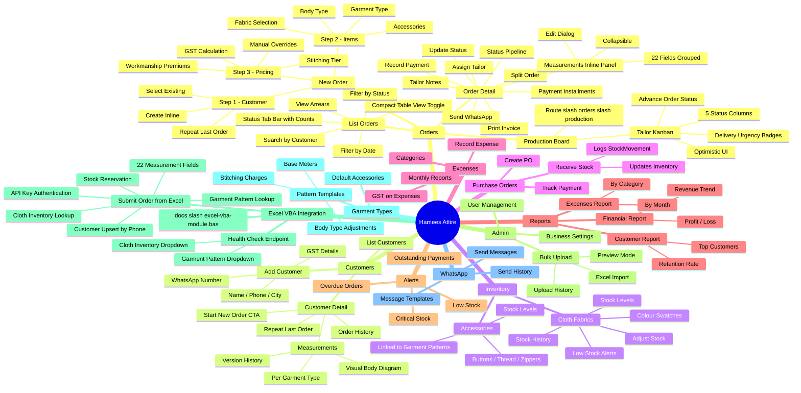

---

## 2. Database Schema — Entity Relationship Diagram

```mermaid
erDiagram
    User {
        string id PK
        string email UK
        string password
        string name
        UserRole role
        boolean active
    }

    Customer {
        string id PK
        string name
        string phone
        string email
        string city
        string gstin
        string customerType
        boolean active
    }

    Order {
        string id PK
        string orderNumber UK
        string customerId FK
        string userId FK
        string measurementId FK
        OrderStatus status
        DateTime deliveryDate
        float totalAmount
        float advancePaid
        float balanceAmount
        float subTotal
        float gstAmount
        StitchingTier stitchingTier
        boolean isHandStitched
        boolean isRushOrder
        boolean hasComplexDesign
        boolean isFullCanvas
        boolean hasPremiumLining
    }

    OrderItem {
        string id PK
        string orderId FK
        string garmentPatternId FK
        string clothInventoryId FK
        string measurementId FK
        string assignedTailorId FK
        BodyType bodyType
        float estimatedMeters
        float actualMetersUsed
        int quantityOrdered
        float totalPrice
    }

    OrderHistory {
        string id PK
        string orderId FK
        string userId FK
        string changeType
        string oldValue
        string newValue
        string description
    }

    PaymentInstallment {
        string id PK
        string orderId FK
        int installmentNumber
        float installmentAmount
        float paidAmount
        DateTime dueDate
        PaymentMode paymentMode
        InstallmentStatus status
    }

    Measurement {
        string id PK
        string customerId FK
        string userId FK
        string garmentType
        BodyType bodyType
        float neck
        float chest
        float waist
        float hip
        float shoulder
        float crossChest
        float sleeveLength
        float bicep
        float elbow
        float armCircumference
        float cuff
        float shirtLength
        float jacketLength
        float backLength
        float lapelWidth
        float inseam
        float outseam
        float thigh
        float knee
        float bottomOpening
        float rise
        float seat
        string replacesId FK
        boolean isActive
    }

    GarmentPattern {
        string id PK
        string name
        float baseMeters
        float slimAdjustment
        float regularAdjustment
        float largeAdjustment
        float xlAdjustment
        float basicStitchingCharge
        float premiumStitchingCharge
        float luxuryStitchingCharge
    }

    GarmentAccessory {
        string id PK
        string garmentPatternId FK
        string accessoryId FK
        int quantityPerGarment
    }

    ClothInventory {
        string id PK
        string sku UK
        string name
        string color
        string colorHex
        string type
        float pricePerMeter
        float currentStock
        float reserved
        float minimumStockMeters
        string supplierId FK
    }

    AccessoryInventory {
        string id PK
        string sku UK
        string name
        string type
        int currentStock
        int reserved
        int minimumStockUnits
        string supplierId FK
    }

    StockMovement {
        string id PK
        string clothInventoryId FK
        string orderId FK
        string userId FK
        StockMovementType type
        float quantityMeters
        float balanceAfterMeters
    }

    AccessoryStockMovement {
        string id PK
        string accessoryInventoryId FK
        string orderId FK
        string userId FK
        StockMovementType type
        int quantityUnits
        int balanceAfterUnits
    }

    Supplier {
        string id PK
        string name
        string phone
        string gstin
        boolean active
    }

    PurchaseOrder {
        string id PK
        string poNumber UK
        string supplierId FK
        float totalAmount
        float paidAmount
        string status
    }

    POItem {
        string id PK
        string purchaseOrderId FK
        string itemName
        string itemType
        float orderedQuantity
        float receivedQuantity
        float pricePerUnit
    }

    Expense {
        string id PK
        ExpenseCategory category
        float amount
        float gstAmount
        float totalAmount
        string paidBy FK
    }

    Alert {
        string id PK
        AlertType type
        AlertSeverity severity
        string relatedId
        string relatedType
        boolean isRead
        boolean isDismissed
    }

    WhatsAppMessage {
        string id PK
        string recipient
        string customerId FK
        string orderId FK
        string messageType
        string status
    }

    DesignUpload {
        string id PK
        string orderItemId FK
        string filePath
        DesignFileCategory category
        string uploadedBy FK
    }

    %% Core relationships
    Customer ||--o{ Order : "places"
    Customer ||--o{ Measurement : "has"
    Customer ||--o{ WhatsAppMessage : "receives"

    User ||--o{ Order : "creates"
    User ||--o{ Measurement : "records"
    User ||--o{ OrderHistory : "makes"
    User ||--o{ StockMovement : "logs"
    User ||--o{ Expense : "records"

    Order ||--o{ OrderItem : "contains"
    Order ||--o{ OrderHistory : "tracks"
    Order ||--o{ PaymentInstallment : "has"
    Order ||--o{ StockMovement : "generates"
    Order ||--o{ AccessoryStockMovement : "generates"
    Order ||--o{ WhatsAppMessage : "triggers"

    Measurement }o--|| Customer : "belongs to"
    Measurement ||--o{ OrderItem : "used in"
    Measurement }o--o| Measurement : "replaces (version chain)"

    OrderItem }o--|| GarmentPattern : "uses pattern"
    OrderItem }o--|| ClothInventory : "uses fabric"
    OrderItem ||--o{ DesignUpload : "has files"
    OrderItem }o--o| User : "assigned tailor"

    GarmentPattern ||--o{ GarmentAccessory : "has defaults"
    GarmentAccessory }o--|| AccessoryInventory : "links to"

    ClothInventory ||--o{ StockMovement : "tracked by"
    ClothInventory }o--o| Supplier : "sourced from"

    AccessoryInventory ||--o{ AccessoryStockMovement : "tracked by"
    AccessoryInventory }o--o| Supplier : "sourced from"

    Supplier ||--o{ PurchaseOrder : "receives"
    PurchaseOrder ||--o{ POItem : "contains"

    User ||--o{ Expense : "paid by"
```

---

## 3. Database Models — Mindmap

```mermaid
mindmap
  root((Database Models))
    Users & Auth
      User
        id / email / password
        name / role / phone
        active
        Roles
          OWNER
          ADMIN
          INVENTORY_MANAGER
          SALES_MANAGER
          TAILOR
          VIEWER
    Customer Domain
      Customer
        id / name / phone / email
        city / state / address
        gstin / customerType B2B-B2C
        active
      Measurement
        Per garment type per customer
        22 measurement fields
        Upper Body
          neck chest waist hip shoulder crossChest
        Arms
          sleeveLength bicep elbow armCircumference cuff
        Lengths
          shirtLength jacketLength backLength lapelWidth
        Lower Body
          inseam outseam thigh knee bottomOpening rise seat
        bodyType SLIM-REGULAR-LARGE-XL
        replacesId for version history
        isActive current version flag
    Order Domain
      Order
        orderNumber unique
        status NEW to DELIVERED
        priority NORMAL-URGENT
        Financial Fields
          totalAmount advancePaid
          balanceAmount discount
          subTotal gstAmount cgst sgst
        Premium Pricing
          stitchingTier BASIC-PREMIUM-LUXURY
          fabricWastagePercent
          workmanshipPremiums
          isHandStitched isRushOrder
          isFullCanvas hasComplexDesign
          hasPremiumLining
        Manual Overrides
          isFabricCostOverridden
          fabricCostOverride
          isStitchingCostOverridden
      OrderItem
        Per garment in an order
        garmentPatternId
        clothInventoryId
        measurementId
        assignedTailorId
        estimatedMeters actualMetersUsed
        bodyType quantityOrdered
      OrderHistory
        Audit trail of all changes
        changeType fieldName
        oldValue newValue
        description userId
      PaymentInstallment
        Multiple payments per order
        installmentAmount paidAmount
        dueDate paidDate
        paymentMode status
    Inventory Domain
      ClothInventory
        sku name brand color colorHex
        type Cotton-Silk-Linen etc
        pricePerMeter
        currentStock reserved
        minimumStockMeters
        Technical Specs
          fabricComposition gsm
          threadCount weaveType
          fabricWidth shrinkagePercent
        Business Tags
          seasonSuitability
          occasionType
        Visual
          swatchImage textureImage
      AccessoryInventory
        sku name type
        currentStock reserved
        minimumStockUnits pricePerUnit
        Button Specific
          buttonSize holePunchSize
          material finish
        Thread Specific
          colorCode threadWeight
      StockMovement
        type PURCHASE-ORDER_RESERVED-etc
        quantityMeters balanceAfterMeters
        orderId clothInventoryId userId
      AccessoryStockMovement
        type quantityUnits balanceAfterUnits
        orderId accessoryInventoryId userId
      GarmentPattern
        name description
        baseMeters
        Body Adjustments
          slimAdjustment regularAdjustment
          largeAdjustment xlAdjustment
        Stitching Charges
          basicStitchingCharge
          premiumStitchingCharge
          luxuryStitchingCharge
      GarmentAccessory
        Bridges GarmentPattern to Accessory
        quantityPerGarment
    Procurement Domain
      Supplier
        name contactPerson
        email phone address
        gstin rating active
      SupplierPrice
        pricePerMeter over time
        effectiveFrom effectiveTo
      PurchaseOrder
        poNumber status
        PENDING-RECEIVED-PARTIAL-CANCELLED
        totalAmount paidAmount
        GST Fields
          cgst sgst igst gstAmount
        supplierInvoiceNumber
      POItem
        itemType CLOTH-ACCESSORY
        orderedQuantity receivedQuantity
        unit pricePerUnit
    Financial Domain
      Expense
        category 12 types
        amount gstAmount totalAmount
        expenseDate vendorName
        paymentMode paidBy
        tdsAmount isRecurring
      BusinessSettings
        Singleton record
        gstin state address
        fabricGstRate garmentGstRate
        invoicePrefix invoiceCounter
      Settings
        Key-value store
        key value description
    Communication Domain
      WhatsAppMessage
        recipient customerId orderId
        messageType templateName
        content status
        PENDING-SENT-DELIVERED-READ-FAILED
        sentAt deliveredAt readAt
      WhatsAppTemplate
        name category language
        content variables JSON
        active
    System Domain
      Alert
        type LOW_STOCK-CRITICAL_STOCK-etc
        severity LOW-MEDIUM-HIGH-CRITICAL
        relatedId relatedType
        isRead isDismissed dismissedUntil
      UploadHistory
        filename userId status
        totalRecords successCount
        failureCount duplicateCount
        failureDetails JSON
      DesignUpload
        orderItemId fileName filePath
        category SKETCH-REFERENCE-etc
        fileType fileSize uploadedBy
```

---

## 4. API Routes — Mindmap

```mermaid
mindmap
  root((API Routes /api))
    auth
      [...nextauth] GET POST
        NextAuth handler
        Credential sign-in
        JWT session management
    orders
      GET - list with filters
      POST - create order
        Atomic transaction
        Stock reservation
      [id]
        GET - order detail
        PATCH - update order
        DELETE - soft delete
        status PATCH
          Stock movements
          OrderHistory log
        split POST
          Two orders created
          Costs distributed
        payments POST
          PaymentInstallment
        installments GET
        items [itemId] PATCH
        tailor-notes PATCH
    customers
      GET - list with search
      POST - create customer
      returning GET - retention
      [id]
        GET - with orders + measurements
        PATCH - update details
        DELETE - soft delete
        measurements
          GET - active list
          POST - new version
          [mId]
            PATCH - update
            DELETE - deactivate
            history GET - version chain
    measurements
      [id] GET PATCH
      compare GET - diff two
    inventory
      cloth
        GET POST - list create
        [id]
          GET PATCH DELETE
          adjust-stock POST
          history GET
      accessories
        GET POST
        [id] GET PATCH DELETE
      low-stock GET
      barcode GET
    purchase-orders
      GET POST
      [id]
        GET PATCH DELETE
        receive POST - updates stock
        payment POST
    garment-patterns
      GET POST
      [id]
        GET PATCH DELETE
        accessories GET POST DELETE
    expenses
      GET POST
      [id] PATCH DELETE
    reports
      financial GET
      expenses GET
      customers GET
    dashboard
      stats GET - all roles
      enhanced-stats GET - owner
    alerts
      GET - list active
      generate POST
      mark-all-read POST
      [id]
        GET PATCH DELETE
        read PATCH
        dismiss PATCH
    suppliers GET POST
    whatsapp
      send POST
      templates GET
      history GET
    admin
      users GET POST
      users [id] PATCH DELETE
    bulk-upload
      download-template GET
      preview POST
      process POST
      history GET
    excel
      submit-order
        POST - create order from VBA
          API key auth x-excel-api-key
          Customer upsert by phone
          Stock reservation
        GET - health check
          Returns garment patterns
          Returns cloth inventory
    barcode
      generate GET
      label GET
    design-uploads
      GET POST
      [id] DELETE
    users GET - self
    installments [id] PATCH DELETE
```

---

## 5. RBAC Permission Matrix — Mindmap

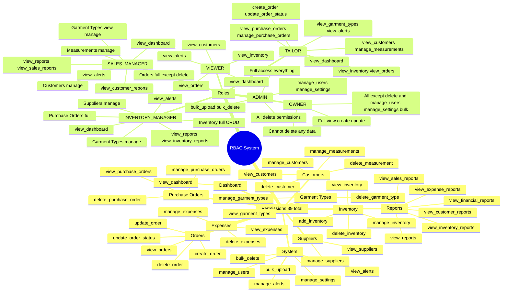

---

## 6. New Order — Data Flow Diagram

```mermaid
flowchart TD
    A([User clicks New Order]) --> B{has permission\ncreate_order?}
    B -- No --> C([Redirect / Hidden])
    B -- Yes --> D[Navigate to /orders/new]

    D --> E[Load initial data in parallel]
    E --> F[GET /api/customers]
    E --> G[GET /api/garment-patterns\nwith default accessories]
    E --> H[GET /api/inventory/cloth]
    E --> I[GET /api/inventory/accessories]

    F & G & H & I --> J[Step 1: Select Customer]

    J --> K{Customer\nexists?}
    K -- No --> L[Create Inline\nname + phone]
    K -- Yes --> M[Show customer card\nwith last order info]
    L --> N[Step 2: Add Items]
    M --> N

    N --> O[Select Garment Pattern]
    O --> P[Auto-load default accessories\nfrom GarmentAccessory table]
    P --> Q[Select Fabric\nshow available stock]
    Q --> R[Select Body Type\nSLIM/REGULAR/LARGE/XL]
    R --> S{More items?}
    S -- Yes --> O
    S -- No --> T[calculateEstimate runs\non every state change]

    T --> U[Step 3: Pricing & Details]
    U --> V[Set Delivery Date]
    V --> W[Set Advance Payment]
    W --> X[Set Stitching Tier\nBASIC / PREMIUM / LUXURY]
    X --> Y[Add Workmanship Premiums\noptional]
    Y --> Z[Review Order Summary\nlive total shown]

    Z --> AA[POST /api/orders]

    AA --> AB[Server: requirePermission\ncreate_order]
    AB --> AC[Server: Validate customer exists\nprisma.customer.findUnique]
    AC --> AD[Server: Check stock availability\ncurrentStock - reserved ge estimatedMeters]
    AD --> AE{Stock\navailable?}
    AE -- No --> AF([Return 400\nInsufficient stock])
    AE -- Yes --> AG[Server: Recalculate pricing\nlib/gst-utils.ts]

    AG --> AH[prisma.$transaction START]
    AH --> AI[Create Order record\nstatus: NEW]
    AI --> AJ[Create OrderItem records\nestimatedMeters calculated]
    AJ --> AK[ClothInventory.reserved += estimatedMeters\nPER ITEM]
    AK --> AL[StockMovement.create\ntype: ORDER_RESERVED]
    AL --> AM[AccessoryInventory.reserved += quantity\nPER ACCESSORY]
    AM --> AN[AccessoryStockMovement.create\ntype: ORDER_RESERVED]
    AN --> AO[OrderHistory.create\nORDER_CREATED]
    AO --> AP[prisma.$transaction COMMIT]

    AP --> AQ[Return order.id to client]
    AQ --> AR[Router.push /orders/orderId]

    AP --> AS[async: after response sent\nnext/server after]
    AS --> AT[lib/generate-alerts.ts\nCheck low stock\nCreate Alert if needed]

    style AH fill:#f0f9ff,stroke:#0ea5e9
    style AP fill:#f0fdf4,stroke:#22c55e
    style AF fill:#fff1f2,stroke:#f43f5e
```

---

## 7. Order Status Lifecycle — State Machine

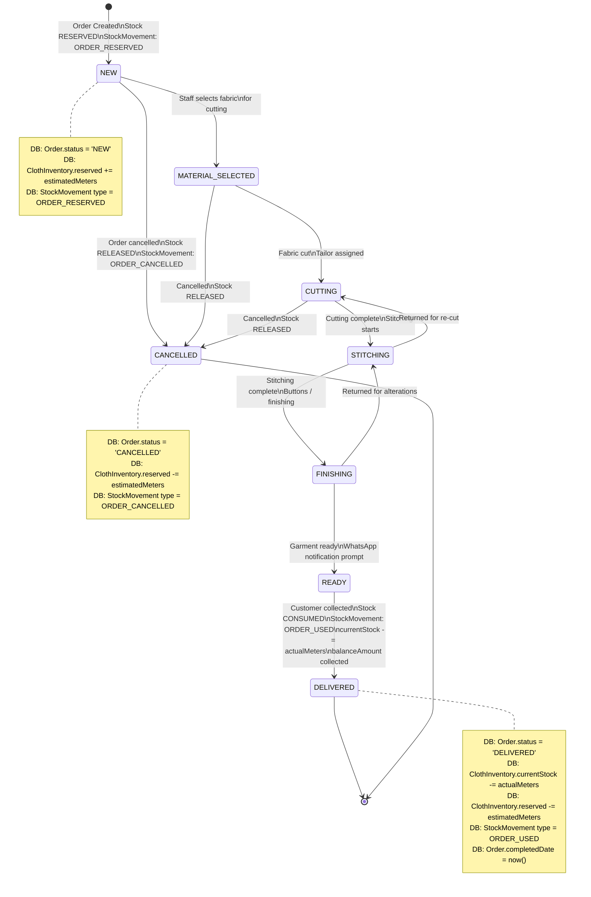

---

## 8. Stock Movement Data Flow

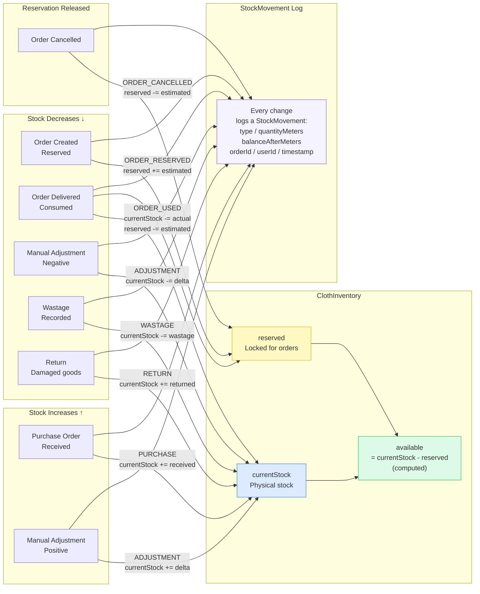

---

## 9. Dashboard — Role-Based Data Flow

```mermaid
flowchart TD
    A[/dashboard page\nServer Component] --> B[auth\nGet session + role]

    B --> C{User Role?}

    C -->|OWNER / ADMIN| D[GET /api/dashboard/enhanced-stats]
    C -->|TAILOR| E[GET /api/dashboard/stats\nfiltered for tailor]
    C -->|SALES_MANAGER| F[GET /api/dashboard/stats\nfiltered for sales]
    C -->|INVENTORY_MANAGER| G[GET /api/dashboard/stats\nfiltered for inventory]
    C -->|VIEWER| H[GET /api/dashboard/stats\nread-only view]

    D --> D1[lib/dashboard-data.ts\ngetEnhancedStats]
    D1 --> D2[(Order aggregate\nrevenue trends)]
    D1 --> D3[(Expense aggregate\nmonthly costs)]
    D1 --> D4[(Customer aggregate\nretention rate)]
    D1 --> D5[(ClothInventory\nstock health)]
    D1 --> D6[(StockMovement\nefficiency metrics)]

    D --> O[owner-dashboard.tsx]
    O --> O1[FinancialTrendChart\nRecharts LineChart]
    O --> O2[GaugeChart\nSVG stock turnover]
    O --> O3[CustomerRetentionChart\nRecharts PieChart]
    O --> O4[OrdersStatusChart\nRecharts BarChart]
    O --> O5[InventorySummary\nTable]
    O --> O6[TopCustomersChart\nRecharts BarChart]
    O --> O7[GarmentTypeRevenueChart\nRecharts BarChart]

    E --> T[tailor-dashboard.tsx]
    T --> T1[In Progress count\ncurrent production]
    T --> T2[Due Today count\nurgent deliveries]
    T --> T3[Overdue count\nlate orders]
    T --> T4[WorkloadChart\nRecharts BarChart]
    T --> T5[DeadlineList\nupcoming orders]

    F --> S[sales-manager-dashboard.tsx]
    S --> S1[Revenue this week]
    S --> S2[Orders pipeline\nProductionPipelineChart]
    S --> S3[Outstanding payments]
    S --> S4[TopFabricsChart]

    G --> I[inventory-manager-dashboard.tsx]
    I --> I1[StockComparisonChart\nfabric levels]
    I --> I2[PendingPOsDialog\npurchase orders]
    I --> I3[Low stock alerts]

    style D fill:#fef3c7,stroke:#d97706
    style E fill:#dbeafe,stroke:#3b82f6
    style F fill:#dcfce7,stroke:#16a34a
    style G fill:#fce7f3,stroke:#db2777
```

---

## 10. Authentication & Permission Flow

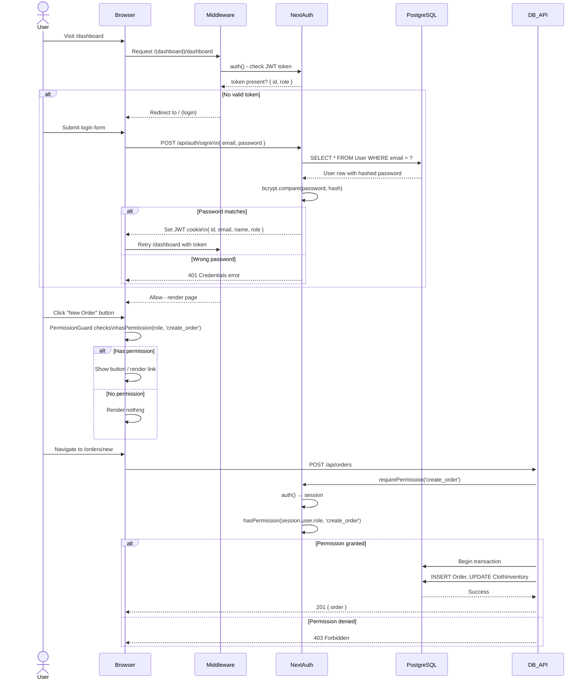

---

## 11. Customer Measurement Lifecycle

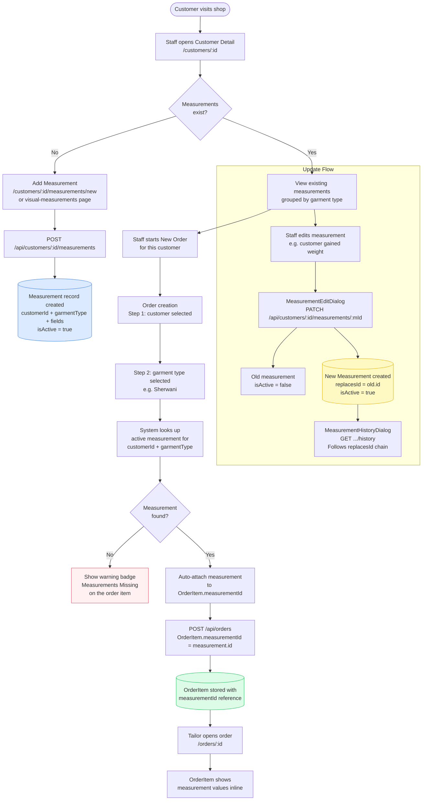

---

## 12. Alert System Flow

```mermaid
flowchart TD
    subgraph TRIGGERS["Alert Triggers"]
        T1[Order status changes\nPATCH /api/orders/:id/status]
        T2[Manual generate\nPOST /api/alerts/generate]
        T3[Scheduled job\nexternal trigger]
    end

    T1 -->|async via\nnext/server after| G
    T2 --> G
    T3 --> G

    G[lib/generate-alerts.ts\ngenerateAlerts]

    G --> C1[Query all active ClothInventory]
    C1 --> C2{calculateStockStatus\ncurrentStock - reserved vs minimum}
    C2 -->|CRITICAL\navailable lt minimum x 0.5| C3[Alert CRITICAL_STOCK\nHIGH severity]
    C2 -->|LOW\navailable lt minimum| C4[Alert LOW_STOCK\nMEDIUM severity]
    C2 -->|HEALTHY| C5[No alert]

    G --> O1[Query orders where\ndeliveryDate lt today\nstatus NOT DELIVERED or CANCELLED]
    O1 --> O2[Alert ORDER_DELAYED\nHIGH severity]

    C3 & C4 & O2 --> U[prisma.alert.upsert\nunique: relatedId + relatedType + type + isDismissed]
    U --> A[(Alert table\nno duplicates)]

    A --> V[/alerts page\nGET /api/alerts]
    V --> V1[Filter: isDismissed=false\nand dismissedUntil null or past]

    V --> ACT{User action}
    ACT -->|Mark Read| R[PATCH /api/alerts/:id/read\nisRead = true]
    ACT -->|Dismiss| D[PATCH /api/alerts/:id/dismiss\nisDismissed = true\ndismissedUntil = snooze date]
    ACT -->|Mark All Read| MR[POST /api/alerts/mark-all-read]

    ACT -->|Take Action| LINK[Direct links\nLow stock → /inventory\nOverdue → /orders?status=overdue]

    style C3 fill:#fff1f2,stroke:#f43f5e
    style C4 fill:#fef9c3,stroke:#eab308
    style C5 fill:#dcfce7,stroke:#22c55e
    style A fill:#f5f3ff,stroke:#8b5cf6
```

---

## 13. WhatsApp Integration Flow

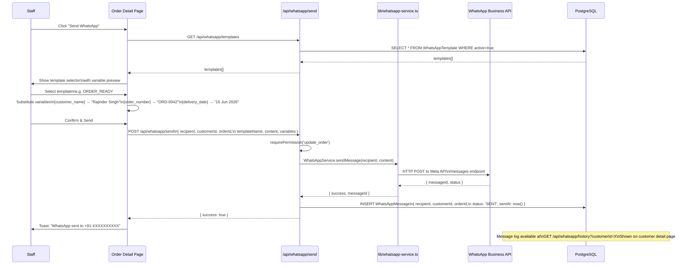

---

## 14. Purchase Order → Stock Receipt Flow

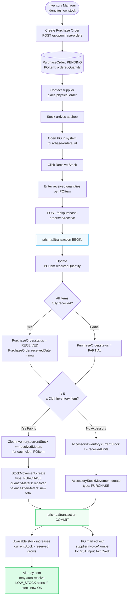

---

## 15. Bulk Upload Flow

```mermaid
flowchart TD
    A([Admin uploads Excel file]) --> B[/bulk-upload page\nrequirePermission: bulk_upload]

    B --> C[GET /api/bulk-upload/download-template\nDownload blank Excel template]

    A --> D[Select Excel file]
    D --> E[POST /api/bulk-upload/preview\nfile uploaded as FormData]

    E --> F[lib/excel-processor.ts\nparseExcel buffer]
    F --> G[Parse each row\nvalidate column headers]
    G --> H{Valid\nformat?}

    H -- No --> I([Return 400\nFormat error])
    H -- Yes --> J[Return preview:\n rows / errors / duplicates]

    J --> K[Show preview table\nGreen valid / Red errors / Yellow duplicates]
    K --> L{User\nconfirms?}

    L -- No --> D
    L -- Yes --> M[POST /api/bulk-upload/process]

    M --> N[lib/excel-processor.ts\nprocessRows - safe-fail loop]

    N --> O{For each row\ntry-catch}

    O --> P{Row type?}

    P -- Customer --> Q[prisma.customer.upsert\nfind by phone number]
    P -- Cloth Fabric --> R[prisma.clothInventory.upsert\nfind by SKU]
    P -- Accessory --> S[prisma.accessoryInventory.upsert\nfind by SKU]

    Q & R & S --> T{Error?}
    T -- Yes --> U[failures.push\nrow number + message\nContinue to next row]
    T -- No --> V[successCount++]

    U & V --> W{More rows?}
    W -- Yes --> O
    W -- No --> X[prisma.uploadHistory.create\nuserId filename counts summary]

    X --> Y([Return result:\nsuccess / failure / duplicate counts])
    Y --> Z[Show result modal\nGreen/Red breakdown]

    style N fill:#f5f3ff,stroke:#8b5cf6
    style U fill:#fef9c3,stroke:#eab308
    style X fill:#dcfce7,stroke:#22c55e
```

---

## 16. Pricing Calculation Flow (New Order)

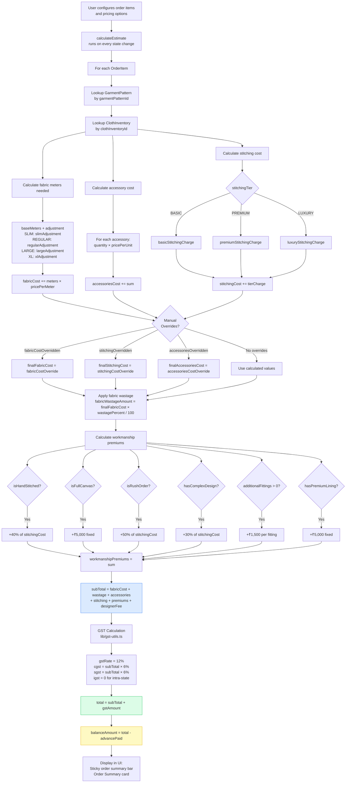

---

## 17. Shared Library Dependency Map

```mermaid
graph LR
    subgraph DB_LAYER["Database Layer"]
        PRISMA[("PostgreSQL\ntailor_inventory")]
        DB[lib/db.ts\nPrisma singleton\nPrismaPg adapter]
        DB --> PRISMA
    end

    subgraph AUTH_LAYER["Auth Layer"]
        AUTH[lib/auth.ts\nNextAuth v5\nJWT strategy\nReact.cache wrapped]
        PERM[lib/permissions.ts\nrolePermissions matrix\nhasPermission\nhasAnyPermission]
        APIPERM[lib/api-permissions.ts\nrequirePermission\nrequireAnyPermission\nrequireAuth]
        AUTH --> DB
        APIPERM --> AUTH
        APIPERM --> PERM
    end

    subgraph UTILS_LAYER["Utilities"]
        UTILS[lib/utils.ts\nformatCurrency\ngenerateOrderNumber\ngenerateSKU\ncalculateStockStatus]
        GST[lib/gst-utils.ts\ncalculateGST\ncgst sgst igst]
        DASHDATA[lib/dashboard-data.ts\ngetDashboardStats\ngetEnhancedStats]
        ALERTS[lib/generate-alerts.ts\ngenerateAlerts\ncreates Alert records]
        EXCEL[lib/excel-processor.ts\nparseExcel\nprocessRows safe-fail]
        WA[lib/whatsapp/\nwhatsapp-service.ts\nWhatsAppService class]
        DASHDATA --> DB
        ALERTS --> DB
        ALERTS --> UTILS
        EXCEL --> DB
        WA --> DB
    end

    subgraph API_ROUTES["API Routes (examples)"]
        ORDERS[/api/orders]
        INVENTORY[/api/inventory/cloth]
        CUSTOMERS[/api/customers]
        REPORTS[/api/reports/financial]
    end

    subgraph PAGES["Pages (examples)"]
        NEW_ORDER[orders/new/page.tsx]
        DASHBOARD[dashboard/page.tsx]
        CUSTOMER_DETAIL[customers/:id/page.tsx]
    end

    %% Pages call APIs
    NEW_ORDER -->|fetch| ORDERS
    NEW_ORDER -->|fetch| INVENTORY
    NEW_ORDER -->|fetch| CUSTOMERS
    DASHBOARD -->|fetch| REPORTS

    %% APIs use lib layer
    ORDERS --> APIPERM
    ORDERS --> UTILS
    ORDERS --> GST
    ORDERS --> DB
    INVENTORY --> APIPERM
    INVENTORY --> UTILS
    INVENTORY --> DB
    REPORTS --> APIPERM
    REPORTS --> DASHDATA

    %% Customer detail server-side
    CUSTOMER_DETAIL --> AUTH
    CUSTOMER_DETAIL --> DB

    style DB_LAYER fill:#eff6ff,stroke:#3b82f6
    style AUTH_LAYER fill:#fdf4ff,stroke:#c026d3
    style UTILS_LAYER fill:#f0fdf4,stroke:#16a34a
    style API_ROUTES fill:#fff7ed,stroke:#ea580c
    style PAGES fill:#fafaf9,stroke:#78716c
```

---

## 18. Component Tree — Order Detail Page

```mermaid
graph TD
    ROOT["/orders/:id/page.tsx\nServer Component"] -->|prisma.order.findUnique| DATA[(Order + all relations\nfetched server-side)]

    ROOT --> LAYOUT[DashboardLayout.tsx\nSidebar + Header]
    ROOT --> BREADCRUMB[Breadcrumb\nHome → Orders → #ORD-XXXX]
    ROOT --> HEADER[Page Header\nOrder number + Status + Customer link]

    ROOT --> C1[OrderActions.tsx\nStatus update buttons]
    ROOT --> C2[OrderHistory.tsx\nAudit trail list]
    ROOT --> C3[PaymentInstallments.tsx\nPayment schedule]
    ROOT --> C4[OrderItemEdit.tsx\nEdit garment/fabric per item]
    ROOT --> C5[SplitOrderDialog.tsx\nSplit into 2 orders]
    ROOT --> C6[RecordPaymentDialog.tsx\nRecord cash/UPI payment]
    ROOT --> C7[PrintInvoiceButton.tsx\nGenerate PDF invoice]
    ROOT --> C8[EditMeasurementDialog.tsx\nUpdate customer measurements]
    ROOT --> C9[OrderItemDetailDialog.tsx\nFull item detail view]
    ROOT --> C10[AssignTailorDialog.tsx\nAssign tailor to item]
    ROOT --> C11[SendWhatsAppButton.tsx\nSend status message]

    C1 -->|PATCH| API1[/api/orders/:id/status]
    C3 -->|GET POST| API2[/api/orders/:id/installments]
    C3 -->|PATCH| API3[/api/installments/:id]
    C4 -->|GET| API4[/api/inventory/cloth]
    C4 -->|PATCH| API5[/api/orders/:id/items/:itemId]
    C5 -->|POST| API6[/api/orders/:id/split]
    C6 -->|POST| API7[/api/orders/:id/payments]
    C8 -->|PATCH| API8[/api/measurements/:id]
    C10 -->|GET| API9[/api/admin/users]
    C10 -->|PATCH| API5
    C11 -->|GET| API10[/api/whatsapp/templates]
    C11 -->|POST| API11[/api/whatsapp/send]

    API1 -->|atomic| DB1[(Order + ClothInventory\n+ StockMovement\n+ OrderHistory)]
    API6 -->|atomic| DB2[(Order×2 + OrderItem\n+ StockMovement + OrderHistory)]
    API7 -->|atomic| DB3[(PaymentInstallment\n+ Order.balanceAmount)]
    API11 --> DB4[(WhatsAppMessage log)]

    style ROOT fill:#dbeafe,stroke:#3b82f6
    style DATA fill:#f5f3ff,stroke:#8b5cf6
    style DB1 fill:#dcfce7,stroke:#22c55e
    style DB2 fill:#dcfce7,stroke:#22c55e
    style DB3 fill:#dcfce7,stroke:#22c55e
```

---

*Render these diagrams at https://mermaid.live by pasting any code block.*
*Or install the Mermaid extension for VS Code: `Markdown Preview Mermaid Support`.*
*All diagrams reflect codebase state as of May 2026 (Phase 2: Excel VBA, Production Board, 22-field measurements, status tab bar).*
