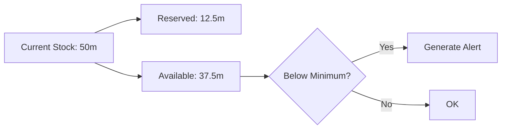
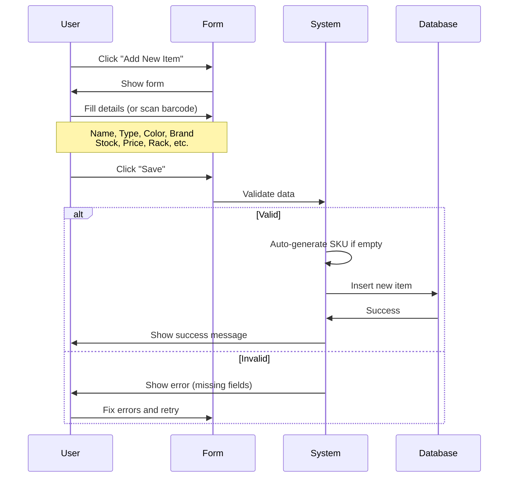
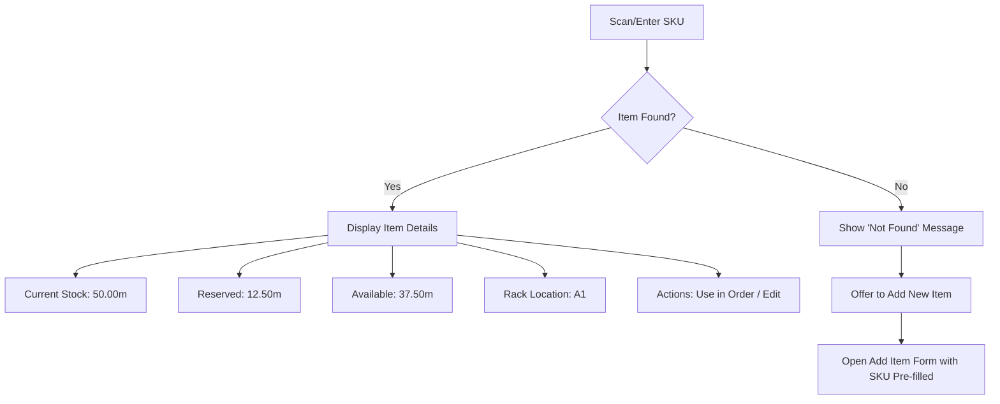
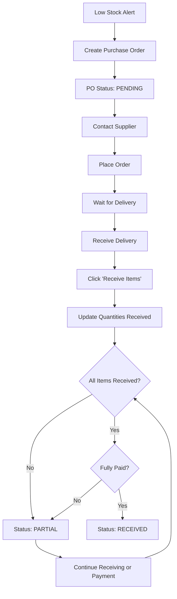

# Hamees Attire - Complete User Guide (Part 2: Inventory Management)

**Version:** 1.0
**Date:** January 20, 2026
**Application URL:** https://hamees.gagneet.com

---

## Table of Contents - Part 2

1. [Inventory Overview](#inventory-overview)
2. [Managing Cloth Inventory](#managing-cloth-inventory)
3. [Managing Accessories](#managing-accessories)
4. [Barcode and QR Code Scanning](#barcode-and-qr-code-scanning)
5. [Stock Movements](#stock-movements)
6. [Purchase Orders](#purchase-orders)
7. [Supplier Management](#supplier-management)
8. [Garment Patterns](#garment-patterns)

---

## Inventory Overview

### What is Inventory?

The Inventory module manages two types of items:

1. **Cloth Inventory**
   - Fabrics: Cotton, Silk, Linen, Wool, Polyester
   - Measured in meters
   - Price per meter
   - Stock reservation for orders

2. **Accessory Inventory**
   - Buttons, Thread, Zippers, Lining, Interfacing, Elastic
   - Measured in units (pieces, spools, meters)
   - Price per unit
   - Quantity tracking

### Key Concepts

#### Current Stock
The total quantity physically available in your store.

**Example:** You have 50 meters of Blue Cotton fabric.

#### Reserved Stock
Quantity allocated to pending orders but not yet used.

**Example:** 3 orders need 12.5 meters total → Reserved = 12.5m

#### Available Stock
What's actually available for new orders.

**Formula:** `Available = Current Stock - Reserved Stock`

**Example:** 50m - 12.5m = 37.5m available

#### Minimum Stock
Threshold for low stock alerts.

**Example:** If minimum is 10m and available drops below 10m, alert is generated.



---

## Managing Cloth Inventory

### Accessing Cloth Inventory

**Navigation:** Sidebar → Inventory → Cloth Inventory tab

**Who Can Access:**
- ✅ OWNER, ADMIN, INVENTORY_MANAGER (manage)
- ✅ TAILOR, VIEWER (view only)
- ❌ SALES_MANAGER (no access to inventory)

### Inventory List View

**Columns Displayed:**

| Column | Description | Example |
|--------|-------------|---------|
| **SKU** | Unique identifier | CLT-COTTON-ABC-1705847293 |
| **Name** | Fabric name | Premium Cotton |
| **Type** | Fabric type | Cotton |
| **Brand** | Supplier brand | ABC Fabrics |
| **Color** | Fabric color | Blue |
| **Current Stock** | Total meters | 50.00m |
| **Reserved** | Allocated to orders | 12.50m |
| **Available** | Current - Reserved | 37.50m |
| **Price/Meter** | Unit price | ₹450.00 |
| **Rack Location** | Storage location | Rack A1 |
| **Status** | Stock level | 🟢 Good / 🟡 Low / 🔴 Critical |
| **Actions** | Edit / Delete buttons | 📝 ❌ |

### Stock Status Indicators

| Indicator | Meaning | Condition |
|-----------|---------|-----------|
| 🟢 **Good** | Healthy stock | Available ≥ Minimum |
| 🟡 **Low Stock** | Needs reorder soon | Available < Minimum but > 0 |
| 🔴 **Critical** | Urgent reorder | Available ≤ 0 |

### Adding New Cloth Item



**Step-by-Step:**

1. **Click "Add New Item"** button (top-right of Cloth Inventory page)

2. **Fill in the Form:**

   **Required Fields (*):**
   - **Name:** Descriptive name (e.g., "Premium Cotton")
   - **Type:** Select from dropdown (Cotton, Silk, Linen, Wool, Polyester)
   - **Brand:** Supplier brand name (e.g., "ABC Fabrics")
   - **Color:** Fabric color (e.g., "Blue")
   - **Current Stock:** Initial quantity in meters (e.g., `50.00`)
   - **Price per Meter:** Cost in ₹ (e.g., `450.00`)
   - **Minimum Stock:** Alert threshold (e.g., `10.00`)

   **Optional Fields:**
   - **SKU:** Leave empty to auto-generate OR scan barcode
   - **Rack Location:** Storage location (e.g., "Rack A1")
   - **Supplier:** Select existing supplier from dropdown

3. **Auto-Generate SKU:**
   - If SKU field is left empty, system generates:
   - Format: `CLT-{TYPE}-{BRAND}-{TIMESTAMP}`
   - Example: `CLT-COTTON-ABC-1737365847`

4. **Scan Barcode (Optional):**
   - Click "Scan Barcode" button next to SKU field
   - System opens barcode scanner
   - Scan manufacturer barcode on fabric roll
   - SKU field auto-fills with scanned code

5. **Click "Save"**
   - System validates all required fields
   - If valid → Item added, success message appears
   - If invalid → Error messages show which fields need fixing

6. **View New Item**
   - New item appears in inventory list
   - Status indicator shows stock level
   - Item is immediately available for order creation

### Editing Cloth Item

**Who Can Edit:** OWNER, ADMIN, INVENTORY_MANAGER

**Steps:**

1. **Find the Item**
   - Use search box to filter by name, color, or SKU
   - Or scroll through the list

2. **Click Edit Button** (pencil icon 📝)

3. **Modify Fields**
   - Update any field except SKU (SKU is immutable)
   - Common updates:
     - Current Stock (after physical audit)
     - Price per Meter (price change from supplier)
     - Rack Location (reorganization)
     - Minimum Stock (adjust alert threshold)

4. **Click "Save"**
   - Changes are immediately applied
   - Stock movement record created for stock adjustments

### Updating Stock After Receiving Delivery

**Best Practice:** Use Purchase Orders instead of manual edit

**If Manual Update Needed:**

1. Edit the item
2. Update "Current Stock" to new total
   - Example: Had 50m, received 100m → Update to 150m
3. Save
4. System creates ADJUSTMENT stock movement automatically

**Better Method:** Create Purchase Order (see section below)

### Deleting Cloth Item

**Who Can Delete:** ADMIN only (OWNER cannot delete)

**⚠️ Warning:** Cannot delete item if:
- It's used in any order (even old completed orders)
- It has reserved stock > 0
- It has historical stock movements

**Steps:**

1. Click Delete button (trash icon ❌)
2. Confirmation dialog appears
3. Review warning message
4. Click "Yes, Delete" to confirm
5. Item removed from system

**What Happens:**
- Item record deleted from database
- Stock movements remain for audit trail
- Orders using this item show "Deleted Fabric" instead

**Recommendation:** Instead of deleting, set stock to 0 and archive.

---

## Managing Accessories

### Accessing Accessories

**Navigation:** Sidebar → Inventory → Accessories Inventory tab

**Who Can Access:** Same as Cloth Inventory

### Accessory Types

The system supports **10 accessory types**:

| Type | Unit | Example Items |
|------|------|---------------|
| **Button** | Pieces | Shirt buttons, trouser buttons, metal buttons |
| **Thread** | Spools | Polyester thread, cotton thread |
| **Zipper** | Pieces | Metal zippers, plastic zippers, invisible zippers |
| **Lining** | Meters | Polyester lining, cotton lining |
| **Interfacing** | Meters | Fusible interfacing, non-fusible |
| **Elastic** | Meters | Waistband elastic, cuff elastic |
| **Hook** | Pieces | Trouser hooks, skirt hooks |
| **Velcro** | Meters | Sew-on velcro, adhesive velcro |
| **Shoulder Pad** | Pairs | Suit shoulder pads, blazer pads |
| **Label** | Pieces | Brand labels, care labels, size labels |

### Accessories List View

**Columns:**

| Column | Description |
|--------|-------------|
| **SKU** | Auto-generated: ACC-{TYPE}-{TIMESTAMP} |
| **Name** | Descriptive name |
| **Type** | Accessory type (dropdown) |
| **Color** | Color variant (optional) |
| **Current Stock** | Total units |
| **Price/Unit** | Unit price |
| **Minimum Stock** | Alert threshold |
| **Supplier** | Supplier name |
| **Status** | Stock level indicator |

### Adding New Accessory

**Steps:**

1. **Click "Add New Item"** on Accessories tab

2. **Fill Form:**
   - **Name:** e.g., "Brass Buttons 15mm"
   - **Type:** Select from dropdown (e.g., "Button")
   - **Color:** e.g., "Gold"
   - **Current Stock:** e.g., `1000` (units)
   - **Unit Price:** e.g., `₹2.50`
   - **Minimum Stock:** e.g., `100` (units)
   - **SKU:** Auto-generates (e.g., `ACC-BUT-1737365847`)
   - **Supplier:** Select from dropdown

3. **Click "Save"**

4. **Accessory Added**
   - Appears in Accessories list
   - Available for garment patterns

### Linking Accessories to Garment Patterns

Accessories are automatically linked when creating garment patterns (see Garment Patterns section).

**Example:**
- Garment: "Men's Shirt"
- Required Accessories:
  - Buttons: 7 pieces per garment
  - Thread: 1 spool per 10 garments
  - Interfacing: 0.5m per garment

When an order is created for 5 shirts:
- System reserves: 35 buttons (7 × 5)
- System reserves: 1 spool thread
- System reserves: 2.5m interfacing

---

## Barcode and QR Code Scanning

### Barcode Scanner Features

The system supports scanning barcodes to quickly lookup and add inventory items.

**Supported Formats:**
- QR Codes (2D)
- UPC (Universal Product Code)
- EAN (European Article Number)
- Code128, Code39, Code93, Codabar

**Access:** Click "Scan Barcode" button on Inventory page

### Scanner Interface

```
┌─────────────────────────────────────┐
│  Barcode Scanner                    │
├─────────────────────────────────────┤
│  [Camera Mode]  [Manual Entry]      │
├─────────────────────────────────────┤
│                                     │
│     ┌─────────────────┐             │
│     │                 │             │
│     │   Camera View   │             │
│     │   (if enabled)  │             │
│     │                 │             │
│     └─────────────────┘             │
│                                     │
│  Or type SKU manually:              │
│  [________________]  [Lookup]       │
│                                     │
│  [Close]                            │
└─────────────────────────────────────┘
```

### Using Camera Mode (Desktop)

**Requirements:**
- Desktop/laptop with webcam
- Chrome or Edge browser (best support)
- Camera permissions granted

**Steps:**

1. **Click "Scan Barcode"** button
2. **Select "Camera Mode"** tab
3. **Grant Permission** (browser asks for camera access)
4. **Point Camera at Barcode/QR Code**
   - Hold steady
   - Ensure good lighting
   - Keep code within frame
5. **Wait for Detection** (2-10 seconds)
   - Green box appears when detected
   - Item details auto-populate

**If Scanning Times Out (10 seconds):**
- System automatically switches to Manual Entry
- Type SKU manually

### Using Manual Entry (Recommended for Mobile)

**Best for:**
- Mobile devices (most reliable)
- Damaged/unreadable barcodes
- Quick entry if you know the SKU

**Steps:**

1. **Click "Scan Barcode"** button
2. **Select "Manual Entry"** tab (default on mobile)
3. **Type SKU** in input field
   - Example: `CLT-COTTON-ABC-1737365847`
   - Or manufacturer barcode: `8901234567890`
4. **Click "Lookup"**
5. **View Results**

### Barcode Lookup Results



**If Item Found:**
- Item name, color, brand displayed
- Current stock and available stock shown
- Rack location highlighted
- Options:
  - "Use in Order" button → Navigate to create order
  - "View Details" → Open item detail page
  - "Close" → Return to inventory

**If Item Not Found:**
- "Item not found" message
- SKU shown: "No match for: CLT-XXX-XXX-123"
- "Add New Item" button appears
- Clicking button opens Add Item form with SKU pre-filled

### Generating QR Codes for Items

**Feature:** Generate printable QR code labels for inventory items

**Access:** API endpoint (UI coming in v0.19.0)

**Current Method (API):**

1. Get item ID from inventory list
2. Use API endpoint: `POST /api/barcode/generate`
3. Request body:
   ```json
   {
     "type": "cloth",
     "itemId": "clxy1234567890abc"
   }
   ```
4. Response includes QR code image (base64)
5. Save image and print

**See:** [Barcode & QR Code Implementation Guide](BARCODE_QR_IMPLEMENTATION_GUIDE.md) for detailed instructions

---

## Stock Movements

### What are Stock Movements?

**Definition:** Complete audit trail of all inventory changes.

Every time stock changes, a movement record is created:
- Purchase deliveries
- Order reservations
- Order usage (when cutting)
- Order cancellations (stock release)
- Manual adjustments
- Returns
- Wastage

### Stock Movement Types

| Type | Description | Quantity | Example |
|------|-------------|----------|---------|
| **PURCHASE** | Stock received from supplier | Positive | +100m received |
| **ORDER_RESERVED** | Stock allocated to order | Negative | -3.5m reserved |
| **ORDER_USED** | Actual usage in production | Negative | -3.3m used |
| **ORDER_CANCELLED** | Reservation released | Positive | +3.5m released |
| **ADJUSTMENT** | Manual correction | +/- | +5m found in audit |
| **RETURN** | Return to supplier | Negative | -10m defective |
| **WASTAGE** | Damage, loss, cutting waste | Negative | -0.2m waste |

### Viewing Stock Movements

**Navigation:** Inventory → Select Item → Click "View History"

**Movement Record Details:**

```
═══════════════════════════════════════════════════════════
Date: 15 Jan 2026, 10:30 AM
Type: ORDER_RESERVED
Quantity: -3.50m
Balance After: 46.50m
User: Sales Manager (sales@hameesattire.com)
Order: ORD-202601-0123
Notes: Reserved for Rajesh Kumar - 2 Shirts
═══════════════════════════════════════════════════════════
```

### Automatic Stock Movements

**System Creates Movements Automatically:**

1. **When Order Created:**
   - Type: ORDER_RESERVED
   - Updates: `reserved` field increases
   - Result: Available stock decreases

2. **When Cutting Starts:**
   - Type: ORDER_USED
   - Updates: `currentStock` decreases, `reserved` decreases
   - Records: `actualMetersUsed` on order

3. **When Order Cancelled:**
   - Type: ORDER_CANCELLED
   - Updates: `reserved` field decreases
   - Result: Available stock increases

4. **When PO Received:**
   - Type: PURCHASE
   - Updates: `currentStock` increases
   - Result: Available stock increases

### Manual Stock Adjustments

**When to Use:**
- Physical audit finds discrepancy
- Discovered damaged fabric
- Found additional stock in storage
- Correct data entry error

**Steps:**

1. **Navigate:** Inventory → Edit Item
2. **Update Stock:** Change "Current Stock" to correct amount
3. **Add Note:** Explain reason for adjustment
4. **Save**
5. **System Creates:** ADJUSTMENT movement record

**Example:**
```
Physical count: 48.5m
System shows: 50.0m
Difference: -1.5m (missing)

Action: Update to 48.5m
Note: "Physical audit - Jan 2026. 1.5m unaccounted for."
```

---

## Purchase Orders

### What is a Purchase Order (PO)?

**Definition:** Record of fabric/accessory purchase from supplier.

**Purpose:**
- Track what you ordered
- Track what you received
- Track payment status
- Update stock automatically when received
- Maintain supplier relationship history

### PO Workflow



### Creating a Purchase Order

**Who Can Create:** OWNER, ADMIN, INVENTORY_MANAGER, TAILOR

**Steps:**

1. **Navigate:** Sidebar → Purchase Orders → Click "New Purchase Order"

2. **Fill PO Details:**

   **Basic Information:**
   - **Supplier:** Select from dropdown (must create supplier first)
   - **PO Number:** Auto-generated (e.g., `PO-202601-001`)
   - **Order Date:** Defaults to today (editable)
   - **Expected Delivery:** Estimated arrival date
   - **Notes:** Special instructions (optional)

3. **Add Items:**

   Click "Add Item" → Select item → Enter details:

   **For Cloth Items:**
   - **Item:** Select fabric from dropdown
   - **Quantity Ordered:** Meters (e.g., `100.00`)
   - **Price per Unit:** ₹/meter (e.g., `₹450.00`)
   - **Total:** Auto-calculated (100 × 450 = ₹45,000)

   **For Accessories:**
   - **Item:** Select accessory from dropdown
   - **Quantity Ordered:** Units (e.g., `5000` buttons)
   - **Price per Unit:** ₹/piece (e.g., `₹2.50`)
   - **Total:** Auto-calculated (5000 × 2.50 = ₹12,500)

4. **Review Totals:**
   - **Subtotal:** Sum of all items
   - **GST (12%):** Auto-calculated
   - **Total Amount:** Subtotal + GST

5. **Payment Details:**
   - **Advance Paid:** Amount paid upfront (e.g., `₹20,000`)
   - **Payment Mode:** Cash, UPI, Bank Transfer, Cheque
   - **Transaction Ref:** Check number, UPI ID, etc.
   - **Balance Due:** Auto-calculated

6. **Click "Create Purchase Order"**

7. **PO Created:**
   - PO number assigned
   - Status: PENDING
   - Appears in PO list

### Receiving Purchase Order

**When Delivery Arrives:**

1. **Find the PO:**
   - Navigate to Purchase Orders
   - Search by PO number or supplier
   - Click on the PO

2. **Click "Receive Items"** button

3. **Enter Quantities Received:**
   - For each item, enter actual quantity received
   - Example: Ordered 100m, Received 98m → Enter `98.00`
   - Can receive partial quantities over multiple deliveries

4. **Optional Payment:**
   - If making additional payment during receipt
   - Enter payment amount
   - Select payment mode
   - Enter transaction reference

5. **Add Notes:**
   - Describe delivery condition
   - Note any issues (damages, shortages)

6. **Click "Receive"**

7. **System Actions:**
   - Updates `currentStock` for each item (PURCHASE movement)
   - Updates PO status:
     - RECEIVED: All items fully received AND fully paid
     - PARTIAL: Some items received OR some payment pending
   - Records payment if provided
   - Creates notes entry with timestamp

**Example Receipt Note:**
```
[16/01/2026 14:30] Received:
- Cotton Blue: 98.00m (ordered: 100.00m, shortage: 2.00m)
- Payment: 25000.00 via BANK_TRANSFER

Delivery in good condition. 2m shortage to be sent in next batch.
```

### Making Payment on PO

**Separate from Receiving Items:**

You can make payments independently:

1. **Open PO Details**
2. **Click "Make Payment"** button
3. **Enter Payment Details:**
   - **Amount:** Partial or full balance
   - **Payment Mode:** Cash, UPI, Card, Bank Transfer, Cheque, Net Banking
   - **Transaction Ref:** Reference number
   - **Notes:** Optional description
4. **Click "Record Payment"**
5. **System Updates:**
   - `paidAmount` increases
   - `balanceAmount` decreases
   - Status updates if fully paid
   - Payment logged in notes

### PO Status Logic

**PENDING:**
- No items received
- No payment made
- Or minimal progress

**PARTIAL:**
- Some items received but not all
- OR some payment made but balance remains
- OR items fully received but payment pending
- OR payment fully done but items pending

**RECEIVED:**
- ✅ All items fully received
- ✅ All payments fully made
- Order complete, PO closed

**CANCELLED:**
- Order cancelled before receiving
- Stock not updated
- Payments remain recorded for accounting

### Cancelling a Purchase Order

**Who Can Cancel:** OWNER, ADMIN, INVENTORY_MANAGER

**Steps:**

1. Open PO details
2. Click "Cancel PO" button
3. Confirm cancellation
4. Enter cancellation reason
5. System sets status to CANCELLED

**Effects:**
- No stock updates
- Cannot receive items
- Payment records preserved
- Appears in "Cancelled" filter

---

## Supplier Management

### What is a Supplier?

**Definition:** Vendor from whom you purchase fabrics and accessories.

**Information Tracked:**
- Contact details
- Payment terms
- Historical purchases
- Price history
- Performance metrics

### Adding a Supplier

**Who Can Add:** OWNER, ADMIN, INVENTORY_MANAGER

**Steps:**

1. **Navigate:** Sidebar → Suppliers → Click "Add Supplier"

2. **Fill Form:**
   - **Name:** Supplier business name (e.g., "ABC Fabrics Pvt Ltd")
   - **Contact Person:** Representative name (e.g., "Rajesh Sharma")
   - **Email:** supplier@example.com
   - **Phone:** 10-digit mobile (e.g., "9876543210")
   - **Address:** Full address with pincode
   - **GST Number:** Supplier's GSTIN (if applicable)
   - **Payment Terms:** e.g., "30 days credit", "Advance 50%"
   - **Notes:** Special terms, relationship details

3. **Click "Save"**

4. **Supplier Added:**
   - Appears in supplier list
   - Available for selection in PO and inventory forms

### Viewing Supplier Details

**Click on Supplier Name** → Opens detail page

**Information Displayed:**

1. **Contact Information**
   - Full address
   - Email, phone
   - GST number

2. **Purchase History**
   - All purchase orders from this supplier
   - Total amount purchased
   - Outstanding balance

3. **Price History**
   - Historical pricing for each item
   - Track price changes over time

4. **Active Items**
   - List of items currently supplied
   - Current stock levels

### Editing Supplier

**Steps:**

1. Click "Edit" button on supplier detail page
2. Modify fields as needed
3. Click "Save"
4. Changes applied immediately

**Common Updates:**
- Phone number change
- Contact person change
- Address change
- Payment terms update

### Supplier Performance Metrics

**Coming in v0.20.0:**
- On-time delivery rate
- Quality score
- Average lead time
- Price competitiveness

---

## Garment Patterns

### What is a Garment Pattern?

**Definition:** Template defining measurements and accessories for a garment type.

**Examples:**
- Men's Shirt
- Women's Trouser
- Men's Suit (3-piece)
- Sherwani

**Purpose:**
- Standardize fabric calculations
- Define required accessories
- Maintain measurement templates
- Ensure consistency across orders

### Default Garment Patterns

The system includes 4 default patterns:

| Pattern | Base Fabric | Body Type Adjustments | Accessories |
|---------|-------------|----------------------|-------------|
| **Men's Shirt** | 2.5m | SLIM: +0m, REG: +0m, L: +0.3m, XL: +0.5m | 7 buttons, thread, interfacing |
| **Men's Trouser** | 2.8m | SLIM: +0m, REG: +0m, L: +0.3m, XL: +0.5m | 1 button, hook, zipper, thread |
| **Men's Suit** | 6.5m | SLIM: +0m, REG: +0.5m, L: +1m, XL: +1.5m | 5 buttons, thread, lining, interfacing, shoulder pads |
| **Sherwani** | 4.2m | SLIM: +0m, REG: +0.3m, L: +0.6m, XL: +1m | 8 buttons, thread, lining |

### Fabric Calculation Formula

```
Required Fabric = Base Meters + Body Type Adjustment

Example (Shirt, LARGE body type):
= 2.5m + 0.3m
= 2.8m
```

### Viewing Garment Patterns

**Navigation:** Sidebar → Garment Types

**List View:**
- Pattern name
- Base fabric required
- Number of linked accessories
- Actions (Edit / Delete)

### Creating Custom Garment Pattern

**Who Can Create:** OWNER, ADMIN, SALES_MANAGER, INVENTORY_MANAGER

**Steps:**

1. **Navigate:** Garment Types → Click "Add Pattern"

2. **Fill Pattern Details:**
   - **Name:** e.g., "Women's Kurti"
   - **Description:** Brief description
   - **Base Meters:** Default fabric needed (e.g., `3.0`)
   - **Body Type Adjustments:**
     - SLIM: `0.0` (no extra)
     - REGULAR: `0.0`
     - LARGE: `0.4`
     - XL: `0.7`

3. **Add Required Accessories:**

   Click "Add Accessory" → Fill details:
   - **Accessory:** Select from dropdown (e.g., "Buttons")
   - **Quantity per Garment:** e.g., `5` buttons
   - **Notes:** Optional (e.g., "15mm brass buttons")

   Repeat for all accessories needed.

4. **Click "Save"**

5. **Pattern Created:**
   - Available in order creation dropdown
   - Fabric calculations automatic
   - Accessories auto-reserved when ordered

### Editing Garment Pattern

**⚠️ Caution:** Editing affects all future orders (not past orders)

**Steps:**

1. Find pattern in list
2. Click "Edit" button
3. Modify fields:
   - Base meters
   - Body type adjustments
   - Add/remove accessories
   - Update quantity per garment
4. Click "Save"
5. Changes apply to new orders only

**Recommendation:** Create new pattern version instead of editing if significant changes.

### Deleting Garment Pattern

**Who Can Delete:** ADMIN only

**⚠️ Warning:** Cannot delete if:
- Used in any order (current or historical)
- Better approach: Archive (set as inactive - feature in v0.20.0)

---

## Next Steps

Continue to:

📖 **[Part 3: Customer Management](USER_GUIDE_PART_3_CUSTOMERS.md)**
- Adding customers
- Recording measurements
- Customer history

📖 **[Part 4: Order Management](USER_GUIDE_PART_4_ORDERS.md)**
- Creating orders
- Order workflow
- Status updates

---

**End of Part 2**

**Questions?** Contact your system administrator.
