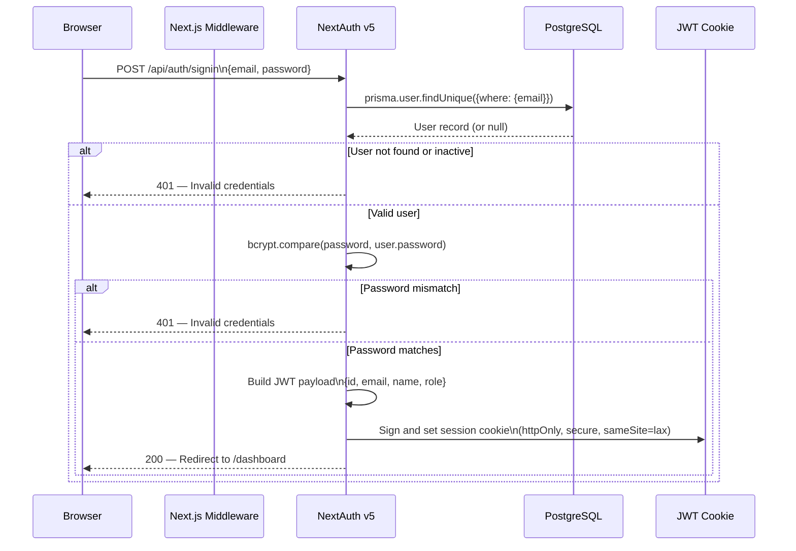
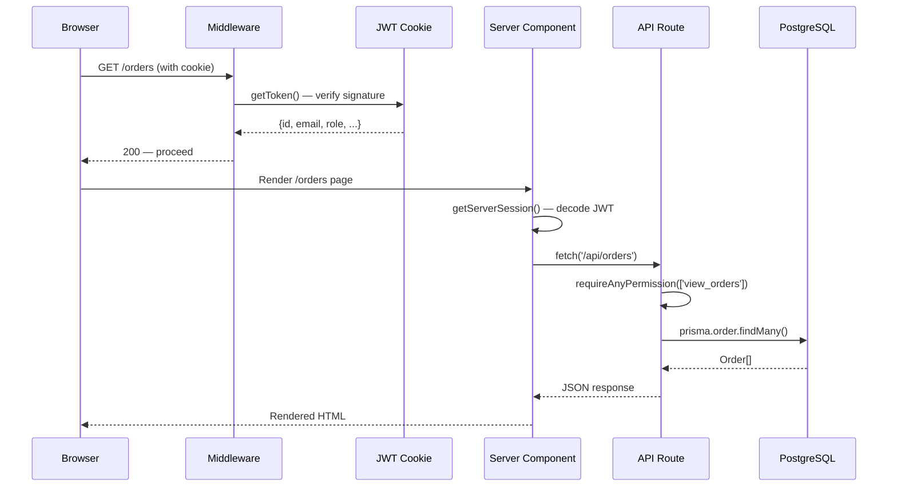

# Authentication Flow

## Technology

- **Library:** NextAuth.js v5 beta.30
- **Strategy:** JWT (stateless, no database sessions)
- **Provider:** Credentials (email + password)
- **Password hashing:** bcryptjs (10 salt rounds)
- **Configuration:** `lib/auth.ts`

## Login Flow



## JWT Payload

The JWT token contains only essential non-sensitive data:

```typescript
// lib/auth.ts — callbacks.jwt
token = {
  id:    user.id,     // cuid string
  email: user.email,  // string
  name:  user.name,   // string
  role:  user.role,   // UserRole enum value
}
```

The `role` is embedded in the JWT at login time and does not require a database lookup on subsequent requests. If a user's role is changed in the database, they must re-login for the new role to take effect.

## Session Object

```typescript
// lib/auth.ts — callbacks.session
// Exposed to client via useSession() and getServerSession()
session.user = {
  id:    token.id,
  email: token.email,
  name:  token.name,
  role:  token.role,   // UserRole
}
```

The `session.user.role` field is what all permission checks use.

## Route Protection — Middleware

```typescript
// middleware.ts
// Runs on every request before page rendering

export const config = {
  matcher: ['/dashboard/:path*', '/orders/:path*', '/inventory/:path*', /* ... */]
}

export async function middleware(request: NextRequest) {
  const token = await getToken({ req: request, secret: process.env.NEXTAUTH_SECRET })

  if (!token) {
    // Not authenticated — redirect to login
    return NextResponse.redirect(new URL('/', request.url))
  }

  return NextResponse.next()
}
```

The middleware protects all routes under `(dashboard)/`. Public routes (only the login page `/`) bypass the middleware.

## API Route Protection

API endpoints use permission guards from `lib/api-permissions.ts`:

```typescript
// Require one specific permission
export async function requirePermission(permission: Permission) {
  const session = await getServerSession(authOptions)
  if (!session?.user) {
    return { error: NextResponse.json({ error: 'Unauthorized' }, { status: 401 }) }
  }
  if (!hasPermission(session.user.role, permission)) {
    return { error: NextResponse.json({ error: 'Forbidden' }, { status: 403 }) }
  }
  return { session, error: null }
}

// Require any of multiple permissions (OR logic)
export async function requireAnyPermission(permissions: Permission[]) {
  const session = await getServerSession(authOptions)
  if (!session?.user) {
    return { error: NextResponse.json({ error: 'Unauthorized' }, { status: 401 }) }
  }
  if (!hasAnyPermission(session.user.role, permissions)) {
    return { error: NextResponse.json({ error: 'Forbidden' }, { status: 403 }) }
  }
  return { session, error: null }
}
```

### Usage Pattern in API Routes

```typescript
// Example: /api/orders/route.ts
export async function POST(request: Request) {
  const { session, error } = await requireAnyPermission(['create_order'])
  if (error) return error   // Returns 401 or 403 response

  // session.user.id, session.user.role are now available
  const body = await request.json()
  // ...
}
```

## Client-Side Auth

React components access the session via `useSession()`:

```typescript
'use client'
import { useSession } from 'next-auth/react'
import { hasPermission } from '@/lib/permissions'

export function OrderActions() {
  const { data: session, status } = useSession()

  if (status === 'loading') {
    return <LoadingSpinner />
  }

  const canDelete = session?.user?.role &&
    hasPermission(session.user.role, 'delete_order')

  return (
    <>
      {canDelete && <Button onClick={handleDelete}>Delete Order</Button>}
    </>
  )
}
```

**Important:** Always check `status === 'loading'` before evaluating permissions. If session hasn't loaded yet, `session?.user?.role` will be `undefined`, and `hasPermission(undefined, ...)` returns `false` — causing spurious "access denied" displays.

## Server Component Auth

In Server Components and Route Handlers:

```typescript
import { getServerSession } from 'next-auth/next'
import { authOptions } from '@/lib/auth'

export default async function Page() {
  const session = await getServerSession(authOptions)
  if (!session) redirect('/') // Shouldn't happen — middleware catches this

  const userRole = session.user.role
  // ...
}
```

## Full Auth Sequence: Protected Page Access



## NextAuth Configuration

Key settings in `lib/auth.ts`:

```typescript
export const authOptions: NextAuthOptions = {
  providers: [
    CredentialsProvider({
      credentials: {
        email: { label: 'Email', type: 'email' },
        password: { label: 'Password', type: 'password' },
      },
      async authorize(credentials) {
        const user = await prisma.user.findUnique({
          where: { email: credentials.email }
        })
        if (!user || !user.active) return null
        const passwordValid = await bcrypt.compare(credentials.password, user.password)
        if (!passwordValid) return null
        return { id: user.id, email: user.email, name: user.name, role: user.role }
      }
    })
  ],
  session: { strategy: 'jwt' },
  callbacks: {
    async jwt({ token, user }) {
      if (user) {
        token.id = user.id
        token.role = user.role
      }
      return token
    },
    async session({ session, token }) {
      session.user.id = token.id
      session.user.role = token.role
      return session
    }
  },
  pages: {
    signIn: '/',  // Login page
  }
}
```

## Security Considerations

1. **Passwords** are bcryptjs-hashed with 10 salt rounds. Plain text passwords are never stored.
2. **JWT secret** is generated with `openssl rand -base64 32` and stored in `NEXTAUTH_SECRET`.
3. **Session cookies** are `httpOnly` (not accessible by JavaScript), `secure` (HTTPS only), `sameSite=lax`.
4. **Role changes** take effect only after re-login (JWT is issued at login time).
5. **Inactive users** (`active: false`) cannot log in — the `authorize` callback returns `null`.
6. **Double protection** — middleware checks authentication, API routes check permissions. Neither can be bypassed independently.
