# Database Schema

**Database:** PostgreSQL 16 — `tailor_inventory`
**ORM:** Prisma 7.7.0 with `@prisma/adapter-pg`
**Schema file:** `prisma/schema.prisma`

## Entity Relationship Diagram

```mermaid
erDiagram
    User {
        String id PK
        String email UK
        String password
        String name
        UserRole role
        String phone
        Boolean active
        DateTime createdAt
    }

    ClothInventory {
        String id PK
        String sku UK
        String name
        String brand
        String color
        String colorHex
        String pattern
        String quality
        String type
        Float pricePerMeter
        Float currentStock
        Float reserved
        Float minimumStockMeters
        String supplierId FK
        String location
        String fabricComposition
        Float gsm
        Int threadCount
        String weaveType
        Float fabricWidth
        Float shrinkagePercent
        String colorFastness
        String_arr seasonSuitability
        String_arr occasionType
        String careInstructions
    }

    AccessoryInventory {
        String id PK
        String sku UK
        String name
        String type
        Int currentStock
        Int reserved
        Int minimumStockUnits
        Float pricePerUnit
        String supplierId FK
        String colorCode
        String threadWeight
        String buttonSize
        Int holePunchSize
        String material
        String finish
        String_arr recommendedFor
        String styleCategory
    }

    GarmentPattern {
        String id PK
        String name
        Float baseMeters
        Float slimAdjustment
        Float regularAdjustment
        Float largeAdjustment
        Float xlAdjustment
        Float basicStitchingCharge
        Float premiumStitchingCharge
        Float luxuryStitchingCharge
        Boolean active
    }

    GarmentAccessory {
        String id PK
        String garmentPatternId FK
        String accessoryId FK
        Int quantityPerGarment
    }

    Customer {
        String id PK
        String name
        String phone
        String email
        String address
        String gstin
        String customerType
        Boolean active
    }

    Measurement {
        String id PK
        String customerId FK
        String userId FK
        String garmentType
        BodyType bodyType
        Float neck
        Float chest
        Float waist
        Float hip
        Float shoulder
        Float sleeveLength
        Float shirtLength
        Float inseam
        Float outseam
        Float thigh
        Float knee
        Float bottomOpening
        Float jacketLength
        Float lapelWidth
        Json additionalMeasurements
        String replacesId FK
        Boolean isActive
    }

    Order {
        String id PK
        String orderNumber UK
        String customerId FK
        String userId FK
        String measurementId FK
        OrderStatus status
        OrderPriority priority
        DateTime deliveryDate
        Float totalAmount
        Float advancePaid
        Float discount
        Float balanceAmount
        Float subTotal
        Float gstRate
        Float cgst
        Float sgst
        Float igst
        Float gstAmount
        Float taxableAmount
        Float fabricCost
        Float stitchingCost
        StitchingTier stitchingTier
        Float workmanshipPremiums
        Boolean isHandStitched
        Boolean isFullCanvas
        Boolean isRushOrder
        Boolean hasComplexDesign
        Int additionalFittings
        Boolean hasPremiumLining
        String notes
        String tailorNotes
    }

    OrderItem {
        String id PK
        String orderId FK
        String garmentPatternId FK
        String clothInventoryId FK
        String measurementId FK
        String assignedTailorId FK
        Int quantityOrdered
        BodyType bodyType
        Float estimatedMeters
        Float actualMetersUsed
        Float wastageMeters
        Float pricePerUnit
        Float totalPrice
    }

    OrderHistory {
        String id PK
        String orderId FK
        String userId FK
        String changeType
        String fieldName
        String oldValue
        String newValue
        String description
        DateTime createdAt
    }

    PaymentInstallment {
        String id PK
        String orderId FK
        Int installmentNumber
        Float installmentAmount
        DateTime dueDate
        DateTime paidDate
        Float paidAmount
        PaymentMode paymentMode
        String transactionRef
        InstallmentStatus status
    }

    StockMovement {
        String id PK
        String clothInventoryId FK
        String orderId FK
        String userId FK
        StockMovementType type
        Float quantityMeters
        Float balanceAfterMeters
        DateTime createdAt
    }

    AccessoryStockMovement {
        String id PK
        String accessoryInventoryId FK
        String orderId FK
        String userId FK
        StockMovementType type
        Int quantityUnits
        Int balanceAfterUnits
        DateTime createdAt
    }

    Supplier {
        String id PK
        String name
        String phone
        String gstin
        Float rating
        Boolean active
    }

    SupplierPrice {
        String id PK
        String supplierId FK
        String clothInventoryId FK
        Float pricePerMeter
        DateTime effectiveFrom
        DateTime effectiveTo
        Boolean active
    }

    PurchaseOrder {
        String id PK
        String poNumber UK
        String supplierId FK
        Float totalAmount
        Float paidAmount
        Float balanceAmount
        Float subTotal
        Float gstAmount
        Boolean isInputTaxCredit
        Boolean itcClaimed
        String status
    }

    POItem {
        String id PK
        String purchaseOrderId FK
        String itemName
        String itemType
        Float orderedQuantity
        Float pricePerUnit
        Float totalPrice
        Float receivedQuantity
    }

    Expense {
        String id PK
        ExpenseCategory category
        String description
        Float amount
        Float gstAmount
        Float gstRate
        Float totalAmount
        DateTime expenseDate
        String vendorName
        String vendorGstin
        PaymentMode paymentMode
        String paidBy FK
        Float tdsAmount
        Float tdsRate
    }

    Alert {
        String id PK
        AlertType type
        AlertSeverity severity
        String title
        String message
        String relatedId
        String relatedType
        Boolean isRead
        Boolean isDismissed
    }

    DesignUpload {
        String id PK
        String orderItemId FK
        String fileName
        String fileType
        String filePath
        Int fileSize
        DesignFileCategory category
        String uploadedBy FK
    }

    WhatsAppMessage {
        String id PK
        String recipient
        String customerId FK
        String orderId FK
        String messageType
        String content
        String status
        DateTime sentAt
    }

    WhatsAppTemplate {
        String id PK
        String name UK
        String category
        String language
        String content
        Json variables
        Boolean active
    }

    User ||--o{ Order : "creates"
    User ||--o{ OrderHistory : "makes"
    User ||--o{ StockMovement : "performs"
    User ||--o{ AccessoryStockMovement : "performs"
    User ||--o{ Measurement : "records"
    User ||--o{ Expense : "pays"
    User ||--o{ DesignUpload : "uploads"
    User ||--o{ OrderItem : "assigned to (tailor)"

    Customer ||--o{ Order : "places"
    Customer ||--o{ Measurement : "has"
    Customer ||--o{ WhatsAppMessage : "receives"

    Order ||--o{ OrderItem : "contains"
    Order ||--o{ OrderHistory : "has"
    Order ||--o{ PaymentInstallment : "has"
    Order ||--o{ StockMovement : "causes"
    Order ||--o{ AccessoryStockMovement : "causes"
    Order ||--o{ WhatsAppMessage : "triggers"
    Order }o--|| Customer : "for"
    Order }o--|| User : "by"
    Order }o--o| Measurement : "uses"

    OrderItem }o--|| GarmentPattern : "uses"
    OrderItem }o--|| ClothInventory : "uses"
    OrderItem }o--o| Measurement : "references"
    OrderItem }o--o| User : "assigned tailor"
    OrderItem ||--o{ DesignUpload : "has"

    GarmentPattern ||--o{ GarmentAccessory : "requires"
    GarmentAccessory }o--|| AccessoryInventory : "is"

    ClothInventory ||--o{ StockMovement : "tracked by"
    ClothInventory }o--o| Supplier : "from"
    ClothInventory ||--o{ SupplierPrice : "has"

    AccessoryInventory ||--o{ AccessoryStockMovement : "tracked by"
    AccessoryInventory }o--o| Supplier : "from"

    Supplier ||--o{ SupplierPrice : "provides"
    Supplier ||--o{ PurchaseOrder : "receives"

    PurchaseOrder ||--o{ POItem : "contains"

    Measurement }o--|| Customer : "for"
    Measurement }o--o| Measurement : "replaces"
```



## Model Reference

### User

The central actor model. All audit-trail models reference `userId`.

| Field | Type | Notes |
|-------|------|-------|
| id | String (cuid) | PK |
| email | String | Unique |
| password | String | bcryptjs hash (10 rounds) |
| name | String | Display name |
| role | UserRole | OWNER, ADMIN, INVENTORY_MANAGER, SALES_MANAGER, TAILOR, VIEWER |
| phone | String? | Optional |
| active | Boolean | Soft disable without deleting |

### ClothInventory

Fabric stock with Phase 1 technical specifications.

**Stock fields:**
- `currentStock` — Total meters in store
- `reserved` — Meters reserved for active orders
- **Available** = `currentStock - reserved` (computed, not stored)
- `minimumStockMeters` — Reorder alert threshold

**Phase 1 specification fields** (v0.23.0):
`fabricComposition`, `gsm`, `threadCount`, `weaveType`, `fabricWidth`, `shrinkagePercent`, `colorFastness`, `seasonSuitability[]`, `occasionType[]`, `careInstructions`, `swatchImage`, `textureImage`

### AccessoryInventory

Buttons, thread, zippers, etc. Units are integers (not float meters).

**Stock fields:**
- `currentStock` — Total units in store
- `reserved` — Units reserved for active orders
- `minimumStockUnits` — Reorder alert threshold

**Phase 1 fields:** `colorCode` (Pantone/DMC), `threadWeight`, `buttonSize` (Ligne), `holePunchSize`, `material`, `finish`, `recommendedFor[]`, `styleCategory`

### GarmentPattern

Defines fabric requirements and stitching charges per garment type.

```
estimatedMeters = baseMeters + bodyTypeAdjustment
  where bodyTypeAdjustment:
    SLIM    → slimAdjustment    (default 0)
    REGULAR → regularAdjustment (default 0)
    LARGE   → largeAdjustment   (default 0.3)
    XL      → xlAdjustment      (default 0.5)
```

Stitching tiers: `basicStitchingCharge`, `premiumStitchingCharge`, `luxuryStitchingCharge`

### Order

The core business record. Contains full GST breakdown and premium pricing fields.

**Financial summary:**
```
subTotal        = fabricCost + accessoriesCost + stitchingCost + workmanshipPremiums + designerConsultationFee
gstAmount       = subTotal × gstRate (typically 0.12)
totalAmount     = subTotal + gstAmount
balanceAmount   = totalAmount - advancePaid - discount - Σ(paidInstallments)
```

**Premium pricing flags** (v0.22.0):
`isHandStitched`, `isFullCanvas`, `isRushOrder`, `hasComplexDesign`, `additionalFittings`, `hasPremiumLining` — each with corresponding cost field.

**Manual override fields:**
`isFabricCostOverridden`, `isStitchingCostOverridden`, `isAccessoriesCostOverridden` — each with override amount and mandatory reason field.

### Measurement

Stores customer body measurements per garment type. Supports version history via self-referencing `replacesId`.

- Only one measurement should be `isActive = true` per customer + garmentType combination
- When updated, old record: `isActive = false`, new record: `replacesId = old.id`
- Linked to `OrderItem.measurementId` at time of order creation

### PaymentInstallment

Records individual payment events. Advance payment is stored only in `Order.advancePaid`, not as an installment — this is the single source of truth.

```
Balance calculation:
  totalPaidInstallments = Σ(installment.paidAmount)  [all statuses]
  balanceAmount = totalAmount - advancePaid - discount - totalPaidInstallments
```

**InstallmentStatus enum:** `PENDING`, `PARTIAL`, `PAID`, `OVERDUE`, `CANCELLED`

### StockMovement / AccessoryStockMovement

Complete audit log for every inventory change.

| Type | When | Effect on stock |
|------|------|----------------|
| PURCHASE | PO received | `currentStock += qty` |
| ORDER_RESERVED | Order created | `reserved += qty` |
| ORDER_USED | Order DELIVERED | `currentStock -= qty`, `reserved -= qty` |
| ORDER_CANCELLED | Order CANCELLED | `reserved -= qty` only |
| ADJUSTMENT | Manual correction | Varies |
| RETURN | Customer return | `currentStock += qty` |
| WASTAGE | Damaged/unusable | `currentStock -= qty` |

`quantityMeters` is positive for additions, negative for reductions.

### Enums

```
UserRole:           OWNER | ADMIN | INVENTORY_MANAGER | SALES_MANAGER | TAILOR | VIEWER
OrderStatus:        NEW | MATERIAL_SELECTED | CUTTING | STITCHING | FINISHING | READY | DELIVERED | CANCELLED
OrderPriority:      NORMAL | URGENT
BodyType:           SLIM | REGULAR | LARGE | XL
StitchingTier:      BASIC | PREMIUM | LUXURY
StockMovementType:  PURCHASE | ORDER_RESERVED | ORDER_USED | ORDER_CANCELLED | ADJUSTMENT | RETURN | WASTAGE
AlertType:          LOW_STOCK | CRITICAL_STOCK | ORDER_DELAYED | REORDER_REMINDER
AlertSeverity:      LOW | MEDIUM | HIGH | CRITICAL
ExpenseCategory:    RENT | UTILITIES | SALARIES | TRANSPORT | MARKETING | MAINTENANCE |
                    OFFICE_SUPPLIES | PROFESSIONAL_FEES | INSURANCE | DEPRECIATION |
                    BANK_CHARGES | MISCELLANEOUS
PaymentMode:        CASH | UPI | CARD | BANK_TRANSFER | CHEQUE | NET_BANKING
InstallmentStatus:  PENDING | PARTIAL | PAID | OVERDUE | CANCELLED
DesignFileCategory: SKETCH | REFERENCE | WORK_IN_PROGRESS | FINAL
```

## Indexes

Key indexes for query performance:

| Table | Indexed Fields |
|-------|---------------|
| ClothInventory | `sku`, `active`, `currentStock` |
| AccessoryInventory | `sku`, `active` |
| Customer | `phone`, `active` |
| Order | `orderNumber`, `customerId`, `status`, `deliveryDate`, `invoiceDate` |
| Measurement | `customerId`, `garmentType`, `userId`, `replacesId`, `isActive` |
| StockMovement | `clothInventoryId`, `orderId`, `createdAt` |
| Alert | `isRead`, `isDismissed`, `severity`, `createdAt` |
| WhatsAppMessage | `customerId`, `orderId`, `status`, `recipient` |

**Unique constraints:**
- `Alert`: `[relatedId, relatedType, type, isDismissed]` — prevents duplicate alerts for same item
- `GarmentAccessory`: `[garmentPatternId, accessoryId]` — one entry per accessory per pattern
