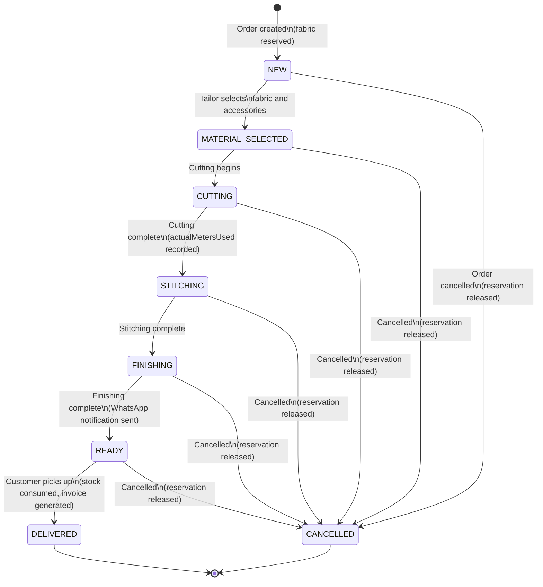
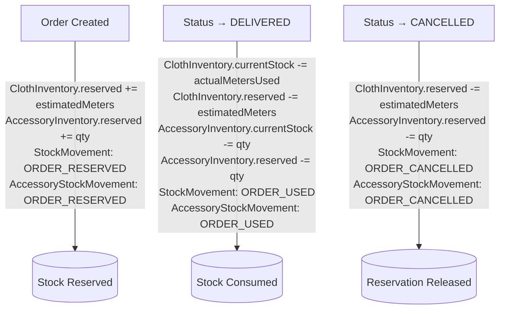

# Order Lifecycle

## Status Flow

Orders progress through a linear production pipeline. Any non-delivered order can be cancelled at any point.



## Status Descriptions

| Status | Production Phase | Stock Effect | WhatsApp |
|--------|-----------------|-------------|----------|
| NEW | Order received, materials not yet pulled | Fabric reserved | Confirmation sent |
| MATERIAL_SELECTED | Tailor has identified the fabric and accessories | No change |  |
| CUTTING | Fabric is being cut to pattern | No change (actualMetersUsed recorded here) | |
| STITCHING | Garment is being sewn | No change | |
| FINISHING | Final touches: buttons, hem, pressing | No change | |
| READY | Garment complete, awaiting customer pickup | No change | Pickup notification sent |
| DELIVERED | Customer has collected the order | Stock consumed: `currentStock -= actualMetersUsed`, `reserved -= estimatedMeters` | |
| CANCELLED | Order cancelled at any stage | Reservation released: `reserved -= estimatedMeters` | |

## Stock Effects by Transition



## API Endpoint: Status Update

```
PATCH /api/orders/[id]/status
Permission required: update_order_status
```

Request body:
```json
{
  "status": "DELIVERED",
  "actualMetersUsed": 3.2,
  "wastage": 0.05,
  "notes": "Delivered on time"
}
```

The `actualMetersUsed` field is optional for most transitions but significant at CUTTING (where actual fabric used is first known) and DELIVERED (where final consumption is recorded).

### Delivery Transaction (simplified)

```typescript
// When status === DELIVERED:
await prisma.$transaction(async (tx) => {
  // 1. Update each OrderItem with actual fabric usage
  for (const item of order.items) {
    const metersUsed = actualMetersUsed || item.estimatedMeters
    const wastedMeters = actualMetersUsed
      ? (actualMetersUsed - item.estimatedMeters)
      : (wastage || 0)

    await tx.orderItem.update({
      where: { id: item.id },
      data: { actualMetersUsed: metersUsed, wastageMeters: wastedMeters }
    })

    // 2. Decrement ClothInventory
    await tx.clothInventory.update({
      where: { id: item.clothInventoryId },
      data: {
        currentStock: { decrement: metersUsed },
        reserved: { decrement: item.estimatedMeters }
      }
    })

    // 3. Create ORDER_USED StockMovement
    await tx.stockMovement.create({
      data: { type: 'ORDER_USED', quantityMeters: -metersUsed, ... }
    })
  }

  // 4. Consume accessories
  for (const movement of order.accessoryStockMovements) {
    await tx.accessoryInventory.update({
      where: { id: movement.accessoryInventoryId },
      data: {
        currentStock: { decrement: movement.quantityUnits },
        reserved: { decrement: movement.quantityUnits }
      }
    })
  }

  // 5. Update Order status and completedDate
  await tx.order.update({
    where: { id: order.id },
    data: { status: 'DELIVERED', completedDate: new Date() }
  })

  // 6. Create OrderHistory record
  await tx.orderHistory.create({ ... })
})

// 7. Send WhatsApp pickup notification (non-blocking, only on → READY)
after(() => whatsappService.sendOrderReady(order.id))
```

### Cancellation Transaction

```typescript
// When status === CANCELLED:
await prisma.$transaction(async (tx) => {
  // Release fabric reservations
  for (const item of order.items) {
    await tx.clothInventory.update({
      where: { id: item.clothInventoryId },
      data: { reserved: { decrement: item.estimatedMeters } }
    })
    await tx.stockMovement.create({
      data: { type: 'ORDER_CANCELLED', quantityMeters: item.estimatedMeters, ... }
    })
  }

  // Release accessory reservations
  for (const movement of order.accessoryStockMovements) {
    await tx.accessoryInventory.update({
      where: { id: movement.accessoryInventoryId },
      data: { reserved: { decrement: movement.quantityUnits } }
    })
  }

  await tx.order.update({
    where: { id: order.id },
    data: { status: 'CANCELLED' }
  })
})
```

## Order Splitting

Multi-item orders can be split into two separate orders for independent management. Only possible when:
- Order has 2+ items
- Status is not DELIVERED or CANCELLED
- Not all items are selected (must leave at least one in original)

```
POST /api/orders/[id]/split
Body: { itemIds: [...], deliveryDate: "...", notes: "..." }
```

The split creates a new order with:
- Proportional financial values (based on item prices as a fraction of total)
- New order number
- Same customer
- OrderHistory entries on both orders

## Order Edit Restrictions

| Action | Allowed When | Permission |
|--------|-------------|-----------|
| Edit order (general) | Not DELIVERED, not CANCELLED | `update_order` |
| Edit order item (fabric/garment) | Not DELIVERED, not CANCELLED | `update_order` |
| Apply discount | Any status | `update_order` (OWNER only by convention) |
| Record payment | Not CANCELLED, balance > 0 | `update_order` |
| Update status | Any valid transition | `update_order_status` |
| Assign tailor to item | Not DELIVERED, not CANCELLED | `update_order` OR `update_order_status` |

## Fabric Efficiency Tracking

When `actualMetersUsed` is recorded:

```
wastageMeters = actualMetersUsed - estimatedMeters
  Positive → more fabric used than estimated (waste)
  Negative → less fabric used (efficient cutting)

efficiency % = (estimatedMeters / actualMetersUsed) × 100
  ≥ 95% → Green (efficient)
  ≥ 85% → Yellow (acceptable)
  < 85% → Red (wasteful)

varianceAmount = wastageMeters × pricePerMeter
  Shows financial impact of over/under consumption
```

## Order Number Format

Generated by `generateOrderNumber()` in `lib/utils.ts`:

```
ORD-{timestamp}-{3-digit-random}
Example: ORD-1769327607178-935
```

For invoice numbers:
```
INV-{YYYYMM}-{sequential}
Example: INV-202601-0042
```
