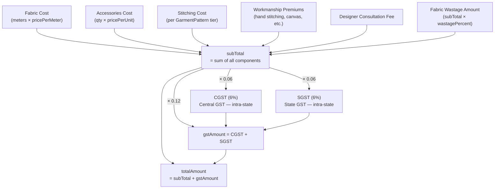
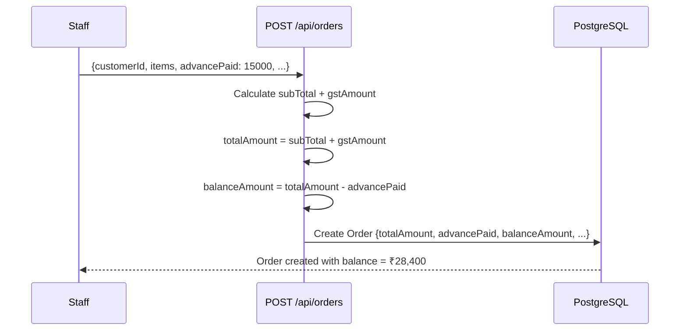
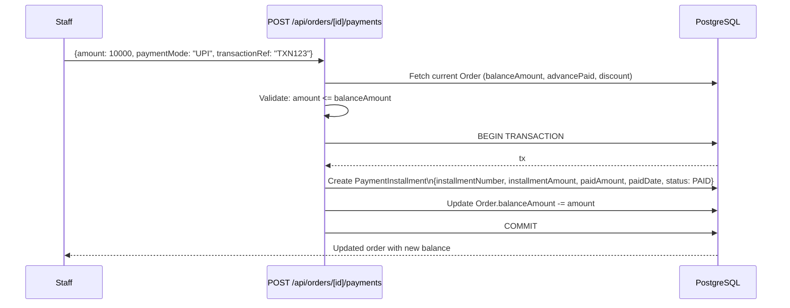
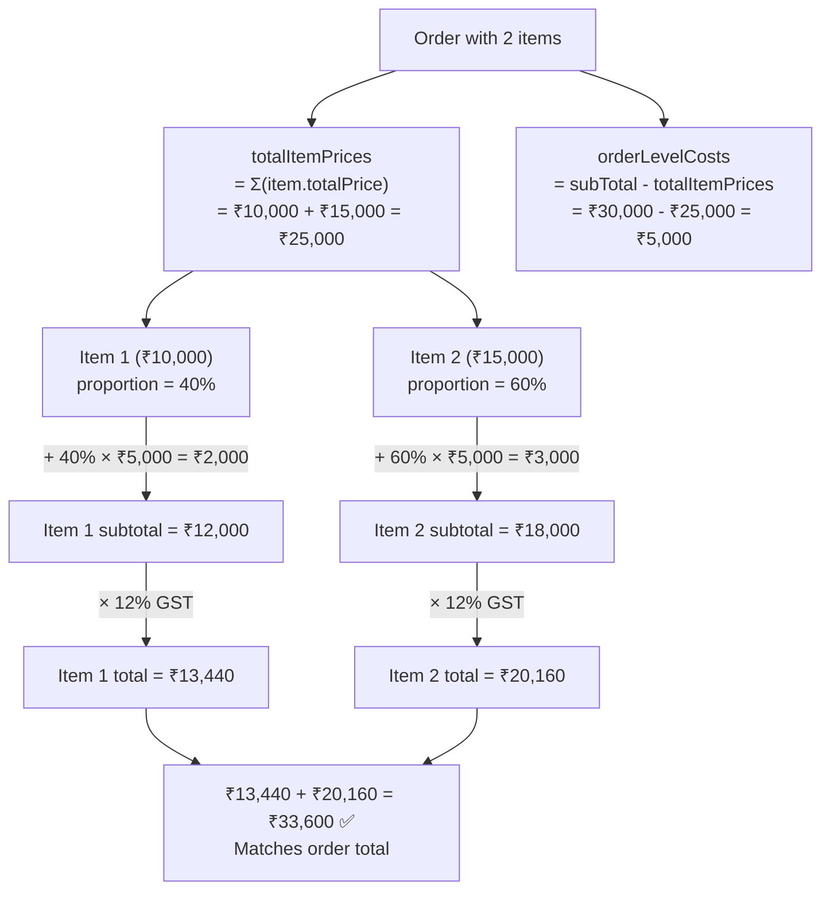

# Payment Flow

## Payment Architecture

An order's payment lifecycle involves three distinct components that together reconcile to the total amount:

```
totalAmount = subTotal + gstAmount

balanceAmount = totalAmount
              - advancePaid          (paid at order creation)
              - discount             (owner-applied reduction)
              - Σ(paidInstallments)  (subsequent balance payments)
```

## GST Calculation

India's Goods and Services Tax applies to all garment orders at 12%.



**IGST** (Integrated GST, for inter-state orders) is stored in the schema but defaults to 0. The system currently handles only intra-state orders.

### Example: Premium Suit Order

```
Fabric:           3.3m × ₹5,000/m      = ₹16,500.00
Accessories:      20 buttons × ₹80      = ₹1,600.00
Stitching (PREMIUM):                    = ₹12,000.00
Hand Stitching premium:                 = ₹4,000.00
Full Canvas premium:                    = ₹3,000.00
Fabric Wastage (10%):                   = ₹1,650.00
─────────────────────────────────────────────────────
subTotal                                = ₹38,750.00
CGST (6%):                              = ₹2,325.00
SGST (6%):                              = ₹2,325.00
gstAmount (12%):                        = ₹4,650.00
─────────────────────────────────────────────────────
totalAmount                             = ₹43,400.00
```

## Order Creation Payment



**Key rule:** Advance payment is stored **only** in `Order.advancePaid`. It is NOT created as a `PaymentInstallment`. This is the single source of truth to avoid double-counting.

### Advance Validation

```typescript
if (validatedData.advancePaid > totalAmount) {
  return NextResponse.json(
    { error: `Advance payment (₹${advancePaid}) cannot exceed total (₹${totalAmount})` },
    { status: 400 }
  )
}
```

## Recording Balance Payments

After order creation, additional payments are recorded as installments:

```
POST /api/orders/[id]/payments
Body: { amount, paymentMode, transactionRef?, notes? }
```



### Balance Calculation (API side)

```typescript
// app/api/orders/[id]/payments/route.ts
const paidInstallments = await prisma.paymentInstallment.aggregate({
  where: { orderId: id },   // No status filter — count all paidAmount values
  _sum: { paidAmount: true }
})
const totalPaidInstallments = paidInstallments._sum.paidAmount || 0

// Correct formula — advance counted separately from installments
const newBalance = parseFloat(
  (order.totalAmount - order.advancePaid - order.discount - totalPaidInstallments).toFixed(2)
)
```

## Discount Application

Only the business owner applies discounts (by convention). Discounts reduce the balance permanently:

```
POST /api/orders/[id]  (PATCH with discount + discountReason)
```

```typescript
// app/api/orders/[id]/route.ts
const balanceAmount = parseFloat(
  (order.totalAmount - advancePaid - discount - totalPaidInstallments).toFixed(2)
)

await prisma.order.update({
  where: { id },
  data: { discount, discountReason, balanceAmount }
})

// Audit trail
await prisma.orderHistory.create({
  data: {
    changeType: 'DISCOUNT_APPLIED',
    description: `Discount of ₹${discount} applied: ${discountReason}`,
    ...
  }
})
```

### Discount Input Modes

The Apply Discount dialog supports two input modes with real-time conversion:

```
Amount Mode:     Enter ₹5,000 → Shows "= 7.85% of total"
Percentage Mode: Enter 10%   → Shows "= ₹4,340.00"
```

## Payment Display: Invoice

The print invoice shows proportionally distributed costs for multi-item orders:



## Invoice Section Layout

```
Item Subtotal:           ₹12,000.00   ← proportional (fabric + accessories + stitching share)
CGST (6%):                ₹720.00    ← 6% of subtotal
SGST (6%):                ₹720.00    ← 6% of subtotal
Total GST (12%):         ₹1,440.00
Item Total:             ₹13,440.00
Less: Discount:           -₹200.00   ← shown only if discount > 0
Less: Advance Paid:     -₹5,000.00   ← shown only if advancePaid > 0
Less: Additional Pmts:  -₹3,000.00   ← calculated: total - discount - advance - balance
Balance Due:             ₹5,240.00   ← from database (source of truth)
```

## Stitching Tier Pricing

The `stitchingTier` field determines the base stitching cost per garment:

| Tier | Charge Source | Typical Range |
|------|--------------|--------------|
| BASIC | `GarmentPattern.basicStitchingCharge` | ₹1,500 – ₹12,000 |
| PREMIUM | `GarmentPattern.premiumStitchingCharge` | ₹3,000 – ₹18,000 |
| LUXURY | `GarmentPattern.luxuryStitchingCharge` | ₹5,000 – ₹25,000+ |

Example by garment type (seeded defaults):

| Garment | BASIC | PREMIUM | LUXURY |
|---------|-------|---------|--------|
| Men's Shirt | ₹2,000 | ₹3,000 | ₹4,000 |
| Men's Trouser | ₹2,500 | ₹3,500 | ₹5,000 |
| Men's Suit | ₹10,000 | ₹15,000 | ₹20,000 |
| Sherwani | ₹12,000 | ₹18,000 | ₹25,000 |

## Workmanship Premiums

Optional add-ons tracked with boolean flags and cost fields on `Order`:

| Flag | Cost Field | Typical Cost |
|------|-----------|-------------|
| `isHandStitched` | `handStitchingCost` | +30-40% of base stitching |
| `isFullCanvas` | `fullCanvasCost` | +₹3,000 – ₹5,000 |
| `isRushOrder` | `rushOrderCost` | +50% of base cost |
| `hasComplexDesign` | `complexDesignCost` | +20-30% |
| `additionalFittings` (count) | `additionalFittingsCost` | +₹1,500/fitting |
| `hasPremiumLining` | `premiumLiningCost` | +₹2,000 – ₹5,000 |

Plus standalone charges:
- `designerConsultationFee` — ₹3,000 – ₹8,000
- `fabricWastagePercent` (0-15%) → `fabricWastageAmount`

## Purchase Order Payments

Separate payment flow for supplier POs:

```
POST /api/purchase-orders/[id]/payment
Body: { amount, paymentMode, transactionRef?, notes? }
```

PO status logic:
- **PENDING** → Neither items received nor payment made
- **PARTIAL** → Some items received OR some payment, but not both complete
- **RECEIVED** → All items received AND full payment made
- **CANCELLED** → PO cancelled

PO also tracks GST with Input Tax Credit (ITC) eligibility:
- `isInputTaxCredit: Boolean` — eligible for ITC claim
- `itcClaimed: Boolean` — ITC already filed in GST returns

## ARREARS Detection

Orders in DELIVERED status with `balanceAmount > 0` are "arrears" — delivered but not fully paid.

```typescript
// Filter arrears in orders list
GET /api/orders?balanceAmount=gt:0&status=DELIVERED

// Badge shown on order detail
if (order.status === 'DELIVERED' && order.balanceAmount > 0) {
  // Show red ARREARS badge
}
```

The OWNER can apply a discount to write off small balances rather than pursuing collection.
