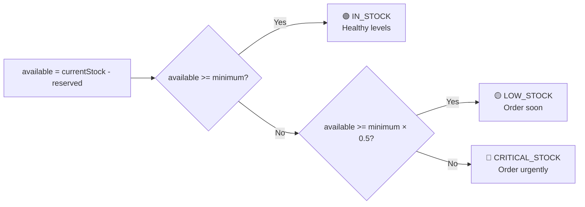
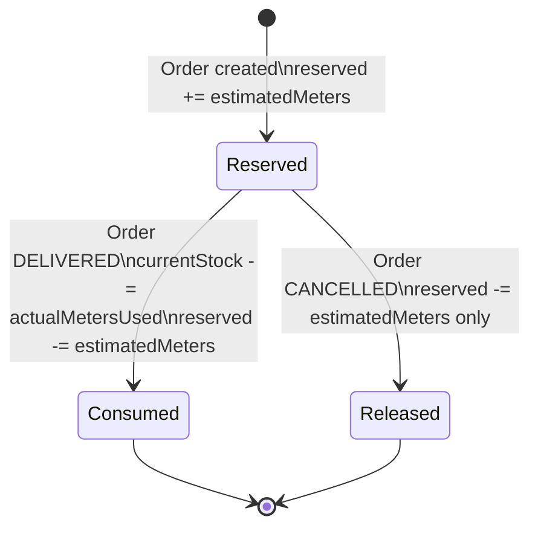
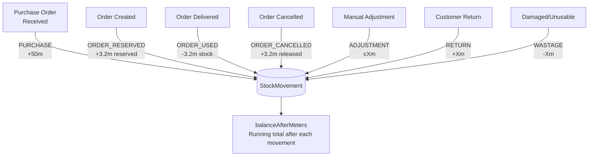

# Stock Reservation System

## Core Principle

**Available stock is never raw `currentStock`.** The correct available quantity is always:

```
available = currentStock - reserved
```

This is a computed value — it is not stored in the database. Every component and query that checks stock availability must perform this subtraction.

## Fabric Stock (ClothInventory)

### Fields

| Field | Type | Meaning |
|-------|------|---------|
| `currentStock` | Float (meters) | Physical stock on shelves |
| `reserved` | Float (meters) | Committed to active orders |
| `minimumStockMeters` | Float (meters) | Reorder alert threshold |

### Stock Status Thresholds



**Concrete example:**
```
Wool Premium:
  currentStock   = 75.0m
  reserved       = 69.35m
  available      = 5.65m
  minimum        = 20m
  minimum × 0.5  = 10m

  available (5.65) < minimum × 0.5 (10) → CRITICAL ✅
```

```typescript
// lib/utils.ts — calculateStockStatus()
export type StockStatus = 'IN_STOCK' | 'LOW_STOCK' | 'CRITICAL'

export function calculateStockStatus(
  currentStock: number,
  reserved: number,
  minimum: number
): StockStatus {
  const available = currentStock - reserved
  if (available < minimum * 0.5) return 'CRITICAL'
  if (available < minimum) return 'LOW_STOCK'
  return 'IN_STOCK'
}
```

## Accessory Stock (AccessoryInventory)

Identical logic but with integers (units) instead of floats (meters):

| Field | Type | Meaning |
|-------|------|---------|
| `currentStock` | Int (units) | Physical count on shelves |
| `reserved` | Int (units) | Committed to active orders |
| `minimumStockUnits` | Int (units) | Reorder alert threshold |

```
available = currentStock - reserved
```

## Reservation Lifecycle



### When Order is Created

```typescript
// app/api/orders/route.ts
// Inside prisma.$transaction():

// 1. Update ClothInventory
await tx.clothInventory.update({
  where: { id: clothInventoryId },
  data: { reserved: { increment: estimatedMeters } }
})

// 2. Create audit record
await tx.stockMovement.create({
  data: {
    clothInventoryId,
    orderId: order.id,
    userId: session.user.id,
    type: 'ORDER_RESERVED',
    quantityMeters: estimatedMeters,           // Positive — fabric committed
    balanceAfterMeters: cloth.currentStock,    // currentStock unchanged
  }
})
```

For accessories (via GarmentAccessory linkage):
```typescript
// Quantity = quantityPerGarment × quantityOrdered
const accessoryQty = garmentAccessory.quantityPerGarment * item.quantityOrdered

await tx.accessoryInventory.update({
  where: { id: accessoryId },
  data: { reserved: { increment: accessoryQty } }
})

await tx.accessoryStockMovement.create({
  data: {
    type: 'ORDER_RESERVED',
    quantityUnits: accessoryQty,
    ...
  }
})
```

### When Order is DELIVERED

```typescript
// app/api/orders/[id]/status/route.ts
// Inside prisma.$transaction():

const metersUsed = actualMetersUsed || item.estimatedMeters

await tx.clothInventory.update({
  where: { id: item.clothInventoryId },
  data: {
    currentStock: { decrement: metersUsed },       // Physical stock reduced
    reserved: { decrement: item.estimatedMeters }  // Reservation cleared
  }
})

await tx.stockMovement.create({
  data: {
    type: 'ORDER_USED',
    quantityMeters: -metersUsed,   // Negative — stock leaves store
    ...
  }
})
```

Note: `currentStock` decrements by `actualMetersUsed` (real fabric used), but `reserved` decrements by `estimatedMeters` (the original reservation). The difference appears as `wastageMeters` on the `OrderItem`.

### When Order is CANCELLED

```typescript
await tx.clothInventory.update({
  where: { id: item.clothInventoryId },
  data: {
    reserved: { decrement: item.estimatedMeters }  // Release only reservation
    // currentStock is NOT touched — fabric is back on shelves
  }
})

await tx.stockMovement.create({
  data: {
    type: 'ORDER_CANCELLED',
    quantityMeters: item.estimatedMeters,  // Positive — reservation returned
    ...
  }
})
```

## Stock Movement Audit Trail

Every change to inventory stock produces a `StockMovement` (fabric) or `AccessoryStockMovement` (accessories). This provides a complete, time-ordered ledger.



**Note:** `quantityMeters` is positive for incoming stock and negative for outgoing stock. `balanceAfterMeters` stores the `currentStock` value after the movement, enabling reconstruction of stock history.

## Fabric Requirement Calculation

When an order item is created, `estimatedMeters` is calculated:

```typescript
// Fetch garment pattern
const pattern = await prisma.garmentPattern.findUnique({
  where: { id: garmentPatternId }
})

// Body type adjustment
const bodyTypeAdjustments: Record<BodyType, number> = {
  SLIM:    pattern.slimAdjustment,    // default 0
  REGULAR: pattern.regularAdjustment, // default 0
  LARGE:   pattern.largeAdjustment,   // default 0.3
  XL:      pattern.xlAdjustment,      // default 0.5
}

const estimatedMeters =
  (pattern.baseMeters + bodyTypeAdjustments[bodyType]) * quantityOrdered
```

Example — Men's Suit (baseMeters = 3.0), LARGE body type:
```
estimatedMeters = (3.0 + 0.3) × 1 = 3.3m reserved
```

## Pre-Order Stock Validation

Before creating an order, the API validates that sufficient stock is available:

```typescript
const cloth = await prisma.clothInventory.findUnique({
  where: { id: clothInventoryId }
})

const available = cloth.currentStock - cloth.reserved
if (available < estimatedMeters) {
  return error(
    `Insufficient stock for ${cloth.name}: need ${estimatedMeters}m, only ${available}m available`
  )
}
```

## Alert Generation

The alert system (`lib/generate-alerts.ts`) scans inventory and creates/updates `Alert` records:

```typescript
// Runs on: inventory page load, dashboard load, manual trigger
const clothItems = await prisma.clothInventory.findMany({
  where: { active: true },
  select: { currentStock: true, reserved: true, minimumStockMeters: true, ... }
})

for (const item of clothItems) {
  const available = item.currentStock - item.reserved
  const minimum = item.minimumStockMeters

  if (available < minimum * 0.5) {
    // Create/update CRITICAL_STOCK alert (severity: CRITICAL)
  } else if (available < minimum) {
    // Create/update LOW_STOCK alert (severity: HIGH)
  }
}
```

The unique constraint on `Alert [relatedId, relatedType, type, isDismissed]` prevents duplicate alerts for the same item.

## Purchase Order Flow

When a Purchase Order is marked as received, stock is added:

```
POST /api/purchase-orders/[id]/receive
```

This:
1. Updates `POItem.receivedQuantity`
2. Increments `ClothInventory.currentStock` (or `AccessoryInventory.currentStock`)
3. Creates `StockMovement` with type `PURCHASE`
4. Updates `PurchaseOrder.status` → PARTIAL or RECEIVED

```typescript
await prisma.clothInventory.update({
  where: { id: clothId },
  data: { currentStock: { increment: receivedQuantity } }
})

await prisma.stockMovement.create({
  data: {
    type: 'PURCHASE',
    quantityMeters: receivedQuantity,  // Positive
    ...
  }
})
```

## Manual Stock Adjustments

```
POST /api/inventory/cloth/[id]/adjust-stock
Permission: manage_inventory
Body: { quantity: number, type: "ADJUSTMENT"|"RETURN"|"WASTAGE", notes: string }
```

Positive quantity = stock added, negative = stock removed.

```typescript
// Types and their meaning:
ADJUSTMENT: Manual correction (positive or negative)
RETURN:     Customer return adds stock back (positive)
WASTAGE:    Damaged/unusable fabric reduces stock (negative)
```

## Dashboard Metrics

The `GET /api/dashboard/enhanced-stats` endpoint computes stock metrics:

```typescript
// Inventory summary for INVENTORY_MANAGER dashboard
const clothItems = await prisma.clothInventory.findMany({
  where: { active: true },
  select: { currentStock: true, reserved: true, minimumStockMeters: true, pricePerMeter: true }
})

const metrics = clothItems.reduce((acc, item) => {
  const available = item.currentStock - item.reserved
  const minimum = item.minimumStockMeters

  return {
    totalItems: acc.totalItems + 1,
    totalValue: acc.totalValue + (item.currentStock * item.pricePerMeter),
    lowStockCount: acc.lowStockCount + (
      available < minimum && available >= minimum * 0.5 ? 1 : 0
    ),
    criticalStockCount: acc.criticalStockCount + (
      available < minimum * 0.5 ? 1 : 0
    ),
  }
}, initialAccumulator)
```
