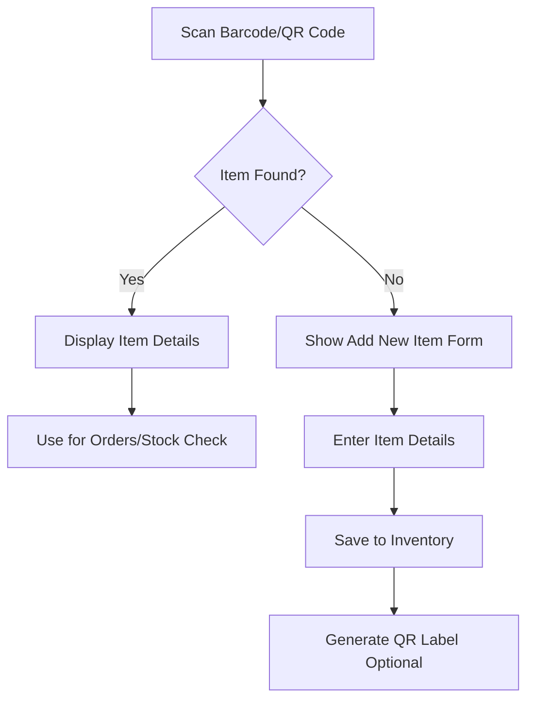
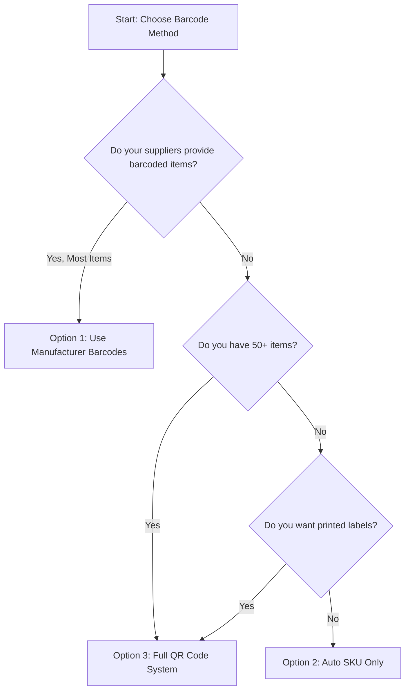
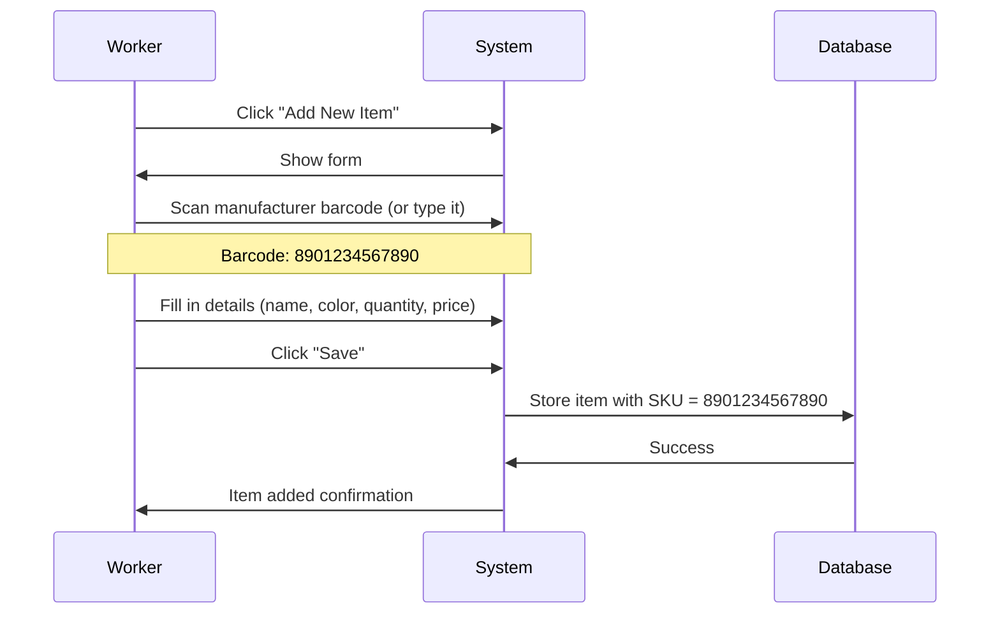
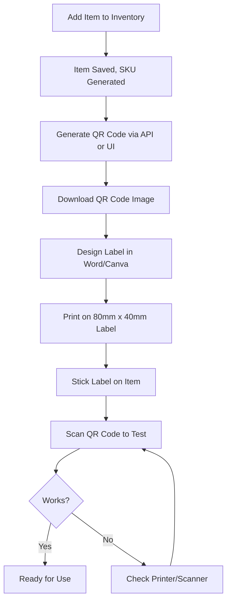
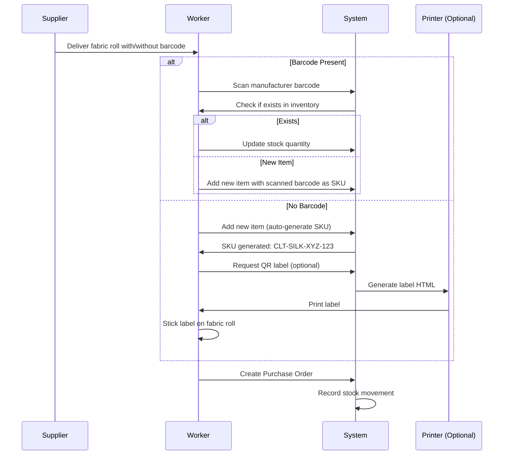
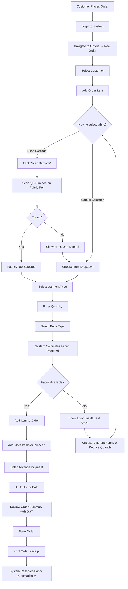
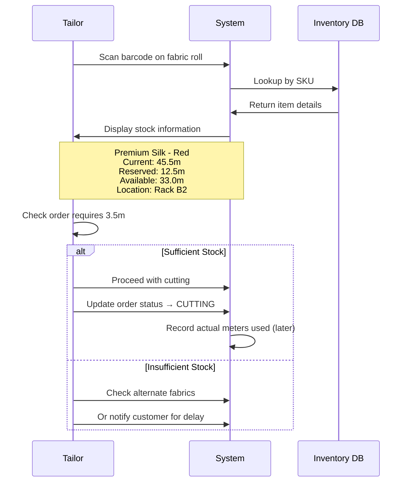
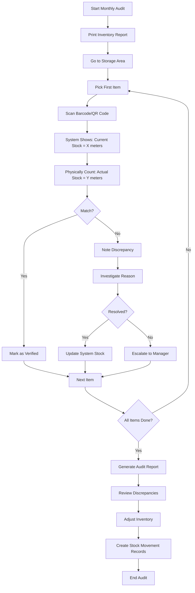

# Hamees Attire - Barcode & QR Code Implementation Guide

**Version:** 0.15.4
**Last Updated:** January 16, 2026
**For:** Store Workers, Inventory Managers, Owners

---

## Table of Contents

1. [Introduction](#introduction)
2. [Barcode System Overview](#barcode-system-overview)
3. [Setup Options](#setup-options)
4. [Option 1: Using Manufacturer Barcodes](#option-1-using-manufacturer-barcodes)
5. [Option 2: Auto-Generated SKU System](#option-2-auto-generated-sku-system)
6. [Option 3: Custom QR Code System](#option-3-custom-qr-code-system)
7. [Daily Workflows](#daily-workflows)
8. [Equipment Requirements](#equipment-requirements)
9. [Printing QR Code Labels](#printing-qr-code-labels)
10. [Troubleshooting](#troubleshooting)
11. [Best Practices](#best-practices)

---

## Introduction

This guide explains how to use barcodes and QR codes in the Hamees Attire inventory management system. You can choose the method that works best for your shop - use existing barcodes, auto-generated SKUs, or custom QR codes.

**Key Point:** You are NOT required to use any specific barcode format. The system is flexible and supports multiple methods.

---

## Barcode System Overview

### What Barcodes Does the System Support?

The system can read **7 types of barcodes**:

| Type | Description | Common Use |
|------|-------------|------------|
| **QR Code** | 2D square barcode | Custom labels, detailed information |
| **UPC** | Universal Product Code | Retail products from suppliers |
| **EAN** | European Article Number | International products |
| **Code128** | High-density linear barcode | Shipping labels, small items |
| **Code39** | Alphanumeric barcode | Industrial use |
| **Code93** | Compact alphanumeric | Small labels |
| **Codabar** | Simple numeric barcode | Libraries, blood banks |

### How the System Works



---

## Setup Options

### Decision Tree: Which Method Should You Use?



**Summary:**
- **Small shop (10-30 items) with supplier barcodes** → Option 1
- **Medium shop (30-100 items)** → Option 2 or Hybrid (1 + 2)
- **Large shop (100+ items) or warehouse** → Option 3

---

## Option 1: Using Manufacturer Barcodes

### ✅ Best For:
- Items that come with printed barcodes (fabric rolls, accessory packages)
- Small to medium shops
- Quick setup with no label printing

### 📋 Workflow

#### Step 1: Receive New Inventory

When you receive a fabric roll or accessory package with a barcode:

1. **Login to the application** (https://hamees.gagneet.com)
2. **Navigate to Inventory** → Click "Manage Inventory"
3. **Select the appropriate tab:**
   - "Cloth Inventory" for fabrics
   - "Accessories Inventory" for buttons, threads, zippers

#### Step 2: Add Item to System



**Form Fields:**

**For Cloth Items:**
- **SKU:** (Auto-filled with scanned barcode, e.g., `8901234567890`)
- **Name:** Premium Cotton
- **Type:** Cotton (dropdown)
- **Brand:** ABC Fabrics
- **Color:** Blue
- **Current Stock:** 50.00 meters
- **Price per Meter:** ₹450.00
- **Minimum Stock:** 10.00 meters
- **Rack Location:** Rack A1 (optional)

**For Accessories:**
- **SKU:** (Auto-filled with scanned barcode)
- **Name:** Brass Buttons
- **Type:** Button (dropdown)
- **Current Stock:** 1000 units
- **Unit Price:** ₹2.50
- **Minimum Stock:** 100 units

#### Step 3: Future Use

When creating an order or checking stock:

1. **Click "Scan Barcode"** button
2. **Scan the manufacturer barcode** on the fabric roll
3. **System displays:**
   - Item name and color
   - Current stock
   - Reserved stock
   - Available stock
   - Rack location
   - Price

**Example:**
```
✅ Found: Premium Cotton - Blue
📦 Current Stock: 50.00 meters
🔒 Reserved: 12.50 meters
✓ Available: 37.50 meters
📍 Location: Rack A1
💰 Price: ₹450.00/meter
```

### ⚠️ Limitations

- Only works for items with pre-printed barcodes
- If barcode is damaged, you cannot scan
- Different suppliers may use same barcode numbers (rare but possible)

### 💡 Tip: Hybrid Approach

Use manufacturer barcodes for branded items, and generate QR codes for custom-cut pieces or unlabeled items.

---

## Option 2: Auto-Generated SKU System

### ✅ Best For:
- Items without barcodes
- Custom inventory
- Quick setup without label printing

### 📋 How It Works

When you add a new item to inventory, the system automatically generates a unique SKU:

**SKU Format:**

**Cloth Items:**
```
CLT-{TYPE}-{BRAND}-{TIMESTAMP}

Example: CLT-COTTON-ABC-1737365847
         │   │       │    └─ Unique timestamp
         │   │       └────── Brand (ABC Fabrics)
         │   └────────────── Fabric type (COTTON)
         └────────────────── Category (CLT = Cloth)
```

**Accessory Items:**
```
ACC-{TYPE}-{TIMESTAMP}

Example: ACC-BUT-1737365847
         │   │    └─ Unique timestamp
         │   └────── Accessory type (BUT = Button)
         └────────── Category (ACC = Accessory)
```

### 📋 Workflow

#### Step 1: Add New Item

1. **Navigate to Inventory** → Click "Add New Item"
2. **Fill in all details** (name, type, color, stock, price)
3. **Leave SKU field empty** or click "Auto-Generate SKU"
4. **Click "Save"**
5. **System generates SKU automatically** → `CLT-SILK-XYZ-1737365847`

#### Step 2: Record the SKU

**Two Methods:**

**Method A: Write on Fabric Roll (Simple)**
- Use a permanent marker
- Write the SKU directly on the fabric roll tag
- Example: Write "CLT-SILK-XYZ-1737365847" on tag

**Method B: Generate QR Code Label (Advanced)**
- After item is saved, click "Generate QR Label"
- Print the label
- Stick on fabric roll or storage bin
- (See Option 3 for detailed label printing instructions)

#### Step 3: Using the SKU

When you need to find the item:

**Desktop (Recommended):**
1. Click "Scan Barcode" → Choose "Manual Entry"
2. Type the SKU: `CLT-SILK-XYZ-1737365847`
3. Click "Lookup"
4. System displays item details

**Mobile (Default):**
1. Click "Scan Barcode"
2. Type the SKU in the input field
3. System displays item details instantly

### 💡 Pro Tip: Create a Reference Sheet

Print a list of all SKUs with item names and keep it at the counter:

```
INVENTORY REFERENCE SHEET - January 2026
═══════════════════════════════════════════════════════════
SKU                        | Item Name          | Location
═══════════════════════════════════════════════════════════
CLT-COTTON-ABC-1705847293  | Premium Cotton Red | Rack A1
CLT-SILK-XYZ-1705847320    | Pure Silk Blue     | Rack B2
CLT-LINEN-ABC-1705847405   | Linen Blend Green  | Rack C1
ACC-BUT-1705847500         | Brass Buttons      | Drawer D3
ACC-THR-1705847550         | Polyester Thread   | Drawer D5
═══════════════════════════════════════════════════════════
```

---

## Option 3: Custom QR Code System

### ✅ Best For:
- Large shops with 100+ items
- Warehouse-style storage
- Professional label printing
- Reducing picking errors

### 🎯 Benefits

- **Visual Confirmation:** Label shows name, color, rack location
- **Fast Scanning:** Instant lookup with smartphone camera (desktop)
- **Error Reduction:** No manual typing, less mistakes
- **Professional Appearance:** Printed labels look organized

### 📋 Complete Setup Workflow



### Step 1: Generate QR Code for an Item

#### Method A: Using the API (Advanced)

**Requirements:**
- API testing tool (Postman, Insomnia, or curl)
- Login credentials

**Instructions:**

1. **Login to get session token** (automatic if using browser)

2. **Generate QR Code:**

```bash
POST https://hamees.gagneet.com/api/barcode/generate
Content-Type: application/json

{
  "type": "cloth",
  "itemId": "clxy1234567890abc"
}
```

**Response:**
```json
{
  "success": true,
  "qrCode": "data:image/png;base64,iVBORw0KGgoAAAANS...",
  "data": {
    "type": "cloth",
    "id": "clxy1234567890abc",
    "sku": "CLT-SILK-XYZ-1737365847",
    "name": "XYZ Textiles Red Silk",
    "timestamp": "2026-01-20T10:30:00.000Z"
  }
}
```

3. **Save the QR Code Image:**
   - Copy the entire `data:image/png;base64,...` string
   - Open a new browser tab
   - Paste the string in the address bar
   - Right-click → Save Image As → `silk-red-qr.png`

#### Method B: Using the UI (Simple) - Coming Soon

**Note:** QR code generation button in the UI is planned for v0.19.0. Currently use API method.

### Step 2: Generate Printable Label

**Option A: Using API (Recommended)**

```bash
POST https://hamees.gagneet.com/api/barcode/label
Content-Type: application/json

{
  "type": "cloth",
  "itemId": "clxy1234567890abc"
}
```

**Response:** Complete HTML document with:
- 80mm x 40mm label dimensions
- QR code (30mm x 30mm)
- Item name in bold
- SKU in monospace font
- Price and stock (if available)
- Print-optimized CSS

**How to Print:**
1. Copy the HTML response
2. Save as `label.html`
3. Open in Chrome/Edge
4. Press `Ctrl+P` (Print)
5. **Printer Settings:**
   - Paper size: 80mm x 40mm (or custom 3.15" x 1.57")
   - Margins: None
   - Scale: 100%
   - Background graphics: ON
6. Print or Save as PDF

**Option B: Design Your Own Label**

**Recommended Tools:**
- Microsoft Word (with QR code image insert)
- Canva (free design tool)
- Adobe Illustrator (professional)

**Label Template (80mm x 40mm):**

```
╔════════════════════════════════════════════════╗
║  HAMEES ATTIRE                                 ║
║  ──────────────────────────────────────────    ║
║                                                ║
║  Premium Silk - Red                            ║
║  Rack Location: B2                             ║
║                                                ║
║      ┌─────────────┐                           ║
║      │ QR CODE     │  SKU: CLT-SILK-XYZ-1737.. ║
║      │   IMAGE     │  Price: ₹850/meter        ║
║      │   30x30mm   │  Stock: 45.5m             ║
║      └─────────────┘                           ║
║                                                ║
╚════════════════════════════════════════════════╝
```

**Design Specifications:**
- **Label Size:** 80mm wide × 40mm tall
- **QR Code Size:** 30mm × 30mm (left side)
- **Font:** Arial or Helvetica
- **Item Name:** 12pt Bold
- **Details:** 9pt Regular
- **Border:** 1pt black line
- **Margins:** 4mm all sides

### Step 3: Print Labels

#### Thermal Printer (Recommended)

**Compatible Printers:**
- Zebra ZD410 (thermal transfer)
- Brother QL-820NWB (label printer)
- Dymo LabelWriter 450 Turbo
- Any 80mm thermal printer with label support

**Label Stock:**
- **Size:** 80mm × 40mm (3.15" × 1.57")
- **Material:** Thermal paper or synthetic (for durability)
- **Adhesive:** Permanent adhesive
- **Color:** White background (for best QR code scanning)

**Where to Buy:**
- Amazon India: "80mm thermal labels"
- Local stationery shops
- Printer manufacturer (Zebra, Brother, Dymo)

**Price Range:** ₹500-₹1500 for 500 labels

#### Regular Printer (Budget Option)

**If you don't have a thermal printer:**

1. **Use adhesive label sheets:**
   - Avery 80mm × 40mm labels
   - A4 sheet with multiple labels
   - Print using regular inkjet/laser printer

2. **Print Settings:**
   - Paper: A4 label sheet
   - Quality: High (for QR code clarity)
   - Color: Black & White (saves ink)

3. **Cut and stick manually**

### Step 4: Apply Labels

**Best Practices:**

1. **Clean the surface** where label will be applied (fabric roll tag, storage bin)
2. **Peel label carefully** to avoid tearing
3. **Apply firmly** with no air bubbles
4. **Test scan immediately** before storing

**Label Placement:**

- **Fabric Rolls:** Attach to cardboard tube end or roll tag
- **Fabric Pieces:** Attach to storage box/bin
- **Accessories:** Attach to storage drawer front or container lid
- **Shelving:** Attach to rack/shelf edge for location markers

### Step 5: Test the QR Code

**Desktop Testing (Chrome/Edge):**

1. Navigate to Inventory → Click "Scan Barcode"
2. Choose "Camera Mode"
3. Point camera at QR code
4. System should detect and display item within 2-3 seconds

**Mobile Testing:**

1. Open inventory page on phone
2. Click "Scan Barcode"
3. **Use Manual Entry** (most reliable on mobile)
4. Type the SKU from the label
5. Verify item details appear correctly

**Troubleshooting Scan Issues:**

| Issue | Solution |
|-------|----------|
| QR code not scanning | Increase QR code size to 35mm × 35mm |
| Blurry QR code | Use higher print quality (600 DPI minimum) |
| Scanner times out | Switch to Manual Entry mode |
| Wrong item appears | Regenerate QR code, may be corrupted |
| Camera doesn't start | Use Manual Entry, check browser permissions |

---

## Daily Workflows

### Workflow 1: Receiving New Inventory



**Step-by-Step:**

1. **Receive Delivery**
   - Check delivery note against shipment
   - Count items and verify quantities

2. **Check for Barcodes**
   - If barcode exists → Scan and check if in system
   - If no barcode → Proceed to add new item

3. **Add to Inventory**
   - Navigate to Inventory → Add New Item
   - Scan barcode OR let system generate SKU
   - Fill in: Name, Type, Color, Quantity, Price, Supplier
   - Set Rack Location
   - Save

4. **Print QR Label (Optional)**
   - Use API to generate QR code
   - Print on thermal label
   - Stick on item

5. **Create Purchase Order**
   - Navigate to Purchase Orders → New PO
   - Select items received
   - Enter invoice amount
   - Record payment (if made)

6. **File Documents**
   - Save supplier invoice
   - Note PO number on invoice

### Workflow 2: Creating an Order with Barcode Lookup



**Step-by-Step:**

1. **Start New Order**
   - Navigate to Orders → New Order
   - Select customer (or create new customer)

2. **Add Items to Order**
   - Click "Add Item" button
   - Choose garment type (Shirt, Trouser, Suit, Sherwani)

3. **Select Fabric Using Barcode**
   - Click "Scan Barcode" next to fabric field
   - **Desktop:** Use camera to scan QR code on fabric roll
   - **Mobile:** Type SKU manually
   - System auto-fills fabric details

4. **Enter Order Details**
   - Quantity: Number of garments (e.g., 2 shirts)
   - Body Type: SLIM, REGULAR, LARGE, or XL
   - System calculates estimated meters needed
   - System checks if fabric is available

5. **Review and Save**
   - Check order summary
   - Verify GST calculation (12% = 6% CGST + 6% SGST)
   - Enter advance payment amount
   - Set delivery date (default: 14 days)
   - Click "Create Order"

6. **System Actions (Automatic)**
   - Generates unique order number (ORD-202601-0001)
   - Reserves fabric (updates `reserved` field in inventory)
   - Creates stock movement record
   - Sends WhatsApp confirmation to customer (if configured)
   - Generates invoice number

7. **Print Receipt**
   - Hand printed order receipt to customer
   - Customer signs acknowledgment

### Workflow 3: Checking Stock Before Cutting



**Step-by-Step:**

1. **Tailor Receives Order**
   - Check order details page
   - Note fabric required and quantity

2. **Locate Fabric**
   - Check "Rack Location" on order (e.g., "Rack B2")
   - Go to that rack in storage

3. **Scan Fabric Roll**
   - Use barcode scanner
   - Scan QR code or manufacturer barcode
   - System shows current stock, reserved, and available

4. **Verify Availability**
   - Check if available stock ≥ required meters
   - If yes → Proceed to cutting
   - If no → Notify sales manager or customer

5. **Update Order Status**
   - Navigate to order detail page
   - Click "Update Status" → Select "CUTTING"
   - Add notes if needed
   - Save

6. **After Cutting**
   - Measure actual meters used
   - Update order with actual meters
   - System calculates wastage automatically

### Workflow 4: Monthly Stock Audit



**Step-by-Step:**

1. **Prepare Audit**
   - Print current inventory list from system
   - Gather measuring tape, notepad, scanner

2. **Physical Count**
   - Go rack by rack
   - Scan each item's QR code/barcode
   - Measure actual meters (for cloth) or count units (accessories)
   - Note discrepancies

3. **Record Findings**
   - Use spreadsheet or notepad
   - Format: `SKU | System Stock | Actual Stock | Difference`

4. **Investigate Discrepancies**
   - Check if fabric was used in recent orders (not yet updated)
   - Check for wastage (cutting errors, damages)
   - Check for theft or loss

5. **Update System**
   - For each discrepancy:
     - Navigate to Inventory → Select Item → Edit
     - Update "Current Stock" to actual count
     - Create Stock Movement with type "ADJUSTMENT"
     - Add notes explaining reason

6. **Generate Report**
   - Export audit results
   - Share with owner/manager
   - File for records

---

## Equipment Requirements

### Minimum Setup (Budget: ₹5,000 - ₹15,000)

**What You Need:**

1. **Computer or Tablet**
   - Desktop, laptop, or tablet with browser
   - Internet connection
   - Chrome or Edge browser (for best scanning support)

2. **Smartphone** (Optional)
   - Android or iOS
   - For mobile scanning (manual entry mode)

3. **Marker Pens** (₹50)
   - Permanent markers to write SKUs on fabric tags
   - No scanning equipment needed

**Total Cost:** ~₹100 (just markers, if you have computer)

**Suitable For:** Small shops with 10-30 items

---

### Recommended Setup (Budget: ₹15,000 - ₹50,000)

**Additional Equipment:**

4. **Thermal Label Printer** (₹8,000 - ₹25,000)
   - **Zebra ZD410:** ₹18,000 (professional, 2" width)
   - **Brother QL-820NWB:** ₹22,000 (WiFi, auto-cut)
   - **Dymo LabelWriter 450:** ₹12,000 (budget option)

5. **Thermal Labels** (₹800 per roll)
   - 80mm × 40mm thermal labels
   - 500 labels per roll
   - Buy from Amazon or printer manufacturer

6. **Webcam** (₹1,500 - ₹3,000) - Optional
   - Logitech C270 HD: ₹1,800
   - For barcode scanning if laptop has no camera

**Total Cost:** ~₹20,000 - ₹30,000

**Suitable For:** Medium shops with 30-100 items

---

### Professional Setup (Budget: ₹50,000+)

**Advanced Equipment:**

7. **Barcode Scanner (Handheld)** (₹3,000 - ₹15,000)
   - Honeywell Voyager 1202g: ₹8,500 (laser scanner)
   - Zebra DS2208: ₹12,000 (2D imager)
   - Connects via USB, faster than camera scanning

8. **Label Design Software** (₹5,000 - ₹20,000)
   - NiceLabel Express: ₹8,000
   - BarTender Starter: ₹15,000
   - Professional label templates and automation

9. **Dedicated Scanning Station**
   - Mount scanner on counter
   - Monitor for instant item lookup
   - Organized workflow

**Total Cost:** ~₹60,000 - ₹80,000

**Suitable For:** Large shops with 100+ items, multiple locations

---

## Printing QR Code Labels

### Method 1: Thermal Printer (Professional)

**Best For:** High volume (100+ labels/month)

**Steps:**

1. **Setup Printer**
   - Install printer drivers from manufacturer website
   - Load 80mm × 40mm thermal label roll
   - Connect via USB or WiFi

2. **Generate Label HTML**
   - Use API endpoint: `POST /api/barcode/label`
   - Save response as `label.html`

3. **Print**
   - Open `label.html` in Chrome
   - Press `Ctrl+P`
   - Select thermal printer
   - Paper size: 80mm × 40mm (custom)
   - Print

4. **Apply Label**
   - Peel label from backing
   - Stick on fabric roll tag or storage bin

**Pros:**
- Fast (print 1 label in 3 seconds)
- Professional appearance
- Durable thermal labels
- No ink required

**Cons:**
- Initial cost (₹8,000 - ₹25,000)
- Requires label stock purchase

---

### Method 2: Regular Printer (Budget)

**Best For:** Low volume (10-50 labels/month)

**Steps:**

1. **Buy Label Sheets**
   - Avery A4 label sheets
   - Pre-cut 80mm × 40mm labels
   - Available at stationery shops

2. **Design in Word**
   - Open Microsoft Word
   - Insert → Picture → Choose QR code image
   - Resize to 30mm × 30mm
   - Add text: Item name, SKU, price
   - Fit to label dimensions

3. **Print**
   - Load label sheet in printer
   - Print → Select label template
   - Use highest quality setting

4. **Apply**
   - Peel and stick

**Pros:**
- Low initial cost
- Uses existing printer

**Cons:**
- Slower (manual design)
- Ink cost higher
- Labels may fade over time

---

### Method 3: QR Code Stickers (Outsourced)

**Best For:** One-time large batch (500+ labels)

**Steps:**

1. **Generate All QR Codes**
   - Export all SKUs from system
   - Use bulk QR code generator
   - Create spreadsheet with SKU + QR code image

2. **Send to Printing Service**
   - Local printing shop or online (PrintVenue, Vistaprint)
   - Provide spreadsheet with QR codes
   - Specify: 80mm × 40mm vinyl stickers

3. **Receive and Apply**
   - Receive printed stickers
   - Match SKU to items
   - Apply stickers

**Pros:**
- Professional quality
- Bulk discount (₹5-10 per label)
- Durable vinyl material

**Cons:**
- Turnaround time (3-7 days)
- Not suitable for frequent updates

---

## Troubleshooting

### Issue 1: Barcode Not Scanning

**Symptoms:**
- Camera shows black screen
- Scanner times out after 10 seconds
- "No barcode detected" message

**Solutions:**

1. **Check Browser Permissions**
   - Click camera icon in address bar
   - Allow camera access
   - Refresh page

2. **Switch to Manual Entry**
   - Click "Manual Entry" tab
   - Type SKU directly
   - Click "Lookup"

3. **Check Lighting**
   - Ensure good lighting on QR code
   - Avoid glare or shadows
   - Hold code steady

4. **Check QR Code Quality**
   - Code should be crisp, not blurry
   - Minimum size: 25mm × 25mm
   - No damage or dirt on code

5. **Use Different Device**
   - Try desktop instead of mobile
   - Use Chrome or Edge browser
   - Update browser to latest version

---

### Issue 2: Wrong Item Appears After Scan

**Symptoms:**
- Scan shows different item than expected
- SKU doesn't match physical label

**Solutions:**

1. **Check SKU Carefully**
   - Verify SKU on label matches what was scanned
   - Similar SKUs may exist (e.g., CLT-SILK-ABC-111 vs CLT-SILK-ABC-112)

2. **Regenerate QR Code**
   - Item may have corrupted QR code
   - Generate new QR code via API
   - Print new label

3. **Check Database**
   - Search for item by name in inventory
   - Verify correct SKU is stored
   - Update if needed

---

### Issue 3: Insufficient Stock Error When Creating Order

**Symptoms:**
- "Not enough stock available" error
- System shows negative available stock

**Solutions:**

1. **Check Reserved Stock**
   - Navigate to Inventory → View Item
   - Check "Reserved" amount
   - This fabric is already allocated to other orders

2. **Check Pending Orders**
   - Navigate to Orders → Filter by status: NEW, CUTTING, STITCHING
   - Find orders using this fabric
   - Consider if any can be cancelled or fabric changed

3. **Reorder Stock**
   - Create Purchase Order for more fabric
   - Notify customer of delay
   - Or select alternate fabric

4. **Adjust Order Quantity**
   - Reduce number of garments in order
   - Or choose different fabric

---

### Issue 4: QR Code Not Printing Correctly

**Symptoms:**
- QR code is blurry on printed label
- Scanner cannot read printed QR code
- Label cuts off QR code

**Solutions:**

1. **Increase Print Quality**
   - Set printer to "Best" or "High Quality"
   - Use at least 600 DPI resolution
   - Ensure ink/toner is not low

2. **Check Label Size**
   - Verify label dimensions: 80mm × 40mm
   - QR code should be 30mm × 30mm minimum
   - Leave 4mm margins on all sides

3. **Test Print**
   - Print one label first
   - Scan to verify
   - Adjust design if needed
   - Then print batch

4. **Use Thermal Printer**
   - Thermal printers give sharper QR codes
   - No ink smudging
   - Better long-term durability

---

### Issue 5: SKU Already Exists Error

**Symptoms:**
- "SKU already in use" error when adding item
- Cannot save new item

**Solutions:**

1. **Check Existing Item**
   - Search inventory for that SKU
   - Item may already be in system
   - Update stock instead of creating new

2. **Use Auto-Generate SKU**
   - Click "Auto-Generate" button
   - System creates unique SKU with timestamp
   - Save item

3. **Modify Manufacturer Barcode**
   - If using supplier barcode that's duplicate
   - Add suffix: `8901234567890-1`, `8901234567890-2`
   - Or use auto-generated SKU instead

---

## Best Practices

### ✅ DO:

1. **Label All High-Value Items**
   - Print QR codes for expensive fabrics (silk, brocade)
   - Reduces errors and theft

2. **Use Rack Locations**
   - Always fill in "Rack Location" field
   - Makes finding items 10x faster
   - Example: "Rack A1", "Drawer D3", "Shelf B2"

3. **Test Scan After Printing**
   - Immediately scan newly printed QR code
   - Verify correct item appears
   - Reprint if issue found

4. **Keep Reference Sheet Updated**
   - Print monthly list of all SKUs
   - Keep at counter for quick lookup
   - Highlight commonly used items

5. **Audit Regularly**
   - Monthly stock count
   - Match physical vs system
   - Adjust discrepancies immediately

6. **Train All Staff**
   - Show how to scan barcodes
   - Demonstrate manual entry fallback
   - Practice adding new items

7. **Backup Labels**
   - Print 2 labels for critical items
   - Keep one as backup
   - Replace damaged labels immediately

8. **Clean QR Codes**
   - Wipe dust off QR code stickers
   - Ensure clear scanning

---

### ❌ DON'T:

1. **Don't Use Small QR Codes**
   - Minimum 25mm × 25mm
   - Scanner cannot read tiny codes

2. **Don't Print on Colored Paper**
   - QR codes need high contrast
   - Use white labels with black ink only

3. **Don't Expose Labels to Water**
   - Thermal labels fade when wet
   - Use laminated or vinyl labels in damp areas

4. **Don't Rely Only on Camera Scanning**
   - Mobile scanning is unreliable
   - Always have manual entry option
   - Desktop scanning works better

5. **Don't Delete Items with Order History**
   - Archive instead of delete
   - Keeps historical records intact

6. **Don't Share SKU Format Externally**
   - Your SKU format is unique to your system
   - Don't share with competitors

7. **Don't Print Too Many Labels at Once**
   - Print in batches of 20-50
   - Easier to organize and apply

8. **Don't Forget to Update Stock**
   - After receiving inventory, update immediately
   - After completing order, record actual meters used
   - Delays cause stock discrepancies

---

## Quick Reference Card

**Print and laminate this card for daily use:**

```
╔══════════════════════════════════════════════════════════════╗
║           HAMEES ATTIRE - BARCODE QUICK REFERENCE            ║
╠══════════════════════════════════════════════════════════════╣
║                                                              ║
║  ADDING NEW INVENTORY                                        ║
║  1. Inventory → Add New Item                                 ║
║  2. Scan barcode OR Auto-Generate SKU                        ║
║  3. Fill details (name, color, stock, price, rack)           ║
║  4. Save → Optional: Generate QR label                       ║
║                                                              ║
║  LOOKING UP ITEM                                             ║
║  1. Click "Scan Barcode"                                     ║
║  2. Desktop: Use camera to scan                              ║
║     Mobile: Type SKU manually                                ║
║  3. View item details                                        ║
║                                                              ║
║  CREATING ORDER                                              ║
║  1. Orders → New Order → Select Customer                     ║
║  2. Add Item → Scan fabric barcode                           ║
║  3. Select garment type, quantity, body type                 ║
║  4. Review GST, advance payment, delivery date               ║
║  5. Save → Fabric auto-reserved                              ║
║                                                              ║
║  STOCK CHECK BEFORE CUTTING                                  ║
║  1. Scan fabric QR code                                      ║
║  2. Check: Available = Current - Reserved                    ║
║  3. If sufficient → Update status to CUTTING                 ║
║  4. After cutting → Record actual meters used                ║
║                                                              ║
║  TROUBLESHOOTING                                             ║
║  • Scanner not working? → Use Manual Entry                   ║
║  • Insufficient stock? → Check Reserved amount               ║
║  • Wrong item? → Regenerate QR code                          ║
║  • Can't find fabric? → Check Rack Location field            ║
║                                                              ║
║  SUPPORT                                                     ║
║  • Website: https://hamees.gagneet.com                       ║
║  • Manager: [Contact Number]                                 ║
║  • Emergency: Refer to full guide in office                  ║
║                                                              ║
╚══════════════════════════════════════════════════════════════╝
```

---

## Appendix: API Reference

### Generate QR Code

**Endpoint:** `POST /api/barcode/generate`

**Request:**
```json
{
  "type": "cloth",
  "itemId": "clxy1234567890abc"
}
```

**Response:**
```json
{
  "success": true,
  "qrCode": "data:image/png;base64,iVBORw0KGgo...",
  "data": {
    "type": "cloth",
    "id": "clxy1234567890abc",
    "sku": "CLT-SILK-XYZ-1737365847",
    "name": "XYZ Textiles Red Silk",
    "timestamp": "2026-01-20T10:30:00.000Z"
  }
}
```

---

### Generate Printable Label

**Endpoint:** `POST /api/barcode/label`

**Request:**
```json
{
  "type": "cloth",
  "itemId": "clxy1234567890abc"
}
```

**Response:** HTML document ready for printing (80mm × 40mm)

---

### Lookup by Barcode/SKU

**Endpoint:** `GET /api/inventory/barcode?barcode={sku}`

**Example:** `GET /api/inventory/barcode?barcode=CLT-SILK-XYZ-1737365847`

**Response (Found):**
```json
{
  "found": true,
  "type": "cloth",
  "item": {
    "id": "clxy1234567890abc",
    "sku": "CLT-SILK-XYZ-1737365847",
    "name": "Premium Silk",
    "type": "Silk",
    "brand": "XYZ Textiles",
    "color": "Red",
    "currentStock": 45.50,
    "reserved": 12.50,
    "pricePerMeter": 850.00,
    "minimumStock": 10.00,
    "rackLocation": "Rack B2",
    "supplierRel": { ... }
  }
}
```

**Response (Not Found):**
```json
{
  "found": false,
  "barcode": "UNKNOWN-SKU"
}
```

---

**End of Guide**

**Version:** 1.0
**Last Updated:** January 20, 2026
**Questions?** Contact your system administrator or refer to the Complete User Guide.
