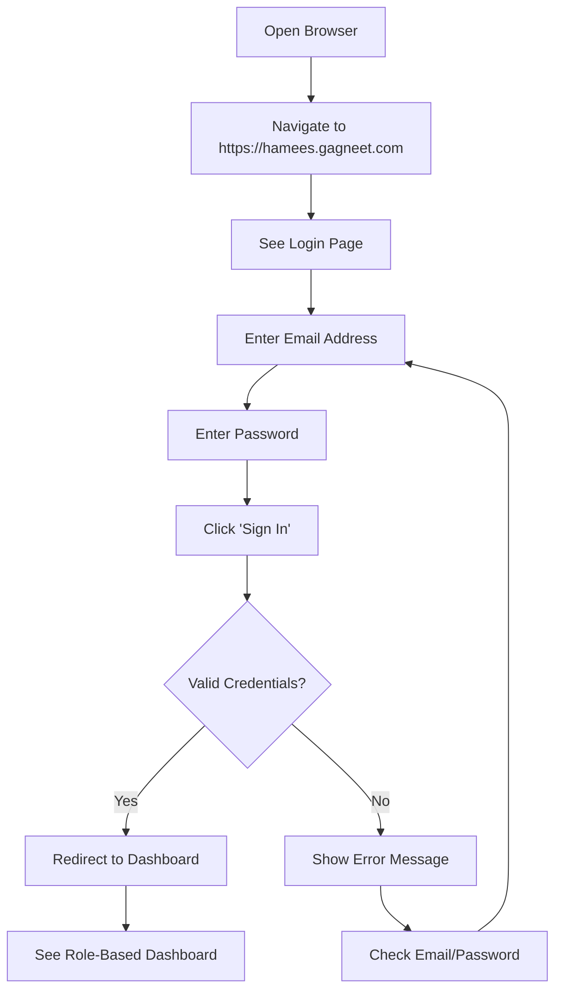

# Hamees Attire - Complete User Guide (Part 1: Getting Started)

**Version:** 0.15.4
**Last Updated:** January 16, 2026
**Application URL:** https://hamees.gagneet.com

---

## Table of Contents - Part 1

1. [Introduction](#introduction)
2. [System Requirements](#system-requirements)
3. [User Roles Overview](#user-roles-overview)
4. [Logging In](#logging-in)
5. [Dashboard Overview](#dashboard-overview)
6. [Navigation](#navigation)
7. [Common UI Elements](#common-ui-elements)

---

## Introduction

Welcome to the Hamees Attire Inventory and Order Management System. This comprehensive application helps tailor shops manage:

- **Fabric and Accessory Inventory** with barcode/QR code support
- **Customer Profiles** with detailed measurements
- **Order Management** with automatic stock reservation
- **Financial Tracking** with GST compliance
- **Reporting and Analytics** with interactive charts
- **Alerts and Notifications** for low stock and delayed orders

### What This Guide Covers

This is **Part 1 of 6** in the complete user guide series:

- **Part 1 (This Document):** Getting Started, Login, Dashboard, Navigation
- **Part 2:** Inventory Management (Cloth & Accessories)
- **Part 3:** Customer Management and Measurements
- **Part 4:** Order Management and Workflows
- **Part 5:** Reports, Alerts, and Administration
- **Part 6:** Best Practices and Troubleshooting

---

## System Requirements

### Supported Devices

✅ **Desktop/Laptop**
- Windows 10+, macOS 10.15+, or Linux
- Minimum 4GB RAM
- Screen resolution: 1366×768 or higher (1920×1080 recommended)

✅ **Tablet**
- iPad (iOS 14+) or Android tablet (Android 10+)
- 10" screen minimum recommended

✅ **Smartphone**
- iPhone (iOS 14+) or Android (10+)
- 5" screen minimum
- Note: Some features work better on desktop (barcode scanning)

### Supported Browsers

| Browser | Minimum Version | Recommended |
|---------|----------------|-------------|
| **Google Chrome** | 120+ | ✅ Best |
| **Microsoft Edge** | 120+ | ✅ Best |
| **Mozilla Firefox** | 120+ | ✅ Good |
| **Safari** | 17+ | ✅ Good |

**Note:** Chrome and Edge are recommended for best barcode scanning performance.

### Internet Connection

- **Minimum:** 2 Mbps download, 1 Mbps upload
- **Recommended:** 10 Mbps or higher
- **Required:** Continuous internet connection (cloud-based system)

### Optional Equipment

- **Barcode Scanner:** Honeywell, Zebra, or webcam for scanning
- **Thermal Printer:** For QR code labels (Zebra, Brother, Dymo)
- **Printer:** For invoices and receipts (any inkjet/laser printer)

---

## User Roles Overview

The system supports **6 different user roles** with specific permissions:

### Role Comparison Matrix

| Feature | OWNER | ADMIN | INV_MGR | SALES_MGR | TAILOR | VIEWER |
|---------|-------|-------|---------|-----------|--------|--------|
| **Dashboard Access** | ✅ | ✅ | ❌ | ✅ | ✅ | ✅ |
| **View Inventory** | ✅ | ✅ | ✅ | ❌ | ✅ | ✅ |
| **Manage Inventory** | ✅ | ✅ | ✅ | ❌ | ❌ | ❌ |
| **Delete Inventory** | ❌ | ✅ | ❌ | ❌ | ❌ | ❌ |
| **View Orders** | ✅ | ✅ | ❌ | ✅ | ✅ | ✅ |
| **Create Orders** | ✅ | ✅ | ❌ | ✅ | ✅ | ❌ |
| **Update Orders** | ✅ | ✅ | ❌ | ✅ | ❌ | ❌ |
| **Delete Orders** | ❌ | ✅ | ❌ | ❌ | ❌ | ❌ |
| **View Customers** | ✅ | ✅ | ❌ | ✅ | ✅ | ✅ |
| **Manage Customers** | ✅ | ✅ | ❌ | ✅ | ❌ | ❌ |
| **Delete Customers** | ❌ | ✅ | ❌ | ❌ | ❌ | ❌ |
| **Update Order Status** | ✅ | ✅ | ❌ | ✅ | ✅ | ❌ |
| **View Expenses** | ✅ | ✅ | ❌ | ❌ | ❌ | ❌ |
| **Manage Expenses** | ✅ | ✅ | ❌ | ❌ | ❌ | ❌ |
| **Financial Reports** | ✅ | ✅ | ❌ | ❌ | ❌ | ❌ |
| **Apply Discounts** | ✅ | ❌ | ❌ | ❌ | ❌ | ❌ |
| **Manage Users** | ❌ | ✅ | ❌ | ❌ | ❌ | ❌ |
| **Bulk Upload** | ❌ | ✅ | ❌ | ❌ | ❌ | ❌ |

### Role Descriptions

#### 1. OWNER
**Primary User:** Business owner/proprietor

**Responsibilities:**
- Overall business oversight
- Financial review and approvals
- Strategic decisions
- Customer relationships
- Discount approvals

**Key Permissions:**
- Full read/write access to all modules
- Apply discounts to clear arrears
- View all financial reports
- **Cannot delete data** (safety measure)
- **Cannot manage users** (ADMIN-only)

**Typical Tasks:**
- Review daily dashboard
- Approve large discounts
- Monitor profit/loss
- Check outstanding payments
- Review customer retention

---

#### 2. ADMIN
**Primary User:** System administrator/IT manager

**Responsibilities:**
- User account management
- System configuration
- Data cleanup and maintenance
- Bulk operations
- Technical troubleshooting

**Key Permissions:**
- **All delete permissions** (customers, orders, inventory)
- Create/update/deactivate users
- Bulk data upload
- System settings management
- Complete data access

**Typical Tasks:**
- Add new staff users
- Clean up duplicate records
- Import bulk inventory
- Generate backup reports
- Fix data issues

---

#### 3. INVENTORY_MANAGER
**Primary User:** Store manager, inventory clerk

**Responsibilities:**
- Stock management
- Purchase order processing
- Supplier relationship
- Stock audits
- Reorder management

**Key Permissions:**
- Manage inventory (add/update cloth and accessories)
- Create/receive purchase orders
- Manage suppliers
- View inventory alerts
- Create garment patterns

**Restricted From:**
- Viewing/creating orders
- Customer management
- Financial reports
- Dashboard access

**Typical Tasks:**
- Receive new fabric deliveries
- Update stock levels
- Create purchase orders
- Check low stock alerts
- Audit inventory monthly

---

#### 4. SALES_MANAGER
**Primary User:** Sales staff, customer service

**Responsibilities:**
- Customer acquisition
- Order processing
- Customer service
- Sales reporting
- Measurement recording

**Key Permissions:**
- Create and manage orders
- Manage customer profiles
- Record measurements
- View sales reports
- Update order details

**Restricted From:**
- Inventory management
- Purchase orders
- Expenses
- Financial reports

**Typical Tasks:**
- Create new customer orders
- Record customer measurements
- Follow up on deliveries
- Handle customer inquiries
- Track sales performance

---

#### 5. TAILOR
**Primary User:** Tailor, stitching staff

**Responsibilities:**
- Garment production
- Order status updates
- Measurement verification
- Quality control
- Production tracking

**Key Permissions:**
- View orders assigned to them
- Update order status (CUTTING → STITCHING → FINISHING → READY)
- View customer measurements
- Create measurements (if customer visits workshop)
- View inventory for fabric selection

**Restricted From:**
- Creating orders
- Editing customer details
- Managing inventory stock levels
- Viewing expenses
- Deleting anything

**Typical Tasks:**
- Check daily work queue
- Update order status as work progresses
- Verify measurements before cutting
- Record actual fabric used
- Mark orders ready for delivery

---

#### 6. VIEWER
**Primary User:** Accountant, auditor, trainee

**Responsibilities:**
- Read-only access for reporting
- Data verification
- Training and learning
- External audit support

**Key Permissions:**
- View dashboard (limited)
- View inventory
- View orders
- View customers
- View alerts

**Restricted From:**
- Creating anything
- Updating anything
- Deleting anything
- Viewing financial details

**Typical Tasks:**
- Generate reports
- Verify data accuracy
- Learn system workflows
- Support audits

---

## Logging In

### First Time Login



### Login Steps

1. **Open Your Browser**
   - Chrome, Edge, Firefox, or Safari
   - Ensure internet connection is active

2. **Navigate to Application**
   - URL: **https://hamees.gagneet.com**
   - Bookmark this page for quick access

3. **Enter Credentials**
   - **Email:** Your assigned email address (e.g., `owner@hameesattire.com`)
   - **Password:** Your password (case-sensitive)

4. **Click "Sign In"**
   - System validates credentials
   - Redirects to dashboard based on your role

### Default Demo Accounts

For testing and training purposes (password: `admin123`):

| Email | Role | Purpose |
|-------|------|---------|
| `owner@hameesattire.com` | OWNER | Business owner demo |
| `admin@hameesattire.com` | ADMIN | System admin demo |
| `inventory@hameesattire.com` | INVENTORY_MANAGER | Stock management demo |
| `sales@hameesattire.com` | SALES_MANAGER | Sales demo |
| `tailor@hameesattire.com` | TAILOR | Production demo |
| `viewer@hameesattire.com` | VIEWER | Read-only demo |

**⚠️ Important:** Change default passwords in production environment!

### Forgot Password?

**Current Version:** Password reset via ADMIN user

1. Contact your system administrator
2. ADMIN user can reset your password via Admin Settings
3. You will receive a new temporary password
4. Login and change password in your profile

**Future Version:** Self-service password reset via email (v0.20.0+)

### Login Issues

**Problem:** "Invalid credentials" error

**Solutions:**
- Check email is correct (no typos)
- Verify password (case-sensitive)
- Clear browser cache and try again
- Contact ADMIN to verify account is active

**Problem:** "Account disabled" message

**Solutions:**
- Contact ADMIN user
- Your account may have been deactivated
- ADMIN can reactivate via Admin Settings

---

## Dashboard Overview

After successful login, you'll see the **Dashboard** - your central hub for all activities.

### Dashboard Layout

```
┌─────────────────────────────────────────────────────────┐
│  🎯 HAMEES ATTIRE          [User: Owner ▼] [Logout]    │
├─────────────────────────────────────────────────────────┤
│  Sidebar                │  Main Content Area            │
│  ────────               │  ──────────────────           │
│  📊 Dashboard           │  ┌─────────────────────────┐  │
│  📦 Inventory           │  │  KPI Cards              │  │
│  🛒 Orders              │  │  ┌────┐ ┌────┐ ┌────┐  │  │
│  👥 Customers           │  │  │ ₹  │ │ 📦 │ │ 📊 │  │  │
│  📊 Reports             │  │  └────┘ └────┘ └────┘  │  │
│  🔔 Alerts              │  └─────────────────────────┘  │
│  ⚙️  Settings           │                               │
│                         │  ┌─────────────────────────┐  │
│                         │  │  Charts & Analytics     │  │
│                         │  │  [Revenue Trend Graph]  │  │
│                         │  │  [Order Status Pie]     │  │
│                         │  └─────────────────────────┘  │
└─────────────────────────────────────────────────────────┘
```

### Dashboard Components

#### 1. Header Bar
- **Logo/Title:** "HAMEES ATTIRE"
- **User Menu:** Shows logged-in user name and role
- **Logout Button:** Sign out of the system

#### 2. Sidebar Navigation (Desktop)
- Vertical menu on the left
- Icons + text labels
- Current page highlighted
- Role-based menu items (you only see what you can access)

#### 3. Mobile Navigation
- Hamburger menu (☰) at top-left
- Tap to open slide-out menu
- Tap outside to close

#### 4. Main Content Area
- Dynamic content based on selected page
- Scrollable if content is long
- Responsive layout (adapts to screen size)

### Role-Specific Dashboards

#### OWNER Dashboard

**KPI Cards (4 cards):**
1. **Revenue This Month**
   - Current month revenue from delivered orders
   - Month-over-month growth percentage
   - Trend indicator (↑ up, ↓ down)
   - Clickable: Shows detailed revenue breakdown

2. **Expenses This Month**
   - Operational expenses + purchase order payments
   - Month-over-month comparison
   - Clickable: Shows expense categories

3. **Profit This Month**
   - Revenue minus Expenses
   - Profit margin percentage
   - Clickable: Shows P&L statement

4. **Outstanding Payments**
   - Total balance due from customers
   - Number of orders with arrears
   - Clickable: Shows list of customers with pending payments

**Charts (6 charts):**

1. **Revenue Trend (Line Chart)**
   - Last 6 months revenue
   - Shows seasonal patterns
   - Hover to see exact amounts

2. **Orders by Status (Pie Chart)**
   - Distribution: NEW, CUTTING, STITCHING, READY, DELIVERED
   - Percentage labels
   - Clickable slices: Filter orders by status

3. **Revenue by Fabric Type (Pie Chart)**
   - Which fabrics generate most revenue
   - Clickable slices: View orders using that fabric

4. **Top 5 Fabrics Usage (Bar Chart)**
   - Most-used fabrics by meters
   - Helps with reorder planning

5. **Inventory Health (Grid)**
   - Total Items, Low Stock, Critical Stock
   - Color-coded indicators

6. **Customer Retention (Pie Chart)**
   - New vs Returning customers
   - Clickable: View returning customer details

**Quick Actions:**
- View Arrears (button)
- New Order (button)
- Add Inventory (button)

---

#### TAILOR Dashboard

**Simpler, Production-Focused Layout:**

**KPI Cards (4 cards):**
1. **In Progress**
   - Orders currently in CUTTING, STITCHING, or FINISHING
   - Clickable: View all in-progress orders

2. **Due Today**
   - Orders with delivery date = today
   - Urgent attention needed
   - Clickable: See today's due orders

3. **Overdue**
   - Orders past delivery date, not yet delivered
   - Critical priority
   - Clickable: See all overdue orders

4. **Completed This Month**
   - Orders marked DELIVERED this month
   - Your productivity metric

**Charts (2 charts):**

1. **Daily Target Progress (Radial Chart)**
   - Target: 5 orders per day (configurable)
   - Shows progress for today
   - Clickable: See today's orders

2. **Workload by Garment Type (Bar Chart)**
   - Distribution of current orders
   - Shirt: 10 orders, Trouser: 5 orders, etc.
   - Clickable: View detailed breakdown

**Upcoming Deadlines (List):**
- Next 7 days
- Order number, customer, delivery date
- Click to open order details

**No Financial Data:**
- Tailors don't see revenue, expenses, or profit
- Focus on production metrics only

---

#### SALES_MANAGER Dashboard

**Sales-Focused Metrics:**

**KPI Cards (4 cards):**
1. **Orders This Month**
   - Total orders created this month
   - Growth vs last month

2. **New Customers**
   - Customers added this month
   - Customer acquisition rate

3. **Revenue This Month**
   - Sales performance
   - Commission calculation (if applicable)

4. **Pending Orders**
   - Orders not yet delivered
   - Follow-up list

**Charts (4 charts):**
1. Revenue Trend (6 months)
2. Orders by Status
3. Top 5 Customers by Revenue
4. Customer Retention Rate

**Quick Actions:**
- New Order (button)
- New Customer (button)
- View Pending Orders (button)

---

#### INVENTORY_MANAGER Dashboard

**Stock-Focused View:**

**KPI Cards (4 cards):**
1. **Total Inventory Value**
   - Current stock × price
   - Asset valuation

2. **Low Stock Items**
   - Items below minimum threshold
   - Reorder list

3. **Critical Stock**
   - Items at 0 or negative stock
   - Urgent purchase needed

4. **Stock Turnover**
   - Inventory movement rate
   - Efficiency metric

**Charts (3 charts):**
1. Stock by Type (Pie Chart)
2. Low Stock Alerts (Bar Chart)
3. Recent Stock Movements (List)

**Quick Actions:**
- Add Inventory (button)
- Create Purchase Order (button)
- View Low Stock (button)

---

## Navigation

### Main Menu Items

Your sidebar menu shows different items based on your role:

| Menu Item | Icon | Roles with Access |
|-----------|------|-------------------|
| **Dashboard** | 📊 | All except INVENTORY_MANAGER |
| **Inventory** | 📦 | All |
| **Orders** | 🛒 | OWNER, ADMIN, SALES_MGR, TAILOR, VIEWER |
| **Customers** | 👥 | OWNER, ADMIN, SALES_MGR, TAILOR, VIEWER |
| **Purchase Orders** | 🚚 | OWNER, ADMIN, INVENTORY_MGR, TAILOR |
| **Suppliers** | 🏭 | OWNER, ADMIN, INVENTORY_MGR |
| **Garment Types** | 👔 | All except VIEWER |
| **Reports** | 📊 | OWNER, ADMIN, SALES_MGR |
| **Expenses** | 💰 | OWNER, ADMIN |
| **Alerts** | 🔔 | All |
| **Bulk Upload** | 📤 | ADMIN only |
| **Admin Settings** | ⚙️ | ADMIN only |

### Navigation Shortcuts

**Desktop:**
- Click menu item in sidebar
- Use browser back/forward buttons
- Breadcrumb navigation (if available)

**Mobile:**
- Tap hamburger menu (☰)
- Tap menu item
- Swipe from left edge to open menu
- Tap outside menu to close

### Page URLs

All pages have bookmarkable URLs:

```
https://hamees.gagneet.com/dashboard
https://hamees.gagneet.com/inventory
https://hamees.gagneet.com/orders
https://hamees.gagneet.com/orders/new
https://hamees.gagneet.com/orders/[orderId]
https://hamees.gagneet.com/customers
https://hamees.gagneet.com/customers/[customerId]
https://hamees.gagneet.com/reports/expenses
https://hamees.gagneet.com/reports/financial
```

**Tip:** Bookmark frequently used pages for quick access!

---

## Common UI Elements

### Buttons

**Primary Actions** (Blue/Indigo):
- "Save", "Create Order", "Add Customer"
- Main action on a page

**Secondary Actions** (Gray):
- "Cancel", "Close", "Back"
- Supporting actions

**Destructive Actions** (Red):
- "Delete", "Cancel Order", "Remove"
- Require confirmation dialog

**Info Actions** (Yellow/Amber):
- "Apply Discount", "Adjust Stock"
- Special actions with caution

### Forms

**Text Inputs:**
- Click to focus
- Type text
- Required fields marked with red asterisk (*)

**Dropdowns:**
- Click to open options
- Select one option
- Search within dropdown (type to filter)

**Date Pickers:**
- Click calendar icon
- Select date from calendar
- Or type date in DD/MM/YYYY format

**Number Inputs:**
- Type numbers only
- Use ↑↓ arrows to increment
- Decimal support (e.g., 45.50)

**Checkboxes:**
- Click to toggle on/off
- Blue checkmark when selected

**Radio Buttons:**
- Select one option from group
- Cannot unselect once selected

### Tables

**Features:**
- **Sortable Columns:** Click column header to sort
- **Search:** Type in search box to filter
- **Pagination:** Navigate pages (10, 15, or 25 items per page)
- **Row Actions:** Hover over row to see Edit/Delete buttons
- **Click Rows:** Click row to view details (if enabled)

### Dialogs (Popups)

**Types:**

1. **Confirmation Dialog**
   - "Are you sure you want to delete?"
   - Yes/No buttons

2. **Form Dialog**
   - Add/Edit forms in popup
   - Save/Cancel buttons

3. **Information Dialog**
   - Display detailed information
   - Close button

**Actions:**
- Click outside dialog to close (some dialogs)
- Press ESC key to close
- Click X button to close
- Click Cancel/Close button

### Alerts and Notifications

**Colors:**
- **Green:** Success (e.g., "Order created successfully")
- **Blue:** Information (e.g., "Stock updated")
- **Yellow:** Warning (e.g., "Low stock detected")
- **Red:** Error (e.g., "Insufficient stock")

**Location:**
- Top-right corner
- Auto-dismiss after 5 seconds
- Click X to dismiss immediately

### Badges

**Status Badges:**

| Status | Color | Meaning |
|--------|-------|---------|
| NEW | Blue | Order just created |
| CUTTING | Purple | Cutting phase |
| STITCHING | Indigo | Stitching phase |
| FINISHING | Yellow | Final touches |
| READY | Green | Ready for pickup |
| DELIVERED | Dark Green | Completed |
| CANCELLED | Red | Cancelled |
| ARREARS | Red | Outstanding payment |

### Tooltips

**Hover over icons** to see helpful tooltips:
- Information icon (ℹ️): Hover to see details
- Question mark (?): Hover for help text
- Warning (⚠️): Hover for warning details

### Loading States

**Indicators:**
- Spinner (rotating circle): Loading data
- Progress bar: Long operations
- Skeleton screens: Placeholder while loading

**What to Do:**
- Wait for operation to complete
- Don't refresh page
- Don't click multiple times

---

## Next Steps

Now that you understand the basics, proceed to:

📖 **[Part 2: Inventory Management](USER_GUIDE_PART_2_INVENTORY.md)**
- Managing cloth inventory
- Managing accessories
- Barcode/QR code scanning
- Purchase orders

📖 **[Part 3: Customer Management](USER_GUIDE_PART_3_CUSTOMERS.md)**
- Adding customers
- Recording measurements
- Customer history

📖 **[Part 4: Order Management](USER_GUIDE_PART_4_ORDERS.md)**
- Creating orders
- Order workflow
- Status updates
- Payments and invoices

📖 **[Part 5: Reports and Administration](USER_GUIDE_PART_5_REPORTS_ADMIN.md)**
- Financial reports
- Expense tracking
- User management
- System settings

📖 **[Part 6: Best Practices](USER_GUIDE_PART_6_BEST_PRACTICES.md)**
- Workflows
- Troubleshooting
- Tips and tricks

---

**End of Part 1**

**Questions?** Continue to Part 2 or contact your system administrator.
