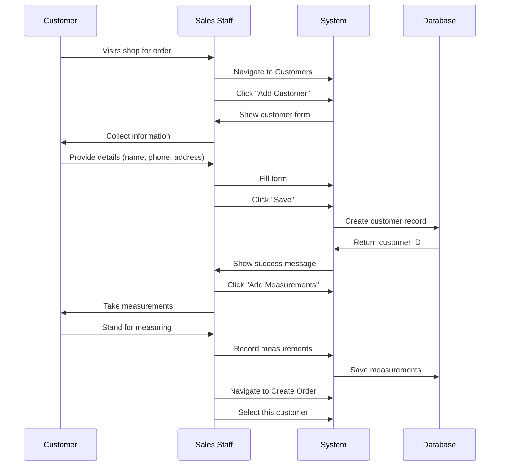
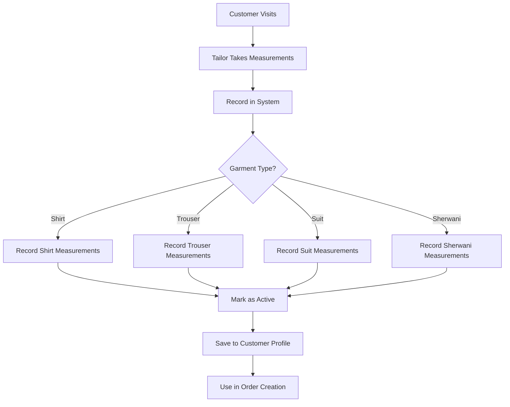

# Hamees Attire - Complete User Guide (Part 3: Customer Management)

**Version:** 0.15.4
**Last Updated:** January 16, 2026
**Application URL:** https://hamees.gagneet.com

---

## Table of Contents - Part 3

1. [Customer Management Overview](#customer-management-overview)
2. [Adding New Customers](#adding-new-customers)
3. [Viewing Customer Details](#viewing-customer-details)
4. [Recording Measurements](#recording-measurements)
5. [Measurement Types](#measurement-types)
6. [Editing Measurements](#editing-measurements)
7. [Customer Order History](#customer-order-history)
8. [Search and Filters](#search-and-filters)

---

## Customer Management Overview

### What is Customer Management?

The Customer module maintains complete profiles of your clients including:

- **Personal Information:** Name, contact details, address
- **Measurements:** Detailed body measurements for each garment type
- **Order History:** All past and current orders
- **Payment History:** Outstanding balances, payment records
- **Preferences:** Notes about fabric preferences, style choices

### Who Can Access?

| Role | View Customers | Add/Edit | Delete | Manage Measurements |
|------|----------------|----------|--------|-------------------|
| **OWNER** | ✅ | ✅ | ❌ | ✅ |
| **ADMIN** | ✅ | ✅ | ✅ | ✅ |
| **SALES_MANAGER** | ✅ | ✅ | ❌ | ✅ |
| **TAILOR** | ✅ | ❌ | ❌ | ✅ (create only) |
| **VIEWER** | ✅ | ❌ | ❌ | ❌ |
| **INVENTORY_MANAGER** | ❌ | ❌ | ❌ | ❌ |

---

## Adding New Customers

### When to Add a Customer

**Before creating their first order**, add the customer to the system.

**Benefits:**
- Reusable measurements
- Order history tracking
- WhatsApp notifications (if configured)
- Quick order creation in future

### Customer Creation Workflow



### Step-by-Step: Adding a Customer

1. **Navigate to Customers**
   - Sidebar → Customers
   - Click "Add Customer" button (top-right)

2. **Fill Customer Form:**

   **Personal Information:**
   - **Name:*** Full name (e.g., "Rajesh Kumar")
   - **Email:** Optional (e.g., "rajesh.kumar@example.com")
   - **Phone:*** 10-digit mobile number (e.g., "9876543210")
   - **Address:*** Full address with locality
   - **City:** City name (e.g., "Delhi")
   - **State:** State name (e.g., "Delhi")
   - **Pincode:** 6-digit postal code (e.g., "110001")
   - **Notes:** Optional (preferences, special instructions)

   **Fields marked with * are required**

3. **Click "Save Customer"**

4. **Customer Created:**
   - Success message appears
   - Customer ID generated automatically
   - Redirects to customer detail page

5. **Next Step: Add Measurements**
   - Click "Add Measurements" button
   - See [Recording Measurements](#recording-measurements) section

### Example Customer Entry

```
Name: Rajesh Kumar
Email: rajesh.kumar@example.com
Phone: 9876543210
Address: 123, Green Park, Sector 15
City: Delhi
State: Delhi
Pincode: 110001
Notes: Prefers cotton fabrics. Regular customer since 2020.
```

### Phone Number Formatting

**System automatically formats phone for WhatsApp:**
- Input: `9876543210`
- Stored: `9876543210`
- WhatsApp: `+919876543210` (E.164 format with India +91 code)

**Accepted Formats:**
- `9876543210` (10 digits)
- `+919876543210` (with country code)
- `919876543210` (without +)

**Validation:**
- Must be 10 digits (without country code)
- Must start with 6, 7, 8, or 9
- No spaces, dashes, or special characters

---

## Viewing Customer Details

### Customer List View

**Navigation:** Sidebar → Customers

**Columns Displayed:**

| Column | Description | Example |
|--------|-------------|---------|
| **Name** | Customer full name | Rajesh Kumar |
| **Phone** | Mobile number | 9876543210 |
| **Email** | Email address | rajesh@example.com |
| **City** | City of residence | Delhi |
| **Orders** | Total order count | 15 orders |
| **Orders Delivered** | Completed orders | 12 ✅ |
| **Orders In Progress** | Active orders | 3 🔵 |
| **Last Order** | Most recent order date | 15 Jan 2026 |
| **Actions** | View / Edit / Delete | 👁️ 📝 ❌ |

### Customer Cards (Mobile View)

On mobile devices, customers display as cards:

```
┌─────────────────────────────────────┐
│  Rajesh Kumar                       │
│  📞 9876543210                      │
│  📧 rajesh@example.com              │
│  📍 Delhi                           │
│                                     │
│  15 orders                          │
│  ┌─────────┐  ┌─────────┐          │
│  │ 12 ✅   │  │ 3 🔵    │          │
│  │Delivered│  │Progress │          │
│  └─────────┘  └─────────┘          │
│                                     │
│  Last Order: 15 Jan 2026            │
│  [View Details]                     │
└─────────────────────────────────────┘
```

### Clickable Order Metrics

**Orders Delivered Badge (Green):**
- Click to see dialog with all delivered orders
- Shows order number, date, amount, status
- Click any order → Navigate to order details

**Orders In Progress Badge (Blue):**
- Click to see dialog with active orders
- Shows NEW, CUTTING, STITCHING, FINISHING, READY statuses
- Click any order → Navigate to order details

### Customer Detail Page

**Clicking on Customer Name** opens detailed view:

**Sections:**

1. **Personal Information Card**
   - Name, Email, Phone
   - Full Address
   - Edit button (if permission)

2. **Measurements Summary**
   - List of all measurement records
   - Grouped by garment type
   - Active/Inactive status
   - "Add Measurements" button
   - "Edit" button for each measurement

3. **Order History Table**
   - All orders (newest first)
   - Order number, Date, Status, Amount, Balance
   - Click order number → Order details
   - Filter by status (dropdown)

4. **Payment Summary**
   - Total Revenue from customer
   - Outstanding Balance (if any)
   - Last Payment Date

5. **Quick Actions**
   - Create New Order (button)
   - Add Measurements (button)
   - Edit Customer (button - if permission)
   - Delete Customer (button - ADMIN only)

---

## Recording Measurements

### Why Record Measurements?

**Benefits:**
- **Accuracy:** No guessing, exact measurements
- **Consistency:** Same fit every time
- **Speed:** Reuse for future orders
- **History:** Track customer body changes over time
- **Quality:** Reduce alterations and returns

### Measurement Workflow



### Step-by-Step: Recording Measurements

1. **From Customer Detail Page:**
   - Click "Add Measurements" button

2. **Or from Orders Page:**
   - While creating an order
   - Click "Add Measurements" link next to customer name

3. **Select Garment Type:**
   - Choose from dropdown: Shirt, Trouser, Suit, Sherwani
   - Each type has different measurement fields

4. **Fill Measurement Fields:**
   - Enter all measurements in **centimeters (cm)**
   - Use decimal points for precision (e.g., `96.5`)
   - All fields are required for the selected garment type

5. **Select Body Type:**
   - SLIM, REGULAR, LARGE, or XL
   - Affects fabric calculation
   - Choose based on customer build

6. **Add Notes (Optional):**
   - Special instructions
   - Fitting preferences
   - Style notes
   - Example: "Prefers loose fit", "Long sleeves +2cm"

7. **Mark as Active:**
   - Check "Set as Active" checkbox
   - Active measurement used by default in orders
   - Only one active measurement per garment type

8. **Click "Save Measurements"**

9. **Measurement Saved:**
   - Success message appears
   - Appears in customer's measurement list
   - Available immediately for order creation

### Measurement Recording Screen

```
┌─────────────────────────────────────────────────────┐
│  Add Measurements for: Rajesh Kumar                 │
├─────────────────────────────────────────────────────┤
│  Garment Type: [Shirt ▼]                            │
│                                                     │
│  ┌─ Shirt Measurements (cm) ──────────────────┐    │
│  │  Neck:        [42.0] cm                     │    │
│  │  Chest:       [96.5] cm                     │    │
│  │  Waist:       [88.0] cm                     │    │
│  │  Hip:         [92.0] cm                     │    │
│  │  Shoulder:    [45.0] cm                     │    │
│  │  Sleeve:      [62.0] cm                     │    │
│  │  Shirt Length:[76.0] cm                     │    │
│  └─────────────────────────────────────────────┘    │
│                                                     │
│  Body Type: ◉ REGULAR  ○ SLIM  ○ LARGE  ○ XL       │
│                                                     │
│  Notes: [Prefers loose fit, regular collar]         │
│                                                     │
│  ☑ Set as Active (default for new orders)          │
│                                                     │
│  [Cancel]                    [Save Measurements]    │
└─────────────────────────────────────────────────────┘
```

---

## Measurement Types

### 1. Shirt Measurements

**Required Fields (7):**

| Field | Description | Measurement Point | Typical Range |
|-------|-------------|-------------------|---------------|
| **Neck** | Collar size | Around neck base | 38-46 cm |
| **Chest** | Chest circumference | Fullest part of chest | 90-120 cm |
| **Waist** | Waist circumference | Natural waistline | 80-110 cm |
| **Hip** | Hip circumference | Fullest part of hips | 90-115 cm |
| **Shoulder** | Shoulder width | Shoulder point to shoulder point | 40-50 cm |
| **Sleeve** | Sleeve length | Shoulder to wrist | 60-70 cm |
| **Shirt Length** | Total shirt length | Neck to bottom hem | 70-85 cm |

**How to Measure:**

```
Chest: Measure around the fullest part of the chest,
       keeping tape parallel to floor. Add 2-4 cm ease.

Waist: Measure around natural waistline (above navel).
       Customer should breathe normally.

Shoulder: Measure from shoulder point (where arm joins body)
          to other shoulder point, across back.

Sleeve: Measure from shoulder point to wrist bone,
        with arm slightly bent.
```

**Punjabi Translation (ਪੰਜਾਬੀ):**
- Neck: ਗਰਦਨ
- Chest: ਛਾਤੀ
- Waist: ਕਮਰ
- Shoulder: ਮੋਢਾ
- Sleeve: ਆਸਤੀਨ
- Shirt Length: ਕਮੀਜ਼ ਲੰਬਾਈ

---

### 2. Trouser Measurements

**Required Fields (7):**

| Field | Description | Measurement Point | Typical Range |
|-------|-------------|-------------------|---------------|
| **Waist** | Waist circumference | Where trousers will sit | 75-110 cm |
| **Hip** | Hip circumference | Fullest part of hips | 90-120 cm |
| **Inseam** | Inside leg length | Crotch to ankle | 75-85 cm |
| **Outseam** | Outside leg length | Waist to ankle | 100-115 cm |
| **Thigh** | Thigh circumference | Fullest part of thigh | 50-70 cm |
| **Knee** | Knee circumference | Around knee | 35-45 cm |
| **Bottom** | Ankle/bottom width | Circumference at bottom | 30-45 cm |

**How to Measure:**

```
Inseam: Measure from crotch point down to ankle bone
        (inside of leg). Customer should stand straight.

Outseam: Measure from waist (where trouser will sit)
         down outside of leg to ankle.

Thigh: Measure around fullest part of thigh,
       about 2 inches below crotch.

Bottom: Measure circumference at bottom opening
        (for desired fit - slim/regular/flared).
```

**Punjabi Translation:**
- Inseam: ਅੰਦਰਲੀ ਸੀਵਨ
- Outseam: ਬਾਹਰੀ ਸੀਵਨ
- Thigh: ਪੱਟ
- Knee: ਗੋਡਾ
- Bottom: ਹੇਠਾਂ

---

### 3. Suit Measurements

**Required Fields (10):**

Combines Shirt measurements + additional:

| Field | Description | Typical Range |
|-------|-------------|---------------|
| **Jacket Length** | From neck to bottom of jacket | 70-80 cm |
| **Lapel Width** | Width of jacket lapel | 7-10 cm |

**Plus all Shirt measurements** (Neck, Chest, Waist, Hip, Shoulder, Sleeve, Shirt Length)

**Plus all Trouser measurements** (for suit pants)

**Total:** 17 measurement fields for a complete 3-piece suit

---

### 4. Sherwani Measurements

**Required Fields (8):**

Similar to Shirt, with additions:

| Field | Description | Typical Range |
|-------|-------------|---------------|
| **Neck** | Collar size | 38-46 cm |
| **Chest** | Chest circumference | 90-120 cm |
| **Waist** | Waist circumference | 80-110 cm |
| **Hip** | Hip circumference | 90-115 cm |
| **Shoulder** | Shoulder width | 40-50 cm |
| **Sleeve** | Sleeve length | 60-70 cm |
| **Sherwani Length** | Knee-length or custom | 90-110 cm |
| **Bottom** | Bottom circumference | 50-70 cm |

**Note:** Sherwani typically longer than regular shirt

---

## Editing Measurements

### When to Edit Measurements

**Common Scenarios:**
- Customer's body size changed
- Previous measurements were incorrect
- Customer prefers different fit
- Garment alteration feedback

### Edit Workflow

**Option 1: Create New Measurement Record (Recommended)**

**Benefits:**
- Maintains measurement history
- Can compare old vs new
- Audit trail preserved

**Steps:**
1. View customer detail page
2. Click "Add Measurements"
3. Select garment type (e.g., Shirt)
4. Enter NEW measurements
5. Check "Set as Active"
6. Click "Save"
7. Previous measurement auto-marked as inactive

**Option 2: Edit Existing Measurement**

**Use When:** Correcting a data entry mistake

**Steps:**
1. View customer detail page
2. Find measurement in list
3. Click "Edit" button (pencil icon 📝)
4. Modify fields
5. Click "Save"
6. Changes applied immediately

**⚠️ Warning:** Editing changes historical data. Orders that used the old measurement won't show the original values.

### Measurement History

**Viewing History:**

1. Customer Detail Page → Measurements section
2. See all measurement records sorted by date
3. Active measurements highlighted (green)
4. Inactive measurements shown (gray)

**Example:**
```
SHIRT MEASUREMENTS
─────────────────────────────────────────────────────
✅ Active - Created: 15 Jan 2026
   Neck: 42cm, Chest: 96.5cm, Waist: 88cm
   Body Type: REGULAR
   [Edit] [View Full]

   Inactive - Created: 10 Jun 2025
   Neck: 42cm, Chest: 95cm, Waist: 86cm
   Body Type: REGULAR
   [View Full]
```

### Accessing Measurements from Order

**While creating an order:**

1. Select customer
2. Select garment type
3. System auto-selects ACTIVE measurement
4. Click "View Measurements" to see details
5. Click "Edit Measurements" → Opens customer page with highlight

**URL Parameter:** `?highlight=measurements`
- Customer page scrolls to measurements section
- Measurements section highlighted in yellow

---

## Customer Order History

### Viewing Order History

**From Customer Detail Page:**

Scroll to "Order History" section

**Information Displayed:**

| Column | Description |
|--------|-------------|
| **Order Number** | Clickable (e.g., ORD-202601-0123) |
| **Order Date** | When order was created |
| **Delivery Date** | Expected/actual delivery |
| **Status** | NEW, CUTTING, DELIVERED, etc. |
| **Items** | Number of garments (e.g., "3 items") |
| **Total Amount** | Order value (including GST) |
| **Balance** | Outstanding payment |

### Filtering Orders

**Filter Options:**
- **All Orders:** Show everything
- **Active:** NEW, CUTTING, STITCHING, FINISHING, READY
- **Delivered:** Completed orders
- **Cancelled:** Cancelled orders
- **With Arrears:** Delivered but balance > 0

**Steps:**
1. Use dropdown above order history table
2. Select filter
3. Table updates instantly

### Order Actions from Customer Page

**Quick Actions:**
- Click order number → View order details
- Click "Create New Order" → Pre-selects this customer
- Click "View Arrears" → Filter to unpaid deliveries

---

## Search and Filters

### Searching Customers

**Search Bar:** Top of customer list page

**Search Fields:**
- Customer name (partial match)
- Phone number (full or partial)
- Email address
- City

**Examples:**
```
Search: "Rajesh"       → Finds "Rajesh Kumar", "Rajesh Sharma"
Search: "9876"         → Finds phone numbers starting with 9876
Search: "Delhi"        → Finds all customers in Delhi
Search: "rajesh@"      → Finds email starting with rajesh@
```

**Real-time Search:**
- Type in search box
- Results filter as you type
- No need to press Enter

### Advanced Filters (Coming in v0.20.0)

**Planned Filters:**
- Filter by city
- Filter by last order date
- Filter by total orders count
- Filter by outstanding balance

---

## Customer Statistics

### Customer Retention Metrics

**Dashboard Shows:**
- **New Customers:** Added this month
- **Returning Customers:** 3+ orders across different months
- **Customer Lifetime Value:** Average revenue per customer
- **Repeat Rate:** Percentage of customers with multiple orders

**Accessing:**
- OWNER/ADMIN Dashboard → Customer Retention Chart
- Click "Returning Customers" → See detailed list

### Top Customers Report

**Navigation:** Reports → Customer Analytics (OWNER/ADMIN only)

**Metrics:**
- Top 20 customers by revenue
- Order frequency
- Average order value
- Last order date
- Customer segmentation (High/Medium/Low value)

---

## Best Practices

### ✅ DO:

1. **Always Record Measurements**
   - Take measurements for every new customer
   - Update when customer mentions fit issues
   - Keep measurement history for reference

2. **Verify Phone Numbers**
   - Confirm 10-digit number is correct
   - Test WhatsApp notifications
   - Update if customer changes number

3. **Add Useful Notes**
   - Fabric preferences
   - Style preferences (collar type, pocket style)
   - Special instructions
   - Previous complaints or requests

4. **Update After Delivery**
   - If alterations needed, record what adjustments were made
   - Update measurements if fit was incorrect

5. **Maintain Active Measurements**
   - Only one active measurement per garment type
   - Mark latest as active when updating

### ❌ DON'T:

1. **Don't Delete Customers with Orders**
   - System prevents deletion if orders exist
   - Archive instead (feature in v0.20.0)

2. **Don't Edit Old Measurements**
   - Create new measurement record instead
   - Preserves history

3. **Don't Skip Body Type**
   - Always select correct body type
   - Affects fabric calculation

4. **Don't Guess Measurements**
   - Always measure, never estimate
   - Accuracy is critical for customer satisfaction

---

## Next Steps

Continue to:

📖 **[Part 4: Order Management](USER_GUIDE_PART_4_ORDERS.md)**
- Creating orders
- Order workflow
- Status updates
- Payments and invoices

📖 **[Part 5: Reports and Administration](USER_GUIDE_PART_5_REPORTS_ADMIN.md)**
- Financial reports
- Expense tracking
- User management

---

**End of Part 3**

**Questions?** Contact your system administrator.
