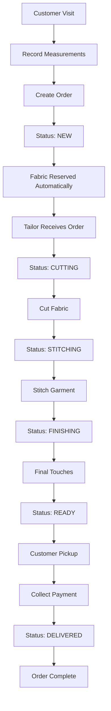
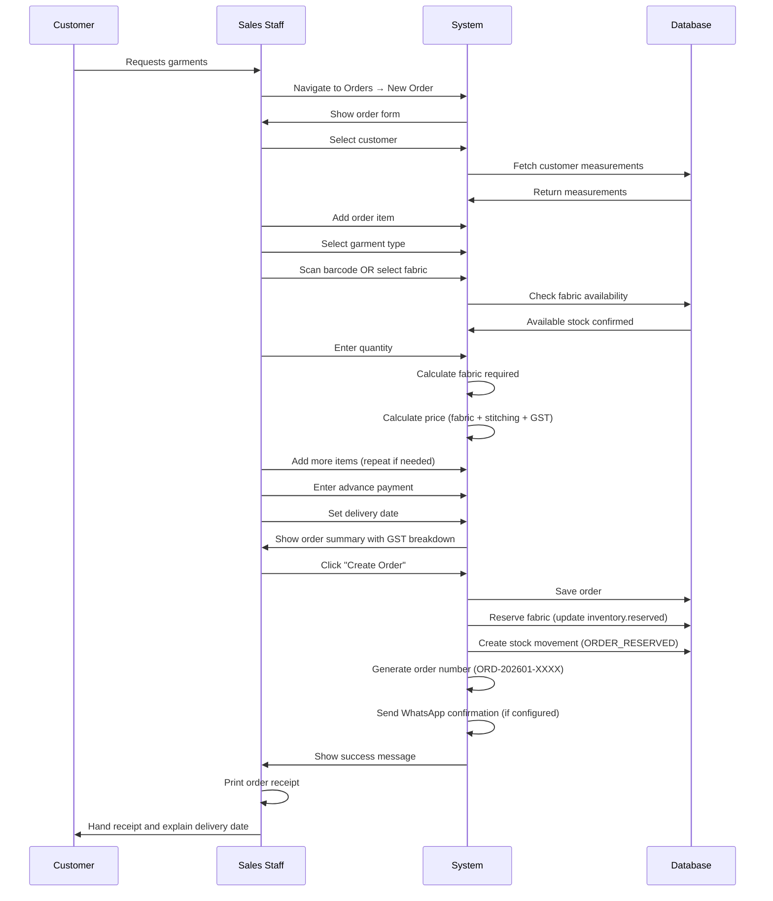
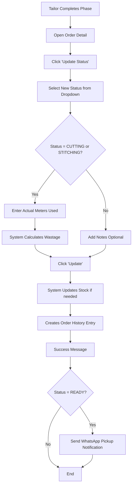
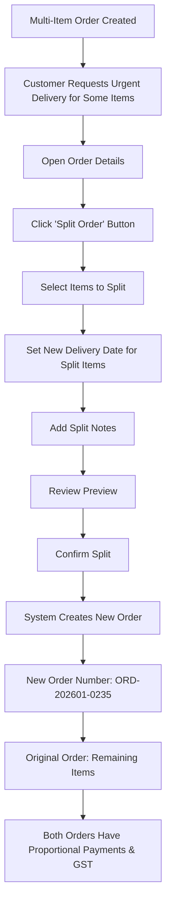

# Hamees Attire - Complete User Guide (Part 4: Order Management)

**Version:** 0.15.4
**Last Updated:** January 16, 2026
**Application URL:** https://hamees.gagneet.com

---

## Table of Contents - Part 4

1. [Order Management Overview](#order-management-overview)
2. [Creating New Orders](#creating-new-orders)
3. [Order Status Workflow](#order-status-workflow)
4. [Viewing Order Details](#viewing-order-details)
5. [Updating Order Status](#updating-order-status)
6. [Order Payments](#order-payments)
7. [Order Item Details](#order-item-details)
8. [Splitting Orders](#splitting-orders)
9. [Printing Invoices](#printing-invoices)
10. [Managing Arrears](#managing-arrears)

---

## Order Management Overview

### What is an Order?

An **Order** represents a customer's request for garments with complete details:

- Customer information
- Garment specifications (type, fabric, measurements)
- Pricing (with GST)
- Payment terms
- Delivery timeline
- Production status

### Order Lifecycle



### Order Statuses

| Status | Color | Description | Who Updates |
|--------|-------|-------------|-------------|
| **NEW** | Blue | Just created, awaiting production | Auto (system) |
| **CUTTING** | Purple | Fabric being cut | Tailor |
| **STITCHING** | Indigo | Garment being stitched | Tailor |
| **FINISHING** | Yellow | Final work (buttons, press, etc.) | Tailor |
| **READY** | Green | Ready for customer pickup | Tailor |
| **DELIVERED** | Dark Green | Completed and delivered | Sales/Owner |
| **CANCELLED** | Red | Order cancelled | Sales/Owner/Admin |

---

## Creating New Orders

### Pre-Requisites

Before creating an order, ensure:

1. ✅ Customer exists in system (or add new customer)
2. ✅ Customer measurements recorded (for the garment type)
3. ✅ Fabric available in inventory
4. ✅ Accessories available (buttons, thread, etc.)

### Order Creation Workflow



### Step-by-Step: Creating an Order

#### Step 1: Navigate to Orders

- Sidebar → Orders
- Click "New Order" button (top-right)

#### Step 2: Select Customer

**Method A: Existing Customer**
- Click dropdown "Select Customer"
- Search by name or phone
- Select customer from list

**Method B: New Customer**
- Click "Add New Customer" link
- Fill customer form (name, phone, address)
- Save
- System auto-selects new customer

#### Step 3: Add Order Items

Click "Add Item" button

**For Each Item:**

1. **Select Garment Type**
   - Dropdown: Shirt, Trouser, Suit, Sherwani
   - System shows fabric requirement (base meters)

2. **Select Fabric**

   **Option A: Scan Barcode**
   - Click "Scan Barcode" icon next to fabric field
   - Scan QR code or manufacturer barcode
   - Fabric auto-selected

   **Option B: Manual Selection**
   - Click "Select Fabric" dropdown
   - Choose from available fabrics
   - See current stock for each

3. **Enter Quantity**
   - Number of garments (e.g., 2 shirts)
   - System calculates total fabric needed
   - Shows available stock vs required

4. **Select Body Type**
   - SLIM, REGULAR, LARGE, or XL
   - Uses customer's active measurement
   - Affects fabric calculation

5. **Review Calculations**
   - **Estimated Meters:** Auto-calculated based on:
     - Garment base meters
     - Body type adjustment
     - Quantity
   - **Fabric Cost:** Meters × Price per meter
   - **Stitching Charges:** ₹1500 per garment (default)
   - **Accessories:** Auto-included from garment pattern
   - **Item Total:** Fabric + Stitching + Accessories

6. **Add Notes (Optional)**
   - Special instructions
   - Style preferences
   - Color combinations

7. **Click "Add Item"**
   - Item appears in order item list
   - Can add more items (repeat steps 1-7)

#### Step 4: Review Order Summary

**Right Side Panel Shows:**

```
ORDER SUMMARY
─────────────────────────────────────
Items (2):
1. Men's Shirt × 2
   Cotton Blue
   ₹2,800 (fabric) + ₹3,000 (stitching)
   = ₹5,800

2. Men's Trouser × 1
   Linen Brown
   ₹1,200 (fabric) + ₹1,500 (stitching)
   = ₹2,700
─────────────────────────────────────
Subtotal:               ₹8,500.00
GST (12%):              ₹1,020.00
  ├─ CGST (6%):         ₹510.00
  └─ SGST (6%):         ₹510.00
─────────────────────────────────────
TOTAL AMOUNT:           ₹9,520.00
─────────────────────────────────────
```

#### Step 5: Enter Payment Details

**Advance Payment:**
- Amount customer pays upfront (e.g., ₹5,000)
- Typically 30-60% of total
- Balance due on delivery

**Balance Amount:**
- Auto-calculated: Total - Advance
- Example: ₹9,520 - ₹5,000 = ₹4,520 due

**Payment Mode:**
- Cash, UPI, Card, Bank Transfer, Cheque
- For advance payment

**Transaction Reference:**
- Optional (UPI ID, check number, etc.)

#### Step 6: Set Delivery Date

- **Default:** 14 days from today
- **Custom:** Click calendar to choose date
- System shows:
  - Days until delivery (e.g., "14 days")
  - Color-coded: Green (>7 days), Yellow (3-7 days), Red (<3 days)

#### Step 7: Add Order Notes

- Special instructions
- Deadlines (wedding, event)
- Customer preferences

#### Step 8: Create Order

**Click "Create Order" Button**

**System Actions:**

1. ✅ Validates all fields
2. ✅ Checks fabric availability
3. ✅ Generates unique order number (ORD-202601-0234)
4. ✅ Saves order to database
5. ✅ **Reserves fabric** (updates `reserved` field in inventory)
6. ✅ Creates stock movement record (ORDER_RESERVED)
7. ✅ Links customer measurements to order items
8. ✅ Generates GST invoice number (if configured)
9. ✅ Sends WhatsApp confirmation (if configured)
10. ✅ Creates first order history entry ("Order created")

**Success Message:**
```
✅ Order created successfully!
Order Number: ORD-202601-0234
Customer will receive WhatsApp confirmation.

[View Order] [Print Receipt] [Create Another]
```

#### Step 9: Print Receipt

**Click "Print Receipt"** button

**Receipt Includes:**
- Order number
- Customer details
- Item list with fabric and garment types
- Pricing breakdown with GST
- Advance payment
- Balance due
- Delivery date
- Signature sections (customer + staff)

---

## Order Status Workflow

### Status Progression

**Normal Workflow:**
```
NEW → CUTTING → STITCHING → FINISHING → READY → DELIVERED
```

**Can Skip Statuses:**
```
NEW → CUTTING → STITCHING → DELIVERED (skip FINISHING and READY if urgent)
```

**Can Go Backwards:**
```
STITCHING → CUTTING (if remake needed)
READY → STITCHING (if alterations needed)
```

**Cannot:**
- Change from DELIVERED back to any status
- Change to DELIVERED if balance > 0 (must collect payment first)

### Automatic Stock Management

**Status Changes Trigger Stock Updates:**

| Status Change | Stock Action | Description |
|---------------|--------------|-------------|
| **NEW created** | Reserve fabric | `reserved` += estimated meters |
| **→ CUTTING** | No change | Fabric still reserved |
| **→ STITCHING** | Release reservation, deduct stock | `reserved` -= estimated, `currentStock` -= actual used |
| **→ CANCELLED** | Release reservation | `reserved` -= estimated, fabric available again |
| **→ DELIVERED** | No change | Stock already deducted at stitching |

### Wastage Tracking

**When Cutting:**
- Tailor records "Actual Meters Used"
- System calculates wastage:
  ```
  Wastage = Actual Used - Estimated Required

  Example:
  Estimated: 3.5m
  Actual Used: 3.7m
  Wastage: +0.2m (used more than expected)

  Or:
  Estimated: 3.5m
  Actual Used: 3.3m
  Wastage: -0.2m (used less, good efficiency!)
  ```

- **Efficiency Percentage:**
  ```
  Efficiency = (Estimated ÷ Actual Used) × 100

  Example:
  3.5m ÷ 3.3m = 106.06% (efficient, used less)
  3.5m ÷ 3.7m = 94.59% (wastage)
  ```

---

## Viewing Order Details

### Order List View

**Navigation:** Sidebar → Orders

**Columns:**

| Column | Description |
|--------|-------------|
| **Order Number** | Clickable (e.g., ORD-202601-0234) |
| **Customer** | Customer name |
| **Order Date** | When created |
| **Delivery Date** | Expected delivery |
| **Status** | Color-coded badge |
| **Items** | Number of garments |
| **Total Amount** | Including GST |
| **Balance** | Outstanding payment |
| **Actions** | View details, Update status |

### Filters

**Filter Orders By:**

- **Status:** All, NEW, CUTTING, STITCHING, FINISHING, READY, DELIVERED, CANCELLED
- **Date Range:** Last 7 days, 30 days, 90 days, Custom
- **Customer:** Select from dropdown
- **Fabric:** Orders using specific fabric
- **Balance Amount:** All, Paid, Arrears (balance > 0)

**Quick Filters:**
- **View Arrears** button → Shows delivered orders with balance > 0 (red badge)
- **Due Today** → Orders with delivery date = today
- **Overdue** → Orders past delivery date, not delivered

### Search

**Search by:**
- Order number (ORD-202601-0234)
- Customer name (Rajesh)
- Phone number (9876543210)

### Pagination

**Controls:**
- Page size: 10, 15, or 25 orders per page
- Navigation: First, Previous, Next, Last
- Item count: "Showing 1 to 10 of 192 orders"

---

## Order Detail Page

**Click on Order Number** → Opens detail view

### Sections

#### 1. Order Header
```
ORD-202601-0234          Status: STITCHING
Created: 15 Jan 2026     Delivery: 29 Jan 2026 (14 days)

[Update Status ▼]  [Record Payment]  [Print Invoice]
```

#### 2. Customer Information
- Name (clickable → customer profile)
- Phone, Email
- Address
- "Edit Measurements" button

#### 3. Order Items List

For each item:
- Garment type with thumbnail
- Fabric (name, color, brand)
- Quantity
- Measurements (clickable to expand)
- Estimated meters vs Actual used
- Wastage and efficiency
- Item price breakdown
- "View Item Details" button

#### 4. Order Item Detail Dialog

**Click "View Details"** on any item → Opens comprehensive popup:

**Sections in Dialog:**

1. **Urgency Alert** (if applicable)
   - Red: Overdue
   - Yellow: Due today
   - Blue: Due in 1-3 days

2. **Measurements (TOP SECTION - Prominent)**
   - **HUGE Fonts:** 48px values (4x larger)
   - Orange gradient background
   - Bilingual labels (English / Punjabi)
   - Examples:
     - Chest / ਛਾਤੀ: **96.5** cm
     - Waist / ਕਮਰ: **88.0** cm
     - Sleeve / ਆਸਤੀਨ: **62.0** cm
   - 2-column grid layout
   - "Edit Measurements" button

3. **Timeline & Phase Tracking**
   - Purple card showing current status
   - Time spent in current phase
   - Recent order history with changes
   - "Advance to Next Status" button

4. **Work Instructions**
   - **Customer Instructions** (Amber card)
     - Customer notes/special requests
   - **Tailor's Observations** (Green card)
     - Editable textarea for tailor notes
     - Save button

5. **Efficiency Metrics** (if actual meters recorded)
   - Cyan card with progress bar
   - Estimated vs Actual meters
   - Wastage calculation
   - Color-coded: Green (≥95%), Yellow (≥85%), Red (<85%)

6. **Fabric Details**
   - Color swatch
   - Brand, Type, Color
   - Storage location (Rack number)

7. **Cloth Remaining**
   - Current stock minus reserved
   - Color-coded: Red if insufficient, Green if adequate

8. **Accessories Required**
   - Orange card with checklist
   - Shows quantity needed per garment
   - Stock status
   - Progress badge (e.g., "3/5 Collected")

9. **Customer History Reference**
   - Indigo card
   - Previous 3 orders from this customer
   - Helps with sizing consistency

10. **Design Uploads**
    - Sketch, reference images, WIP, final photos
    - Upload button (Owner/Admin only)
    - Download and delete options
    - Categories: SKETCH, REFERENCE, WORK_IN_PROGRESS, FINAL

#### 5. Payment Summary
- Total Amount
- Advance Paid
- Discount (if any) with reason
- Balance Due
- All installments list

#### 6. Timeline
- Order history with all status changes
- User who made change
- Timestamp
- Notes/comments

#### 7. Actions Panel
- **Update Status** button
- **Record Payment** button
- **Apply Discount** button (OWNER only)
- **Split Order** button (if 2+ items)
- **Print Invoice** button
- **Cancel Order** button
- **Edit Order Item** button

---

## Updating Order Status

### Who Can Update?

| Role | Can Update Status? |
|------|-------------------|
| **OWNER** | ✅ All statuses |
| **ADMIN** | ✅ All statuses |
| **SALES_MANAGER** | ✅ All statuses |
| **TAILOR** | ✅ Production statuses only (CUTTING, STITCHING, FINISHING, READY) |
| **VIEWER** | ❌ No |

### Update Status Workflow



### Step-by-Step: Update Status

1. **Open Order Details**
   - Find order in list
   - Click order number

2. **Click "Update Status"** button

3. **Select New Status**
   - Dropdown shows allowed statuses
   - Example: From CUTTING → Can choose STITCHING, CANCELLED, or back to NEW

4. **Enter Additional Information (if required):**

   **If Changing to CUTTING:**
   - Optional: Record actual meters about to use
   - Add cutting notes

   **If Changing to STITCHING:**
   - **Required:** Enter "Actual Meters Used"
   - System calculates wastage automatically
   - Stock updated: `currentStock` decreases, `reserved` releases

   **If Changing to READY:**
   - System sends WhatsApp pickup notification (if configured)

   **If Changing to DELIVERED:**
   - **Validation:** Balance must be 0 or collect remaining payment first
   - If balance > 0, show error: "Collect payment before marking as delivered"

5. **Add Notes (Optional)**
   - Describe any issues
   - Record alterations made
   - Note customer feedback

6. **Click "Update"**

7. **System Actions:**
   - Updates order status
   - Updates stock (if applicable)
   - Creates stock movement (if applicable)
   - Adds order history entry
   - Sends notifications (if configured)

8. **Success Message:**
   ```
   ✅ Order status updated to STITCHING
   Stock updated: -3.3m from Cotton Blue inventory
   Efficiency: 106.06% (used less than estimated)
   ```

### Quick Status Advance Button

**On Order Item Detail Dialog:**

"Advance to CUTTING" button (one-click)
- Skips the dropdown selection
- Shows next logical status
- Opens same form
- Faster workflow

---

## Order Payments

### Payment Types

1. **Advance Payment**
   - Collected when order created
   - Partial payment (typically 30-60% of total)

2. **Balance Payment**
   - Collected at delivery
   - Can be multiple installments

3. **Additional Payments**
   - Partial payments over time
   - Recorded via "Record Payment" button

### Recording Payment

**Step-by-Step:**

1. **Open Order Details**

2. **Click "Record Payment"** button

3. **Payment Dialog Opens:**
   ```
   PAYMENT SUMMARY
   ─────────────────────────────────────
   Total Amount:       ₹9,520.00
   Already Paid:       ₹5,000.00
   Balance Due:        ₹4,520.00 (in RED)
   ─────────────────────────────────────

   Payment Amount: [₹4,520.00]  (pre-filled, editable)

   Payment Mode:
   ◉ Cash  ○ UPI  ○ Card  ○ Bank Transfer  ○ Cheque

   Transaction Reference: [____________]
   (Optional for Cash, required for others)

   Notes: [________________________________]
   (Optional: Partial payment, final settlement, etc.)

   [Cancel]               [Record Payment]
   ```

4. **Fill Details:**
   - **Amount:** Full balance or partial
   - **Payment Mode:** Select one
   - **Transaction Ref:** UPI ID, Check #, etc.
   - **Notes:** Why partial, when to collect rest, etc.

5. **Click "Record Payment"**

6. **System Actions:**
   - Creates installment record with status PAID
   - Updates `balanceAmount` on order
   - Records `paidDate` = today
   - Creates order history entry
   - Shows success message

7. **Result:**
   ```
   ✅ Payment recorded successfully!
   Amount: ₹4,520.00
   New Balance: ₹0.00

   You can now mark order as DELIVERED.
   ```

### Viewing Payment History

**Order Detail → Payment Summary Section**

Shows all installments:
```
PAYMENT HISTORY
─────────────────────────────────────────────────────────
15 Jan 2026  PAID  ₹5,000.00  Cash          Advance
                               (sales@hameesattire.com)

29 Jan 2026  PAID  ₹4,520.00  UPI           Balance
                               ID: 9876543210@paytm
                               (owner@hameesattire.com)
─────────────────────────────────────────────────────────
Total Paid: ₹9,520.00
Balance: ₹0.00
```

---

## Splitting Orders

### When to Split an Order?

**Use Cases:**
- Customer needs some items urgently
- Fabric for some items not available
- Cancel specific items without affecting others
- Separate delivery dates for different items

**Requirements:**
- Order must have 2+ items
- Order cannot be DELIVERED
- Order cannot be CANCELLED

### Split Order Workflow



### Step-by-Step: Splitting an Order

1. **Open Order Details**
   - Must have 2+ items

2. **Click "Split Order"** button (Actions section)

3. **Split Dialog Opens:**
   ```
   SPLIT ORDER: ORD-202601-0234
   ─────────────────────────────────────────────────────
   Select items to move to new order:

   ☑ Men's Shirt × 2         ₹5,800
      Cotton Blue

   ☐ Men's Trouser × 1       ₹2,700
      Linen Brown

   ─────────────────────────────────────────────────────
   New Delivery Date: [__|__/__|__/2026]  📅

   Split Reason: [Customer needs shirts urgently for__]
                 [wedding on Jan 25th________________]

   ─────────────────────────────────────────────────────
   PREVIEW:

   NEW ORDER (to be created):
     • 1 item: Men's Shirt × 2
     • Subtotal: ₹5,800
     • GST (12%): ₹696
     • Total: ₹6,496
     • Advance (proportional): ₹3,413
     • Balance: ₹3,083
     • Delivery: 25 Jan 2026

   REMAINING ORDER (ORD-202601-0234):
     • 1 item: Men's Trouser × 1
     • Subtotal: ₹2,700
     • GST (12%): ₹324
     • Total: ₹3,024
     • Advance (proportional): ₹1,587
     • Balance: ₹1,437
     • Delivery: 29 Jan 2026 (unchanged)

   ─────────────────────────────────────────────────────
   [Cancel]                              [Split Order]
   ```

4. **Review Preview**
   - Check calculations
   - Verify proportional split is correct

5. **Click "Split Order"**

6. **System Actions:**
   - Creates new order with unique number (ORD-202601-0235)
   - Moves selected items to new order
   - Splits advance payment proportionally
   - Recalculates GST for both orders
   - Creates order history entries for both orders
   - Maintains stock reservations

7. **Success Message:**
   ```
   ✅ Order split successfully!

   New Order: ORD-202601-0235
   - 1 item (Men's Shirt × 2)
   - Total: ₹6,496
   - Delivery: 25 Jan 2026

   Original Order: ORD-202601-0234
   - 1 item (Men's Trouser × 1)
   - Total: ₹3,024
   - Delivery: 29 Jan 2026

   [View New Order]  [View Original Order]
   ```

8. **Both Orders Independent:**
   - Can update status separately
   - Can collect payments separately
   - Can deliver on different dates

---

## Printing Invoices

### GST-Compliant Invoice

**Click "Print Invoice"** button on order detail page

**Invoice Includes:**

```
╔══════════════════════════════════════════════════════╗
║          HAMEES ATTIRE                               ║
║          Custom Tailoring & Garments                 ║
║          123 Main Street, Delhi - 110001             ║
║          GSTIN: 07XXXXX1234X1Z5                      ║
╠══════════════════════════════════════════════════════╣
║  TAX INVOICE                                         ║
║                                                      ║
║  Invoice No: INV-202601-0234                         ║
║  Invoice Date: 15 Jan 2026                           ║
║  Order No: ORD-202601-0234                           ║
╠══════════════════════════════════════════════════════╣
║  CUSTOMER DETAILS                                    ║
║  Name: Rajesh Kumar                                  ║
║  Phone: 9876543210                                   ║
║  Address: 45 Park Avenue, Delhi - 110002             ║
╠══════════════════════════════════════════════════════╣
║  ITEM DETAILS                                        ║
║  ──────────────────────────────────────────────      ║
║  1. Men's Shirt × 2                                  ║
║     Fabric: Cotton Blue (ABC Fabrics)                ║
║     Rate: ₹2,900/item                                ║
║     Amount: ₹5,800                                   ║
║                                                      ║
║  2. Men's Trouser × 1                                ║
║     Fabric: Linen Brown                              ║
║     Rate: ₹2,700/item                                ║
║     Amount: ₹2,700                                   ║
║  ──────────────────────────────────────────────      ║
║                                       Subtotal: ₹8,500║
║                             CGST @ 6%: ₹510          ║
║                             SGST @ 6%: ₹510          ║
║                          Total GST 12%: ₹1,020       ║
║  ──────────────────────────────────────────────      ║
║                             TOTAL AMOUNT: ₹9,520     ║
║                                                      ║
║                            Advance Paid: ₹5,000      ║
║                              BALANCE DUE: ₹4,520     ║
╠══════════════════════════════════════════════════════╣
║  Delivery Date: 29 Jan 2026                          ║
║                                                      ║
║  Terms & Conditions:                                 ║
║  • Balance due on delivery                           ║
║  • Alterations free within 7 days                    ║
║  • Fabric defects reported within 24 hours           ║
╠══════════════════════════════════════════════════════╣
║  Customer Signature: ____________                    ║
║                                                      ║
║  Authorized Signatory: ____________                  ║
║                                      (For Hamees)    ║
╚══════════════════════════════════════════════════════╝
```

**Invoice Features:**
- Professional GST-compliant format
- Complete item breakdown
- GST calculation (CGST 6% + SGST 6% = 12%)
- Advance and balance display
- Terms and conditions
- Signature sections
- Print-optimized CSS for A4 paper

**Printing:**
1. Invoice opens in new window
2. Print dialog appears automatically
3. Select printer
4. Print or save as PDF
5. Window auto-closes after printing

---

## Managing Arrears

### What are Arrears?

**Definition:** Orders that have been delivered but customer has not paid full balance.

**Indicator:** Red "ARREARS" badge on order card

**Condition:** `status = DELIVERED AND balanceAmount > 0`

### Viewing Arrears

**Quick Access:**
- Orders page → Click "View Arrears" button
- Red outline when inactive, solid red when active
- URL: `/orders?balanceAmount=gt:0&status=DELIVERED`

**Filter Shows:**
- All delivered orders with outstanding balance
- Balance amount in red
- Days overdue (if past expected payment date)
- Customer contact info

### Applying Discount to Clear Arrears

**Who Can Apply:** OWNER only

**Use Cases:**
- Cash payment settled outside system
- Customer loyalty discount
- Write-off small balance
- Payment reconciliation

**Step-by-Step:**

1. **Open Order with Arrears**

2. **Click "Apply Discount"** (yellow button)

3. **Discount Dialog Opens:**
   ```
   APPLY DISCOUNT: ORD-202601-0234
   ─────────────────────────────────────────────────────
   PAYMENT SUMMARY (Blue Info Box)
   Total Amount:       ₹9,520.00
   Already Paid:       ₹7,020.00
   Balance Due:        ₹2,500.00
   ─────────────────────────────────────────────────────

   Discount Amount: [₹2,500.00]  (pre-filled with balance)
                    (Large, bold, RED text)

   Discount Reason: [Cash payment settled on delivery__]
                    [Customer paid ₹2500 in cash______]
                    (REQUIRED field)

   ─────────────────────────────────────────────────────
   New Balance After Discount: ₹0.00 (Green)

   [Cancel]                            [Apply Discount]
   ```

4. **Enter Discount Details:**
   - **Amount:** Full balance or partial
   - **Reason:** Mandatory explanation

5. **Click "Apply Discount"**

6. **System Actions:**
   - Updates `discount` field on order
   - Stores `discountReason`
   - Recalculates `balanceAmount = totalAmount - advancePaid - discount`
   - Creates order history entry with reason
   - Removes ARREARS badge if balance = 0

7. **Success:**
   ```
   ✅ Discount applied successfully!
   Discount: ₹2,500.00
   Reason: Cash payment settled on delivery
   New Balance: ₹0.00

   Order no longer has arrears.
   ```

8. **Audit Trail:**
   - Discount and reason permanently stored
   - Visible on order detail page in yellow box
   - Included in invoice if reprinted
   - Tracked in order history

---

## Next Steps

Continue to:

📖 **[Part 5: Reports & Administration](USER_GUIDE_PART_5_REPORTS_ADMIN.md)**
- Financial reports
- Expense tracking
- User management
- System settings

📖 **[Part 6: Best Practices](USER_GUIDE_PART_6_BEST_PRACTICES.md)**
- Complete workflows
- Tips and tricks
- Troubleshooting

---

**End of Part 4**

**Questions?** Contact your system administrator.
