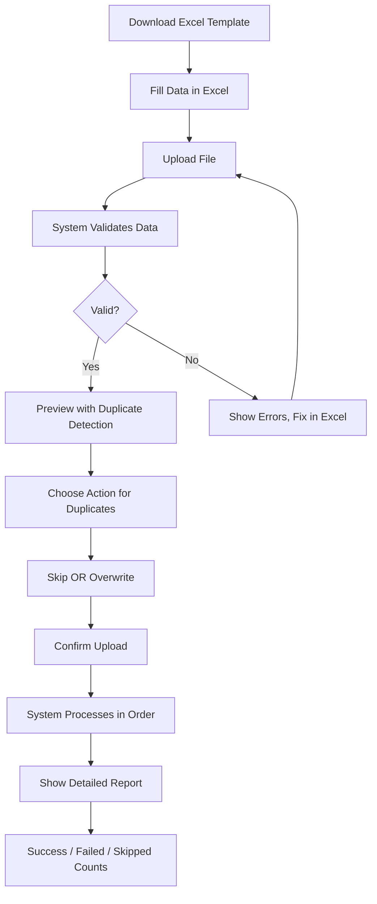

# Hamees Attire - Complete User Guide (Part 5: Reports & Administration)

**Version:** 0.15.4
**Last Updated:** January 16, 2026
**Application URL:** https://hamees.gagneet.com

---

## Table of Contents - Part 5

1. [Reports Overview](#reports-overview)
2. [Financial Reports](#financial-reports)
3. [Expense Reports](#expense-reports)
4. [Customer Analytics](#customer-analytics)
5. [Alerts System](#alerts-system)
6. [User Management (ADMIN)](#user-management-admin)
7. [Bulk Upload](#bulk-upload)
8. [System Settings](#system-settings)

---

## Reports Overview

### Who Can Access Reports?

| Report Type | OWNER | ADMIN | SALES_MGR | Others |
|-------------|-------|-------|-----------|--------|
| **Financial Reports** | ✅ | ✅ | ❌ | ❌ |
| **Expense Reports** | ✅ | ✅ | ❌ | ❌ |
| **Sales Reports** | ✅ | ✅ | ✅ | ❌ |
| **Customer Reports** | ✅ | ✅ | ✅ | ❌ |
| **Inventory Reports** | ✅ | ✅ | ❌ | INV_MGR only |

### Report Features

All reports include:
- **Interactive Charts:** Click to drill down
- **Date Range Selection:** 3, 6, or 12 months
- **Export Options:** PDF, Excel (coming in v0.20.0)
- **Print Optimization:** Clean layout for printing
- **Real-Time Data:** Always up-to-date

---

## Financial Reports

### Accessing Financial Reports

**Navigation:** Sidebar → Reports → Financial Reports

**Access:** OWNER and ADMIN only

### Report Sections

#### 1. Current Month P&L (Profit & Loss)

**4 KPI Cards:**

```
┌─────────────────┐  ┌─────────────────┐  ┌─────────────────┐  ┌─────────────────┐
│   REVENUE       │  │   EXPENSES      │  │  NET PROFIT     │  │  PROFIT MARGIN  │
│   ₹1,25,000     │  │   ₹85,000       │  │  ₹40,000        │  │     32.00%      │
│   ↑ +15.2%      │  │   ↑ +8.5%       │  │  ↑ +25.3%       │  │   ↑ +2.1%       │
│   (vs last)     │  │   (vs last)     │  │  (vs last)      │  │  (vs last)      │
└─────────────────┘  └─────────────────┘  └─────────────────┘  └─────────────────┘
    GREEN              RED                 BLUE                 BLUE
```

**Formulas:**
- **Revenue:** Sum of all DELIVERED orders' totalAmount (current month)
- **Expenses:** Sum of all Expense records + PO payments (current month)
- **Net Profit:** Revenue - Expenses
- **Profit Margin:** (Net Profit ÷ Revenue) × 100

**Color Coding:**
- Profit (positive): Blue with trending up icon 📈
- Loss (negative): Orange with trending down icon 📉

#### 2. Year-to-Date Summary

**3 Cards:**
```
Total Revenue (YTD):    ₹8,50,000
Total Expenses (YTD):   ₹5,20,000
Net Profit (YTD):       ₹3,30,000
```

**Calculation:** Sum from Jan 1st to today

#### 3. Financial Trend Chart (Multi-Line)

**X-Axis:** Months (last 6 or 12 months)
**Y-Axis:** Amount (₹)

**3 Lines:**
1. **Revenue** (Green line) - Delivered orders
2. **Expenses** (Red line) - All expenses + PO payments
3. **Profit** (Blue line) - Revenue minus Expenses

**Hover:** Shows exact values for each month

**Example:**
```
      Revenue (Green)
         ╱╲
        ╱  ╲     Profit (Blue)
       ╱    ╲   ╱
      ╱      ╲ ╱
     ╱        ╲╱
────╱──────────╲─────── Expenses (Red)
   Jul  Aug  Sep  Oct  Nov  Dec
```

**Analysis:**
- Identify seasonal trends
- Compare revenue vs expense growth
- Spot months with losses
- Plan for slow periods

#### 4. Cash Position

**2 Metrics:**
```
Cash Received This Month:   ₹95,000
Outstanding Payments:       ₹45,000
```

- **Cash Received:** Sum of all PAID installments (current month)
- **Outstanding:** Sum of all order balanceAmount (all active orders)

#### 5. Assets

**Inventory Valuation:**
```
Total Inventory Value: ₹3,25,000
```

**Calculation:** Sum of (currentStock × pricePerMeter) for all cloth + (currentStock × unitPrice) for all accessories

### Using Financial Reports

**Step-by-Step:**

1. **Select Time Range**
   - Dropdown: 3, 6, or 12 months
   - Click to change
   - Charts update automatically

2. **Review P&L Cards**
   - Check if profit or loss
   - Compare growth percentages
   - Identify concerning trends

3. **Analyze Trend Chart**
   - Look for revenue dips (slow months)
   - Check if expenses growing faster than revenue
   - Identify seasonal patterns

4. **Check Cash Flow**
   - Compare cash received vs revenue (delivery timing lag)
   - Review outstanding balances (arrears)

5. **Export Report (Future)**
   - Click "Export PDF" button
   - Save for accounting or investors

**Interpretation Examples:**

**Healthy Business:**
```
Revenue: ₹1,25,000 ↑ +15%
Expenses: ₹85,000 ↑ +8%
Profit: ₹40,000 ↑ +25%
Margin: 32%

→ Revenue growing faster than expenses ✅
→ Profit margin healthy (>25%) ✅
```

**Warning Signs:**
```
Revenue: ₹80,000 ↓ -5%
Expenses: ₹90,000 ↑ +10%
Profit: -₹10,000 (LOSS)
Margin: -12.5%

→ Revenue declining ⚠️
→ Expenses increasing ⚠️
→ Operating at a loss 🔴
→ Action needed: Reduce costs or increase sales
```

---

## Expense Reports

### Accessing Expense Reports

**Navigation:** Sidebar → Reports → Expense Reports

**Access:** OWNER and ADMIN only

### Expense Categories (12 Total)

| Category | Examples | Typical Monthly |
|----------|----------|-----------------|
| **Rent** | Shop rent, warehouse | Fixed |
| **Utilities** | Electricity, water, internet | ₹5K-₹15K |
| **Salaries** | Staff wages | Fixed |
| **Transport** | Delivery, pickup, travel | ₹3K-₹10K |
| **Marketing** | Ads, flyers, social media | ₹5K-₹20K |
| **Maintenance** | Repairs, cleaning | Variable |
| **Office Supplies** | Stationery, printer ink | ₹2K-₹5K |
| **Professional Fees** | Accountant, lawyer | Quarterly |
| **Insurance** | Shop, inventory insurance | Annual |
| **Bank Charges** | Transaction fees, loan EMI | ₹1K-₹5K |
| **Depreciation** | Equipment depreciation | Monthly |
| **Miscellaneous** | Other expenses | Variable |

### Report Sections

#### 1. Summary Cards

```
┌─────────────────┐  ┌─────────────────┐  ┌─────────────────┐  ┌─────────────────┐
│ TOTAL EXPENSES  │  │   THIS MONTH    │  │  TRANSACTIONS   │  │  AVG PER MONTH  │
│   ₹5,20,000     │  │   ₹85,000       │  │      156        │  │    ₹86,667      │
│   (6 months)    │  │   ↑ +8.5%       │  │  (6 months)     │  │   (6 months)    │
└─────────────────┘  └─────────────────┘  └─────────────────┘  └─────────────────┘
```

#### 2. Monthly Trend Bar Chart

**Red Bars:** Expenses per month

```
₹
100K │        █
 90K │     █  █
 80K │  █  █  █  █
 70K │  █  █  █  █  █
 60K │  █  █  █  █  █  █
────┴──────────────────────
    Jul Aug Sep Oct Nov Dec
```

**Usage:** Identify months with unusually high expenses

#### 3. Category Pie Chart

**12 Color-Coded Slices:**

```
     Rent (25%)
        ╱╲
Salaries ╱  ╲ Utilities
(30%)   ╱    ╲ (10%)
       ╱      ╲
      ╱        ╲
     ╱          ╲
    ╱   Other   ╲
   ╱   (35%)     ╲
  ╱_______________╲
```

**Usage:** See which categories consume most budget

#### 4. Category Breakdown Table

| Category | Amount | % of Total | Trend |
|----------|--------|------------|-------|
| Salaries | ₹1,56,000 | 30% | ↑ +5% |
| Rent | ₹1,30,000 | 25% | → 0% |
| Utilities | ₹52,000 | 10% | ↑ +12% |
| Transport | ₹36,400 | 7% | ↓ -3% |
| Marketing | ₹41,600 | 8% | ↑ +25% |
| ... | ... | ... | ... |

#### 5. Top 10 Expenses List

**Individual large expenses:**

```
1. ₹30,000 - Salary: Tailor (15 Dec 2025)
2. ₹25,000 - Shop Rent January (1 Jan 2026)
3. ₹18,500 - Fabric Purchase (10 Dec 2025)
4. ₹15,000 - Electricity Bill Q4 (20 Dec 2025)
5. ₹12,000 - Marketing - Social Media Ads (5 Jan 2026)
...
```

### Adding an Expense

**Who Can Add:** OWNER, ADMIN

**Step-by-Step:**

1. **Navigate:** Sidebar → Expenses → Click "Add Expense"

2. **Fill Form:**
   - **Category:** Select from 12 categories
   - **Description:** What was purchased/paid
   - **Amount:** Total cost (₹)
   - **Date:** When expense occurred
   - **Payment Mode:** Cash, UPI, Card, Bank Transfer, Cheque
   - **Notes:** Optional details

3. **Example:**
   ```
   Category: Utilities
   Description: Electricity Bill - December 2025
   Amount: ₹8,500
   Date: 05/01/2026
   Payment Mode: Bank Transfer
   Notes: BESCOM Bill #12345
   ```

4. **Click "Save"**

5. **Expense Recorded:**
   - Appears in expense list
   - Included in reports immediately
   - Counted in financial P&L

### Expense vs Purchase Order

**Confusion:** When to use Expense vs PO?

**Purchase Order:**
- Buying inventory (fabric, accessories)
- Updates stock levels
- Tracked separately in inventory value

**Expense:**
- Operational costs (rent, salary, utilities)
- Does NOT affect stock
- Reduces profit directly

**Example:**
- Buy ₹50,000 fabric → **Purchase Order** (increases inventory asset)
- Pay ₹25,000 rent → **Expense** (decreases profit)

---

## Customer Analytics

### Accessing Customer Reports

**Navigation:** Dashboard → Customer Retention Chart → Click "View Returning Customers"

**Or:** API endpoint: `GET /api/customers/returning`

**Access:** OWNER, ADMIN, SALES_MANAGER

### Returning Customer Criteria

**Definition:** Customer with 3+ orders across different months

**Why 3+ and Different Months?**
- 1-2 orders: Could be one-time or trial
- 3+ across months: True loyal customer
- Same month doesn't count (could be single event)

### Customer Retention Dialog

**Sections:**

1. **Summary Card**
   ```
   RETURNING CUSTOMERS: 15
   (3+ orders across different months)
   ```

2. **Customer List Table**

| Name | Phone | Total Orders | Months Active | First Order | Last Order | Total Revenue |
|------|-------|--------------|---------------|-------------|------------|---------------|
| Rajesh Kumar | 9876543210 | 12 | 8 months | May 2025 | Jan 2026 | ₹85,400 |
| Amit Sharma | 9876543211 | 8 | 6 months | Jul 2025 | Jan 2026 | ₹62,300 |
| Priya Singh | 9876543212 | 7 | 5 months | Aug 2025 | Dec 2025 | ₹48,900 |
| ... | ... | ... | ... | ... | ... | ... |

**Click Customer Name:** Navigate to customer profile

**Sorted By:** Total revenue (descending)

### Customer Segmentation (API Response)

**When calling `/api/customers/returning`:**

```json
{
  "returnRate": 68.2,
  "newCustomers": 22,
  "returningCustomers": 15,
  "customers": [
    {
      "id": "cust_123",
      "name": "Rajesh Kumar",
      "phone": "9876543210",
      "email": "rajesh@example.com",
      "totalOrders": 12,
      "monthsActive": 8,
      "firstOrder": "2025-05-15",
      "lastOrder": "2026-01-15",
      "lifetimeValue": 85400,
      "segment": "HIGH_VALUE"
    }
  ]
}
```

**Customer Segments:**
- **HIGH_VALUE:** Lifetime revenue > ₹50,000
- **MEDIUM_VALUE:** ₹20,000 - ₹50,000
- **LOW_VALUE:** < ₹20,000

### Customer Lifetime Value (CLV)

**Formula:**
```
CLV = Sum of all order totalAmount for customer
```

**Average CLV Calculation:**
```
Average CLV = Total Revenue ÷ Total Unique Customers
```

**Usage:**
- Identify top 20 customers for VIP treatment
- Calculate repeat customer rate
- Estimate customer acquisition cost vs value

---

## Alerts System

### What are Alerts?

Automatic notifications for critical events:

- **Low Stock:** Item below minimum threshold
- **Critical Stock:** Item at 0 or negative
- **Order Delayed:** Order past delivery date, not delivered
- **Reorder Reminder:** Item needs purchase order

### Accessing Alerts

**Navigation:** Sidebar → Alerts

**Badge:** Red notification badge shows unread count

**Access:** All roles can view alerts

### Alert Types & Severity

| Alert Type | Severity | Trigger | Example |
|------------|----------|---------|---------|
| **LOW_STOCK** | MEDIUM | Available < Minimum | Cotton Blue: 8m available, min 10m |
| **CRITICAL_STOCK** | CRITICAL | Available ≤ 0 | Silk Red: 0m available |
| **ORDER_DELAYED** | HIGH | Delivery date passed, not delivered | ORD-202601-0100: Due Jan 10, today Jan 15 |
| **REORDER_REMINDER** | LOW | Item consistently low for 7+ days | Brass Buttons: Low for 10 days |

### Alert List View

**Columns:**

| Column | Description |
|--------|-------------|
| **Type** | Icon + type name |
| **Severity** | Color-coded badge (CRITICAL, HIGH, MEDIUM, LOW) |
| **Message** | Description of issue |
| **Created** | When alert was generated |
| **Status** | READ / UNREAD |
| **Actions** | Mark as read, View detail, Dismiss |

**Example:**
```
🔴 CRITICAL  LOW_STOCK
   Cotton Blue fabric below minimum stock
   Available: 8.0m, Minimum: 10.0m
   2 hours ago  [UNREAD]
   [View Item] [Mark Read] [Dismiss]
```

### Alert Actions

**1. View Detail**
- Click alert or "View Item" button
- Navigates to relevant page:
  - Stock alert → Inventory page (item highlighted)
  - Order delayed → Order detail page
  - Reorder reminder → Purchase Orders page

**2. Mark as Read**
- Changes status to READ
- Reduces unread badge count
- Alert remains visible

**3. Dismiss**
- Hides alert from list
- Can view dismissed alerts (filter toggle)
- Useful for alerts you've addressed

### Alert Auto-Generation

**System automatically creates alerts:**

**Every Hour:**
- Checks all inventory items
- If `currentStock - reserved < minimumStock` → LOW_STOCK alert

**Every Day (6 AM):**
- Checks all orders
- If `deliveryDate < today AND status != DELIVERED` → ORDER_DELAYED alert

**On Order Creation:**
- If fabric `available < required` → Warning (not alert, inline message)

**On Stock Update:**
- If update causes critical stock → Immediate CRITICAL_STOCK alert

### Filtering Alerts

**Filter Options:**
- **All:** Show everything
- **Unread Only:** Default view
- **By Type:** LOW_STOCK, CRITICAL_STOCK, ORDER_DELAYED, REORDER_REMINDER
- **By Severity:** CRITICAL, HIGH, MEDIUM, LOW
- **Dismissed:** Show previously dismissed alerts

---

## User Management (ADMIN)

### Accessing User Management

**Navigation:** Sidebar → Admin Settings

**Access:** ADMIN only (even OWNER cannot access)

**Why ADMIN-Only?**
- User management is technical administrative task
- Prevents OWNER from accidentally deleting users
- ADMIN responsible for system configuration

### User Management Page

**Sections:**

1. **User List Table**
2. **Add User Dialog**
3. **Edit User Dialog**
4. **Role Permissions Reference**

### User List

**Columns:**

| Name | Email | Role | Status | Actions |
|------|-------|------|--------|---------|
| Hamees Owner | owner@hameesattire.com | OWNER | Active | Edit |
| System Admin | admin@hameesattire.com | ADMIN | Active | Edit |
| Inventory Manager | inventory@hameesattire.com | INVENTORY_MANAGER | Active | Edit, Deactivate |
| Sales Staff | sales@hameesattire.com | SALES_MANAGER | Inactive | Edit, Activate |
| Workshop Tailor | tailor@hameesattire.com | TAILOR | Active | Edit, Deactivate |

**Status:**
- **Active** (Green): Can login and use system
- **Inactive** (Gray): Cannot login, account disabled

### Adding a New User

**Step-by-Step:**

1. **Click "Add User"** button

2. **Fill Form:**
   ```
   Name:*      [Rajesh Kumar____________]

   Email:*     [rajesh@hameesattire.com]
               (must be unique)

   Password:*  [••••••••] (min 6 characters)

   Role:*      [Sales Manager ▼]
               Options: OWNER, ADMIN, INVENTORY_MANAGER,
                        SALES_MANAGER, TAILOR, VIEWER

   ☑ Active    (can login immediately)

   [Cancel]              [Create User]
   ```

3. **Validation:**
   - Email must be unique (not already in use)
   - Password minimum 6 characters
   - All required fields (*) must be filled

4. **Click "Create User"**

5. **System Actions:**
   - Hashes password with bcryptjs (10 salt rounds)
   - Creates user record
   - User can login immediately if active

6. **Success:**
   ```
   ✅ User created successfully!
   Email: rajesh@hameesattire.com
   Temporary Password: ••••••••

   Share credentials securely with user.
   User should change password after first login.
   ```

### Editing a User

**Step-by-Step:**

1. **Find User** in list

2. **Click "Edit"** button

3. **Edit Dialog:**
   ```
   Name:       [Rajesh Kumar____________]

   Email:      [rajesh@hameesattire.com]
               (can change if new email unique)

   Password:   [________________]
               (leave blank to keep current password)
               (enter new password to reset)

   Role:       [Sales Manager ▼]
               (can promote/demote)

   Status:     ◉ Active  ○ Inactive

   [Cancel]              [Save Changes]
   ```

4. **Make Changes:**
   - Update name (e.g., typo fix)
   - Change email (if user changed email address)
   - **Reset Password:** Enter new password (or leave blank)
   - Change role (promote to ADMIN, demote to VIEWER, etc.)
   - Activate/Deactivate account

5. **Click "Save Changes"**

6. **System Updates:**
   - Email validation (if changed)
   - Password rehashed (if provided)
   - Role permissions immediately applied
   - User logged out if deactivated

7. **Success:**
   ```
   ✅ User updated successfully!

   Changes:
   • Role changed: SALES_MANAGER → ADMIN
   • Password reset

   User must login again with new password.
   ```

### Deactivating vs Deleting

**Deactivate (Recommended):**
- User cannot login
- Historical data preserved (orders, expenses created by user)
- Can reactivate later if needed
- Method: Edit user → Set status to Inactive

**Delete (Not Implemented - Intentional):**
- Permanently removes user
- Would break data integrity (orders have userId references)
- Not allowed in current version

**Best Practice:** Always deactivate instead of delete

### Password Reset Workflow

**For Users Who Forgot Password:**

1. User contacts ADMIN
2. ADMIN opens Admin Settings
3. ADMIN finds user in list
4. ADMIN clicks Edit
5. ADMIN enters new temporary password (e.g., "temp123")
6. ADMIN clicks Save
7. ADMIN shares new password with user securely (phone, in-person)
8. User logs in with temporary password
9. User changes password in profile (future feature v0.20.0)

### Role Permissions Reference

**On Admin Settings Page:**

Expandable section showing complete permission matrix:

```
ROLE PERMISSIONS REFERENCE
═══════════════════════════════════════════════════════

OWNER
• Full access to all features except user management and
  bulk upload
• Cannot delete data (safety measure)
• Can apply discounts to clear arrears
• View all financial reports

ADMIN
• Complete system access including all delete permissions
• User management (create, edit, deactivate users)
• Bulk data upload/import
• System configuration
• All reports and analytics

INVENTORY_MANAGER
• Manage inventory (cloth and accessories)
• Create and receive purchase orders
• Manage suppliers and garment patterns
• View inventory reports and alerts
• No access to orders, customers, or financials

SALES_MANAGER
• Create and manage orders
• Manage customers and measurements
• View sales and customer reports
• Update order details
• No access to inventory management or expenses

TAILOR
• View orders, customers, and inventory
• Update order status (production phases)
• Record measurements
• View assigned work queue
• Cannot create orders or manage customers

VIEWER
• Read-only access to dashboard, orders, customers,
  inventory, and alerts
• Cannot create, update, or delete anything
• Used for accountants, auditors, or trainees
═══════════════════════════════════════════════════════
```

---

## Bulk Upload

### Accessing Bulk Upload

**Navigation:** Sidebar → Bulk Upload

**Access:** ADMIN only

**Purpose:** Import large amounts of data from Excel files

### What Can Be Bulk Uploaded?

| Data Type | Supported | Notes |
|-----------|-----------|-------|
| **Cloth Inventory** | ✅ | Yes, with all fields |
| **Accessories** | ✅ | Yes, with all fields |
| **Suppliers** | ✅ | Yes, basic info |
| **Customers** | ✅ | Yes, without measurements |
| **Garment Patterns** | ✅ | Yes, but accessories manually linked |
| **Orders** | ❌ | Export only (too complex for import) |
| **Order Items** | ❌ | Export only |
| **Purchase Orders** | ❌ | Export only |
| **Measurements** | ⚠️ | Future feature |

### Bulk Upload Workflow



### Step-by-Step: Bulk Upload

1. **Click "Download Template"** button
   - System generates Excel file with current data
   - File includes all tables in separate sheets
   - Headers and sample data included

2. **Open Template in Excel**
   - Multiple sheets: Users, Suppliers, ClothInventory, Accessories, etc.
   - Filled with current system data

3. **Add New Rows**
   - Add data to appropriate sheet
   - Follow column format exactly
   - Required columns marked in header notes

4. **Save Excel File**

5. **Click "Upload File"** button
   - Select your Excel file
   - Click "Open"

6. **System Validates**
   - Checks all required fields
   - Validates data types (numbers, dates, emails)
   - Checks foreign key relationships (e.g., supplier must exist)

7. **Preview Shows:**
   ```
   PREVIEW - 50 items to upload
   ═══════════════════════════════════════════════════════

   CLOTH INVENTORY (25 items)
   ✅ Valid: 20
   ⚠️  Duplicates Found: 5

   DUPLICATES:
   1. SKU: CLT-COTTON-ABC-123
      Existing: Cotton Blue, 50m stock
      New: Cotton Blue, 75m stock
      [○ Skip] [◉ Overwrite]

   2. SKU: CLT-SILK-XYZ-456
      Existing: Silk Red, 30m stock
      New: Silk Red, 45m stock
      [○ Skip] [◉ Overwrite]
   ...

   [Cancel]               [Confirm Upload]
   ```

8. **Choose Duplicate Actions**
   - **Skip:** Keep existing, don't import duplicate
   - **Overwrite:** Replace existing with new data

9. **Click "Confirm Upload"**

10. **System Processes:**
    - Tables processed in dependency order:
      1. Users
      2. Suppliers
      3. ClothInventory
      4. Accessories
      5. GarmentPatterns
      6. Customers
    - Invalid records skipped (logged in report)
    - Valid records inserted/updated

11. **Final Report:**
    ```
    UPLOAD COMPLETE
    ═══════════════════════════════════════════════════════

    CLOTH INVENTORY:
    ✅ Success: 22 items
    ⚠️  Skipped: 3 duplicates
    ❌ Failed: 0

    ACCESSORIES:
    ✅ Success: 15 items
    ⚠️  Skipped: 2 duplicates
    ❌ Failed: 1 (invalid supplier ID)

    FAILED DETAILS:
    Row 18: Supplier ID "SUP-999" not found in database

    ═══════════════════════════════════════════════════════
    Total Success: 37 / 40
    [Download Error Report] [Close]
    ```

12. **View Data**
    - Navigate to inventory to verify
    - New items appear immediately

### Excel Template Format

**Sample: ClothInventory Sheet**

| sku | name | type | brand | color | currentStock | pricePerMeter | minimumStock | rackLocation | supplier |
|-----|------|------|-------|-------|--------------|---------------|--------------|--------------|----------|
| CLT-COTTON-ABC-123 | Premium Cotton | Cotton | ABC Fabrics | Blue | 50.00 | 450.00 | 10.00 | Rack A1 | ABC Fabrics Pvt Ltd |
| CLT-SILK-XYZ-456 | Pure Silk | Silk | XYZ Textiles | Red | 30.00 | 850.00 | 5.00 | Rack B2 | XYZ Textiles |

**Notes in Template:**
- Column headers must match exactly
- Supplier name must exist in Suppliers sheet first
- SKU auto-generated if left blank
- Dates in DD/MM/YYYY format

---

## System Settings

### Accessing Settings

**Navigation:** Sidebar → Settings (or profile icon → Settings)

**Access:** All users can access their own settings

**ADMIN Settings:** Separate (Admin Settings menu)

### User Profile Settings

**Sections:**

1. **Personal Information**
   - Name (editable)
   - Email (editable, must be unique)
   - Role (view-only, cannot change own role)
   - Account status (view-only)

2. **Change Password** (Future: v0.20.0)
   - Current password
   - New password
   - Confirm new password

3. **Preferences** (Future: v0.20.0)
   - Language: English, Hindi, Punjabi
   - Date format: DD/MM/YYYY, MM/DD/YYYY
   - Currency display: ₹1,234.56 or ₹1234.56

4. **Notifications** (Future: v0.20.0)
   - Email notifications on/off
   - WhatsApp notifications on/off
   - Alert preferences

### Application Settings (ADMIN)

**Future Features (v0.20.0+):**

- **Business Info:**
  - Shop name
  - Address
  - GSTIN
  - Logo upload

- **Invoice Settings:**
  - Invoice prefix (INV-)
  - Terms and conditions
  - Signature image

- **WhatsApp Configuration:**
  - API credentials
  - Message templates
  - Auto-send preferences

- **Stock Settings:**
  - Default minimum stock threshold
  - Reorder reminder days
  - Stock movement auto-archive

- **Order Settings:**
  - Default delivery days (currently 14)
  - Default stitching charges (currently ₹1500)
  - GST rate (currently 12%)

- **Backup & Export:**
  - Auto-backup schedule
  - Export all data
  - Restore from backup

---

## Next Steps

Final part:

📖 **[Part 6: Best Practices & Troubleshooting](USER_GUIDE_PART_6_BEST_PRACTICES.md)**
- Complete workflows with mermaid diagrams
- Tips and tricks
- Common issues and solutions
- Performance optimization
- Security best practices

---

**End of Part 5**

**Questions?** Contact your system administrator.
