# Hamees Attire - Complete User Guide (Part 6: Best Practices & Workflows)

**Version:** 0.15.4
**Last Updated:** January 16, 2026
**Application URL:** https://hamees.gagneet.com

---

## Table of Contents - Part 6

1. [Complete Daily Workflows](#complete-daily-workflows)
2. [Best Practices by Role](#best-practices-by-role)
3. [Common Issues & Solutions](#common-issues--solutions)
4. [Performance Tips](#performance-tips)
5. [Security Best Practices](#security-best-practices)
6. [Data Backup](#data-backup)
7. [Mobile Usage Tips](#mobile-usage-tips)
8. [Keyboard Shortcuts](#keyboard-shortcuts)

---

## Complete Daily Workflows

### Morning Opening Routine (OWNER/SALES_MANAGER)


**Checklist:**
- [ ] Login and check dashboard
- [ ] Review yesterday's revenue and expenses
- [ ] Check low stock alerts (create POs if needed)
- [ ] Review orders due today (tailor readiness)
- [ ] Check overdue orders (customer communication)
- [ ] Review outstanding payments (arrears)
- [ ] Prepare cash register

**Time:** 15-20 minutes

---

### Customer Walk-In (SALES_MANAGER)


**Estimated Time:** 20-45 minutes (depending on measurements)

**Key Points:**
- Always verify phone number for WhatsApp
- Double-check measurements if customer mentions fit issues before
- Explain GST breakdown (12% = 6% CGST + 6% SGST)
- Confirm delivery date clearly
- Print and hand receipt

---

### Tailor Daily Workflow

```mermaid
graph TD
    A[Start Day] --> B[Login to Dashboard]
    B --> C[Review Tailor Dashboard]
    C --> D[Check 'In Progress' Count]
    D --> E[Check 'Due Today' Count]
    E --> F[Check 'Overdue' Count]
    F --> G{Overdue > 0?}
    G -->|Yes| H[Prioritize Overdue]
    G -->|No| I[Work on Due Today]
    H --> J[Click Order to Open Details]
    I --> J
    J --> K[View Item Detail Dialog]
    K --> L[Check Measurements TOP SECTION]
    L --> M[Note Fabric Location Rack]
    M --> N[Go to Storage Rack]
    N --> O[Scan Fabric QR Code]
    O --> P{Sufficient Stock?}
    P -->|Yes| Q[Pull Fabric Roll]
    P -->|No| R[Notify Sales Manager]
    R --> Q
    Q --> S[Return to Workshop]
    S --> T[Start Cutting Phase]
    T --> U[Update Status → CUTTING]
    U --> V[Cut Fabric]
    V --> W[Measure Actual Meters Used]
    W --> X[Update Order with Actual Meters]
    X --> Y[Update Status → STITCHING]
    Y --> Z[Begin Stitching]
    Z --> AA[Update Status → FINISHING]
    AA --> AB[Attach Buttons/Accessories]
    AB --> AC[Press and Quality Check]
    AC --> AD[Update Status → READY]
    AD --> AE[System Sends WhatsApp Pickup]
    AE --> AF[Place in Ready Section]
    AF --> AG{More Orders?}
    AG -->|Yes| J
    AG -->|No| AH[End Day]
```



**Daily Target:** 5 orders completed (configurable)

**Efficiency Tips:**
- Batch similar garments (all shirts, then all trousers)
- Use barcode scanner for quick fabric lookup
- Update status immediately after each phase
- Record actual meters accurately for inventory tracking

---

### End of Day Closing (OWNER)


**Checklist:**
- [ ] Count cash and match with system
- [ ] Verify all payments recorded (no missing receipts)
- [ ] Check orders delivered today (all marked DELIVERED?)
- [ ] Review tomorrow's due orders (tailor readiness)
- [ ] Prepare delivery area for pickup tomorrow
- [ ] Check low stock for urgent restocking
- [ ] Lock doors, turn off lights

**Time:** 15-20 minutes

---

### Monthly Routine (OWNER)

**First Week of Month:**

1. **Financial Review** (30 minutes)
   - Navigate to Reports → Financial Reports
   - Review last month P&L
   - Compare revenue trend (last 3 months)
   - Check profit margin (target: >25%)
   - Identify high-expense categories

2. **Stock Audit** (2-3 hours)
   - Print inventory list from system
   - Physically count all fabric meters
   - Count all accessories
   - Note discrepancies
   - Update system stock (if differences found)
   - Create ADJUSTMENT stock movements

3. **Customer Analysis** (15 minutes)
   - Dashboard → Customer Retention Chart
   - Click "View Returning Customers"
   - Identify top 10 customers by revenue
   - Plan loyalty rewards or thank you calls

4. **Expense Review** (20 minutes)
   - Reports → Expense Reports
   - Review last month expenses
   - Compare with budget
   - Identify areas to reduce costs

5. **Purchase Planning** (30 minutes)
   - Check Low Stock alerts
   - Review top 5 most-used fabrics (dashboard)
   - Create Purchase Orders for next month
   - Contact suppliers for quotes

**Total Time:** ~4 hours (can spread across week)

---

## Best Practices by Role

### OWNER Best Practices

**✅ DO:**

1. **Daily Dashboard Review**
   - Check profit trend every morning
   - Monitor outstanding payments (arrears)
   - Review low stock alerts

2. **Financial Discipline**
   - Record ALL expenses immediately
   - Reconcile cash daily
   - Review P&L monthly
   - Maintain 3-month emergency fund

3. **Customer Focus**
   - Follow up on delayed orders personally
   - Call returning customers for feedback
   - Apply discounts judiciously (record reason)

4. **Strategic Planning**
   - Analyze seasonal patterns (dashboard charts)
   - Stock up before peak season (wedding months)
   - Plan marketing during slow months

5. **Staff Management**
   - Review tailor productivity (orders completed/day)
   - Recognize high performers
   - Provide feedback based on system data

**❌ DON'T:**

1. Don't ignore low stock alerts (leads to lost sales)
2. Don't delay recording expenses (affects P&L accuracy)
3. Don't apply large discounts without reason (audit issues)
4. Don't micromanage (trust system data, not just memory)
5. Don't skip monthly stock audit (inventory shrinkage detection)

---

### SALES_MANAGER Best Practices

**✅ DO:**

1. **Customer Measurement Accuracy**
   - Always measure, never guess
   - Double-check if customer mentions past fit issues
   - Update measurements if body size changed

2. **Order Creation**
   - Verify fabric availability before promising delivery
   - Explain GST clearly to customers
   - Collect at least 30% advance
   - Set realistic delivery dates (14 days default)

3. **Communication**
   - Confirm delivery date verbally and on receipt
   - Call customers 1 day before pickup
   - Follow up on arrears politely

4. **System Hygiene**
   - Complete all required fields in forms
   - Add notes for special requests
   - Record all payments immediately

5. **Customer Retention**
   - Greet returning customers by name
   - Reference past orders ("Same fit as last time?")
   - Build rapport for loyalty

**❌ DON'T:**

1. Don't promise delivery without checking fabric stock
2. Don't skip measurements to save time (causes returns)
3. Don't forget to print receipts (dispute prevention)
4. Don't mark delivered until full payment collected
5. Don't overpromise on delivery dates (under-deliver = unhappy customer)

---

### TAILOR Best Practices

**✅ DO:**

1. **Accuracy in Measurements**
   - Use Item Detail Dialog to view HUGE measurement display
   - Verify measurements before cutting
   - Call sales if measurements seem incorrect

2. **Wastage Reduction**
   - Plan cutting pattern to minimize waste
   - Record actual meters used accurately
   - Aim for >95% efficiency

3. **Status Updates**
   - Update status immediately after phase complete
   - Add notes if issues encountered
   - Use "Quick Advance" button for speed

4. **Quality Control**
   - Check seams, buttons, press before marking READY
   - Compare finished garment to measurements
   - Test zippers, hooks, etc.

5. **Time Management**
   - Prioritize overdue orders first
   - Batch similar garments (efficiency)
   - Target 5 orders/day completion

**❌ DON'T:**

1. Don't skip recording actual meters used (inventory inaccuracy)
2. Don't mark READY without quality check (customer complaints)
3. Don't ignore rack location (wastes time searching)
4. Don't cut fabric without updating status first (accountability)
5. Don't delay status updates (owner can't track progress)

---

### INVENTORY_MANAGER Best Practices

**✅ DO:**

1. **Purchase Orders**
   - Create PO before contacting supplier (documentation)
   - Verify delivery against PO (count meters)
   - Record shortages/damages in notes
   - Update stock immediately after receiving

2. **Stock Organization**
   - Use rack locations consistently
   - Label all storage bins/racks
   - Print QR codes for high-value items
   - Rotate stock (FIFO - first in, first out)

3. **Supplier Management**
   - Maintain good relationships (timely payments)
   - Track delivery reliability
   - Negotiate bulk discounts
   - Keep backup suppliers for critical fabrics

4. **Inventory Audits**
   - Monthly physical count
   - Investigate discrepancies immediately
   - Update minimum stock thresholds seasonally
   - Archive slow-moving items

5. **Alert Response**
   - Act on CRITICAL_STOCK within 24 hours
   - Plan reorders when LOW_STOCK triggered
   - Don't wait until out-of-stock

**❌ DON'T:**

1. Don't skip physical verification on delivery (fraud prevention)
2. Don't ignore low stock alerts (delays production)
3. Don't forget to record PO payments (expense tracking)
4. Don't mix up rack locations (wastes tailor time)
5. Don't order excess slow-moving items (cash flow impact)

---

## Common Issues & Solutions

### Issue 1: "Insufficient Stock" Error When Creating Order

**Symptom:**
```
❌ Error: Not enough Cotton Blue fabric available
Required: 7.5m
Available: 5.2m (Current: 18.0m, Reserved: 12.8m)
```

**Causes:**
1. Other orders have reserved most of the fabric
2. Stock not updated after recent delivery
3. Minimum stock threshold too high

**Solutions:**

**Immediate:**
1. Check reserved stock:
   - Navigate to Inventory → Find fabric
   - View "Reserved" column
   - Click to see which orders reserved it
2. Options:
   - **A:** Choose different fabric for customer
   - **B:** Reduce order quantity
   - **C:** Cancel/modify another order (if customer agrees)
   - **D:** Split order (deliver some now, rest later)

**Long-Term:**
1. Create Purchase Order for more fabric
2. Set reorder alert earlier (increase minimum stock)
3. Review bestseller fabrics monthly (stock more)

---

### Issue 2: Payment Not Recorded, Can't Mark Delivered

**Symptom:**
```
❌ Cannot mark order as DELIVERED
Balance amount is ₹4,520.00
Please collect payment first.
```

**Cause:**
- Customer paid cash but not recorded in system

**Solution:**

**Step-by-Step:**
1. Open order detail page
2. Click "Record Payment"
3. Enter amount: ₹4,520
4. Select mode: Cash
5. Add note: "Balance collected on delivery"
6. Click "Record Payment"
7. Now you can mark as DELIVERED

**Prevention:**
- Always record payments immediately when collected
- Don't delay data entry
- Use payment receipt as reminder

---

### Issue 3: Customer Says Measurements Don't Fit

**Symptom:**
- Customer complains garment too tight/loose
- Measurements in system seem incorrect

**Investigation:**

1. **View Order Item Detail:**
   - Check which measurement was used (measurementId)
   - Verify measurement date (recent or old?)
   - Check body type selected (SLIM vs LARGE makes difference)

2. **Compare with Actual:**
   - Ask customer to measure themselves
   - Compare with system measurements
   - Check if body size changed

3. **Check Tailor Notes:**
   - View "Tailor's Observations" in item detail
   - Check if tailor noted measurement issues

**Solutions:**

**If Measurements Wrong:**
1. Record NEW measurements (immediately)
2. Mark old measurement as inactive
3. Remake garment if severe
4. Apply discount for inconvenience (OWNER only)

**If Measurements Correct but Fit Issue:**
1. Check body type (should LARGE be XL?)
2. Check fabric type (silk fits differently than cotton)
3. Offer alterations (free within 7 days policy)

**Prevention:**
- Always double-check measurements with customer
- Ask about fit preferences (loose vs fitted)
- Reference previous orders for consistency

---

### Issue 4: Barcode Scanner Not Working

**Symptom:**
- Camera shows black screen
- Scanner times out after 10 seconds
- "No barcode detected" message

**Solutions:**

**For Desktop:**

1. **Check Browser Permissions:**
   - Click camera icon in address bar
   - Allow camera access
   - Refresh page

2. **Try Different Browser:**
   - Chrome or Edge recommended
   - Update browser to latest version

3. **Check Lighting:**
   - Ensure good lighting on barcode
   - Avoid glare or shadows
   - Hold code steady

4. **Use Manual Entry:**
   - Click "Manual Entry" tab
   - Type SKU directly
   - More reliable on some devices

**For Mobile:**

**Best Solution:** Use Manual Entry (default)
- Mobile camera scanning unreliable
- Manual entry works 100% of time
- Faster on small screens

**If Scanner Needed:**
- Use desktop device instead
- Or invest in handheld barcode scanner (USB)

---

### Issue 5: Stock Discrepancy After Audit

**Symptom:**
```
Physical Count: 42.5m
System Shows: 50.0m
Difference: -7.5m (missing)
```

**Investigation:**

1. **Check Recent Orders:**
   - Were any orders completed but actual meters not recorded?
   - Search orders using this fabric in last 30 days
   - Filter by status DELIVERED but actualMetersUsed = null

2. **Check Stock Movements:**
   - Inventory → Select Item → View History
   - Look for suspicious adjustments
   - Check if purchase receipt was recorded correctly

3. **Physical Re-Count:**
   - Measure again carefully
   - Check if fabric in different location
   - Ask staff if moved

**Resolution:**

**If Missing Explained (e.g., used in orders):**
1. Update those orders with actual meters
2. System auto-adjusts stock

**If Missing Unexplained:**
1. Navigate to Inventory → Edit Item
2. Update "Current Stock" to 42.5m (actual)
3. Add note: "Physical audit - Jan 2026. 7.5m unaccounted."
4. System creates ADJUSTMENT movement

**Prevention:**
- Always record actual meters when cutting
- Monthly audits to catch early
- Train staff on importance of accurate recording

---

### Issue 6: Customer Can't Receive WhatsApp

**Symptom:**
- Order created but customer says no WhatsApp received
- System shows "Message would be sent" in logs

**Causes:**

1. **WhatsApp API Not Configured:**
   - System running in development mode
   - Messages logged but not sent
   - Check PM2 logs: `pm2 logs hamees-inventory`
   - Look for: `[WhatsApp] DEV MODE - Message would be sent`

2. **Wrong Phone Number:**
   - Number incorrect in customer profile
   - Not a WhatsApp account
   - Phone turned off/no internet

3. **WhatsApp API Issue:**
   - API credentials expired
   - Message template not approved (if production mode)
   - API quota exceeded

**Solutions:**

**Check Configuration:**
1. Ask ADMIN if WhatsApp API is configured
2. Check `.env` file for `WHATSAPP_API_KEY`
3. If missing → System in dev mode (messages not actually sent)

**If Development Mode:**
- Messages only logged to console
- Ask ADMIN to configure WhatsApp Business API

**If Production Mode:**
1. Verify customer phone number
2. Test with your own number
3. Check WhatsApp Business API dashboard for errors
4. Contact ADMIN for API issues

**Workaround:**
- Call customer instead
- Send manual WhatsApp from your phone
- SMS as alternative

---

## Performance Tips

### Speed Up System

**For Faster Page Loads:**

1. **Use Pagination Effectively:**
   - Default: 10 orders per page
   - If slow: Reduce to 10 items
   - If fast internet: Increase to 25 items

2. **Clear Browser Cache Monthly:**
   - Chrome: Settings → Privacy → Clear browsing data
   - Select "Cached images and files"
   - Don't clear cookies (will logout)

3. **Close Unused Tabs:**
   - Each open tab uses memory
   - Keep only active page open

4. **Use Filters Instead of Scrolling:**
   - Filter by date range (last 7 days faster than 90 days)
   - Filter by status (fewer results = faster load)

### Optimize Barcode Scanning

**For Faster Scans:**

1. **Use Manual Entry on Mobile:**
   - Manual entry instant
   - Camera scanning slow on mobile

2. **Invest in USB Barcode Scanner:**
   - Honeywell Voyager 1202g: ₹8,500
   - Instant scan, no camera needed
   - Works as keyboard (types SKU)

3. **Print QR Codes Large:**
   - Minimum 30mm × 30mm
   - Larger codes scan faster
   - High contrast (black on white)

### Reduce Order Creation Time

**From 10 Minutes to 5 Minutes:**

1. **Pre-Record Measurements:**
   - Take measurements first
   - Add to system before starting order
   - Order creation then just selection

2. **Use Barcode Scanner:**
   - Scan fabric instead of dropdown search
   - 3 seconds vs 15 seconds

3. **Keep Fabrics Organized:**
   - Rack locations accurate
   - QR codes on rolls
   - Popular fabrics in front

4. **Use Customer History:**
   - Click customer → View past orders
   - "Same as last time?" option
   - Measurements already recorded

---

## Security Best Practices

### Password Security

**✅ Strong Passwords:**
- Minimum 8 characters
- Mix: uppercase, lowercase, numbers, symbols
- Example: `HameEs@2026!`
- Avoid: name, phone, "password123"

**Change Passwords:**
- Every 90 days
- Immediately if suspected compromise
- Never share passwords

**Password Manager:**
- Use browser password manager
- Or app: LastPass, 1Password
- Store securely

### Account Security

**✅ DO:**
1. **Logout When Done:**
   - Click user menu → Logout
   - Especially on shared computers

2. **Lock Screen:**
   - When leaving computer unattended
   - Windows: Win+L
   - Mac: Cmd+Ctrl+Q

3. **Verify URLs:**
   - Always https://hamees.gagneet.com
   - Check for green padlock 🔒
   - Don't click suspicious links

4. **Report Unauthorized Access:**
   - Contact ADMIN immediately
   - Change password
   - Review order history for unauthorized changes

**❌ DON'T:**
1. Don't save passwords on public computers
2. Don't share login credentials with anyone
3. Don't use same password for multiple accounts
4. Don't write passwords on paper near computer

### Data Protection

**For ADMIN:**

1. **Regular Backups:**
   - Database backup weekly minimum
   - Store off-site (cloud or external drive)
   - Test restore procedure

2. **User Access Control:**
   - Deactivate ex-employees immediately
   - Review active users quarterly
   - Use least-privilege principle (don't give ADMIN to everyone)

3. **Audit Logs:**
   - Review order history for suspicious changes
   - Check who applied discounts (should be OWNER only)
   - Investigate large stock adjustments

4. **System Updates:**
   - Keep Node.js and dependencies updated
   - Apply security patches promptly
   - Monitor application logs for errors

---

## Data Backup

### Why Backup?

**Disaster Scenarios:**
- Server crash / hardware failure
- Accidental deletion (bulk delete)
- Database corruption
- Ransomware attack
- Natural disaster (fire, flood)

**Recovery Time:**
- With backup: 2-4 hours
- Without backup: Days or weeks (data loss)

### Backup Strategy (ADMIN)

**What to Backup:**

1. **Database:**
   - PostgreSQL database: `tailor_inventory`
   - All tables (orders, customers, inventory, etc.)
   - Frequency: Daily

2. **Uploaded Files:**
   - Design uploads: `/uploads/designs/`
   - Frequency: Weekly

3. **Application Code:**
   - `/home/gagneet/hamees/` directory
   - Frequency: After each update

**How to Backup Database:**

**Method 1: pg_dump (Recommended)**

```bash
# SSH into server
ssh gagneet@server

# Create backup
pg_dump -U hamees_user tailor_inventory > backup_$(date +%Y%m%d).sql

# Compress
gzip backup_$(date +%Y%m%d).sql

# Result: backup_20260120.sql.gz
```

**Method 2: Automated Script**

Create `/home/gagneet/backup-db.sh`:

```bash
#!/bin/bash
BACKUP_DIR="/home/gagneet/backups"
DATE=$(date +%Y%m%d_%H%M%S)
FILENAME="hamees_backup_$DATE.sql.gz"

# Create backup
pg_dump -U hamees_user tailor_inventory | gzip > "$BACKUP_DIR/$FILENAME"

# Keep only last 30 days
find "$BACKUP_DIR" -name "hamees_backup_*.sql.gz" -mtime +30 -delete

echo "Backup completed: $FILENAME"
```

**Schedule with Cron:**

```bash
# Edit crontab
crontab -e

# Add line (backup daily at 2 AM):
0 2 * * * /home/gagneet/backup-db.sh
```

**Where to Store Backups:**

**❌ Don't:** Store only on same server (if server fails, backups lost)

**✅ Do:**
1. **External Drive:**
   - USB drive connected to server
   - Copy backups weekly
   - Store off-site (at home)

2. **Cloud Storage:**
   - Google Drive, Dropbox, AWS S3
   - Automated sync
   - Free tier: 15GB (Google Drive)

3. **Multiple Locations:**
   - Server + External Drive + Cloud
   - 3-2-1 Rule: 3 copies, 2 different media, 1 off-site

### Restore from Backup

**When Needed:**
- After accidental data deletion
- After database corruption
- Server migration

**Steps:**

```bash
# SSH into server
ssh gagneet@server

# Stop application
pm2 stop hamees-inventory

# Drop existing database (CAREFUL!)
dropdb -U postgres tailor_inventory

# Create fresh database
createdb -U postgres tailor_inventory
psql -U postgres -d tailor_inventory -c "GRANT ALL PRIVILEGES ON DATABASE tailor_inventory TO hamees_user;"

# Restore from backup
gunzip < backup_20260120.sql.gz | psql -U hamees_user tailor_inventory

# Start application
pm2 start hamees-inventory

# Verify
# Open https://hamees.gagneet.com and check data
```

**Test Restore:**
- Practice restore procedure quarterly
- Ensures backups actually work
- Familiar with process if emergency

---

## Mobile Usage Tips

### Best Practices for Mobile

**Recommended for Mobile:**
- ✅ View orders, customers, inventory
- ✅ Update order status (tailor in workshop)
- ✅ Record measurements (customer visit)
- ✅ Check stock (sales call)
- ✅ Manual barcode entry

**Better on Desktop:**
- ⚠️ Creating orders (complex form)
- ⚠️ Generating reports (charts)
- ⚠️ Camera barcode scanning (unreliable)
- ⚠️ Bulk operations

### Mobile Workflow: Update Order Status

**Tailor on Workshop Floor:**

1. Open order on phone
2. Tap order number
3. Scroll to "Actions"
4. Tap "Update Status"
5. Select new status
6. If stitching: Enter actual meters
7. Tap "Update"
8. Continue working

**Tip:** Bookmark order detail page for quick access

### Mobile Workflow: Check Stock

**Sales Manager at Supplier:**

1. Open inventory on phone
2. Use search box: Type fabric name
3. View current stock
4. Check if need to purchase
5. Call owner for approval
6. Create PO on desktop later

---

## Keyboard Shortcuts

### Common Shortcuts

**Windows/Linux:**

| Shortcut | Action |
|----------|--------|
| `Ctrl + P` | Print current page |
| `Ctrl + F` | Find on page (search) |
| `Ctrl + R` | Refresh page |
| `Esc` | Close dialog/popup |
| `Alt + ←` | Browser back |
| `Alt + →` | Browser forward |
| `Ctrl + Click` | Open link in new tab |

**Mac:**

| Shortcut | Action |
|----------|--------|
| `Cmd + P` | Print current page |
| `Cmd + F` | Find on page (search) |
| `Cmd + R` | Refresh page |
| `Esc` | Close dialog/popup |
| `Cmd + [` | Browser back |
| `Cmd + ]` | Browser forward |
| `Cmd + Click` | Open link in new tab |

### Application-Specific (Future v0.20.0)

Planned keyboard shortcuts:

- `Ctrl/Cmd + N` - New order
- `Ctrl/Cmd + K` - Quick search (customers, orders, inventory)
- `Ctrl/Cmd + S` - Save current form
- `Ctrl/Cmd + Shift + P` - Print invoice
- `/` - Focus search box

---

## Summary

### Quick Reference: When to Use Each Feature

| Task | Feature | Steps |
|------|---------|-------|
| **Add fabric** | Inventory → Add Cloth | Fill form or scan barcode |
| **Check stock** | Inventory → Search | Or scan barcode |
| **New customer** | Customers → Add | Name, phone, address |
| **Record measurements** | Customer → Add Measurements | Select garment type, fill measurements |
| **Create order** | Orders → New Order | Select customer, add items, set payment |
| **Update order status** | Order Detail → Update Status | Select new status, add notes |
| **Collect payment** | Order Detail → Record Payment | Enter amount, mode, save |
| **Mark delivered** | Order Detail → Update Status → DELIVERED | Ensure balance = 0 first |
| **Apply discount** | Order Detail → Apply Discount (OWNER) | Enter amount and reason |
| **View reports** | Reports → Select Report | Choose time range, review |
| **Add expense** | Expenses → Add Expense | Category, amount, date |
| **Create PO** | Purchase Orders → New PO | Supplier, items, payment |
| **Receive PO** | PO Detail → Receive Items | Enter quantities, payment |

### Getting Help

**Issues Not Covered Here?**

1. **Check Documentation:**
   - Part 1: Getting Started
   - Part 2: Inventory
   - Part 3: Customers
   - Part 4: Orders
   - Part 5: Reports
   - Part 6: This document

2. **Contact ADMIN:**
   - Email: admin@hameesattire.com
   - Phone: (your admin's number)

3. **Report Bug:**
   - Describe issue, steps to reproduce, screenshots

4. **Feature Request:**
   - Contact OWNER with suggestion
   - Explain business benefit
   - Provide use case examples

---

## Conclusion

**Congratulations!** You've completed the Hamees Attire User Guide.

**You Now Know:**
- ✅ How to navigate the system
- ✅ Manage inventory and track stock
- ✅ Create and manage customers
- ✅ Process orders from creation to delivery
- ✅ Generate financial and expense reports
- ✅ Use barcode and QR code system
- ✅ Apply best practices for your role
- ✅ Troubleshoot common issues

**Next Steps:**

1. **Practice:** Use the system daily
2. **Train Staff:** Share relevant parts of this guide
3. **Optimize:** Implement best practices for your shop
4. **Improve:** Provide feedback for future enhancements

**Version Updates:**
- This guide is for v0.15.4 (January 2026)
- Check for updates quarterly
- New features documented in `CHANGELOG.md`

---

**Thank you for using Hamees Attire Inventory Management System!**

**Support:** admin@hameesattire.com | https://hamees.gagneet.com

**End of User Guide Series (Part 6 of 6)**
